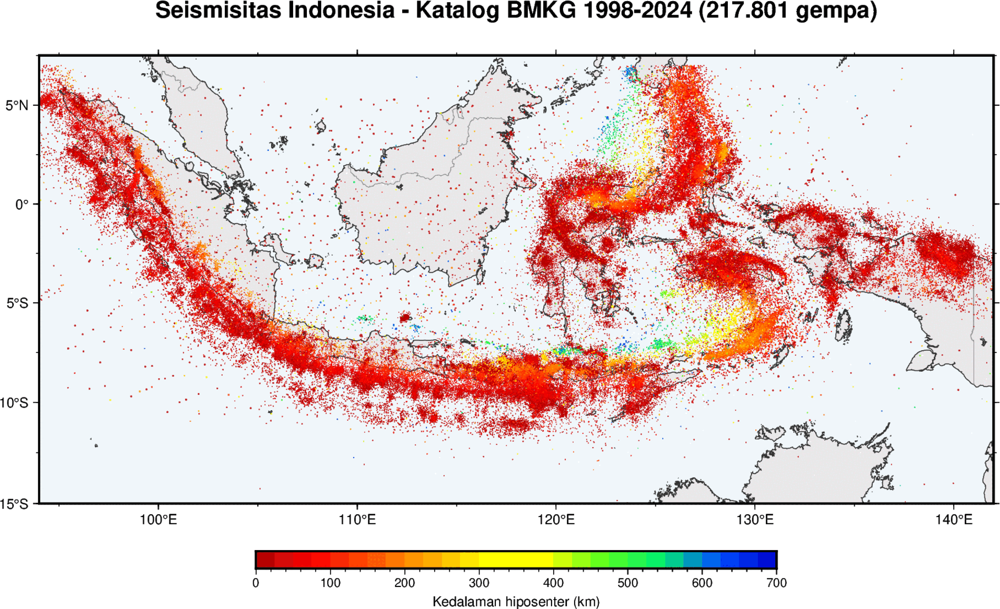
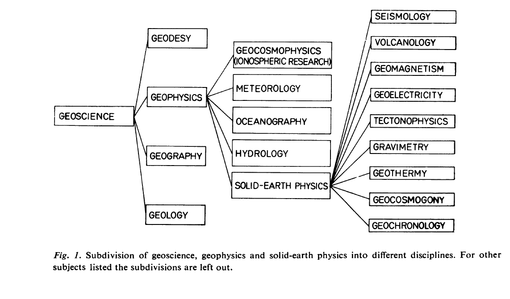
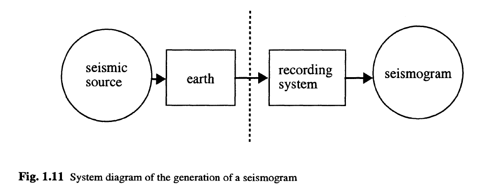
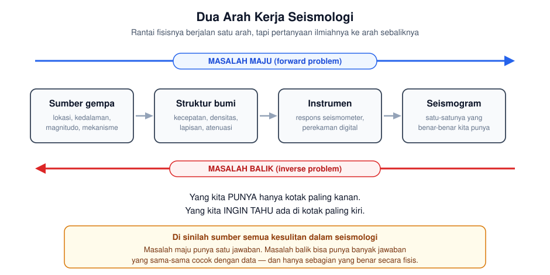
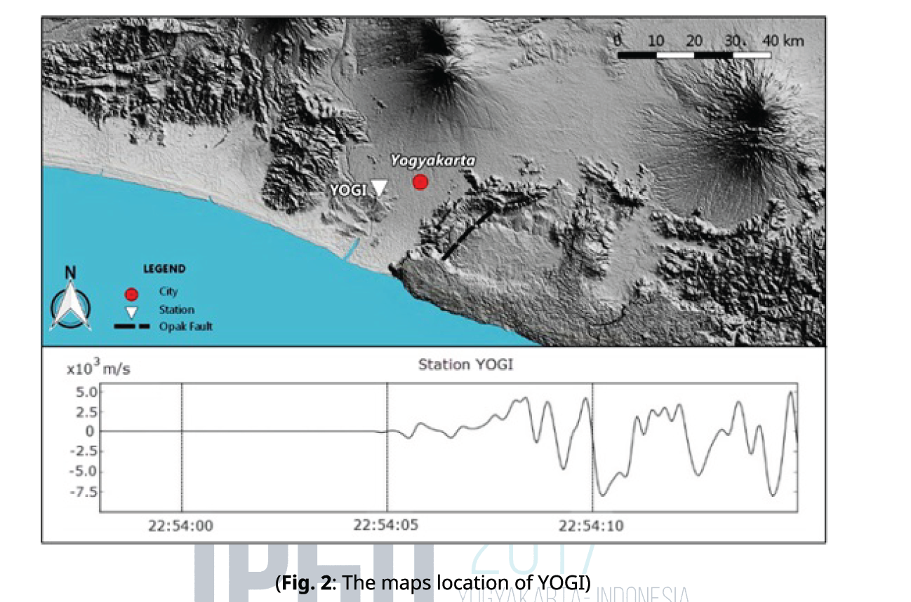
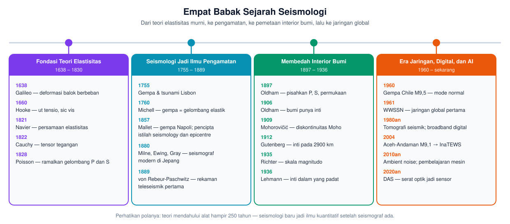
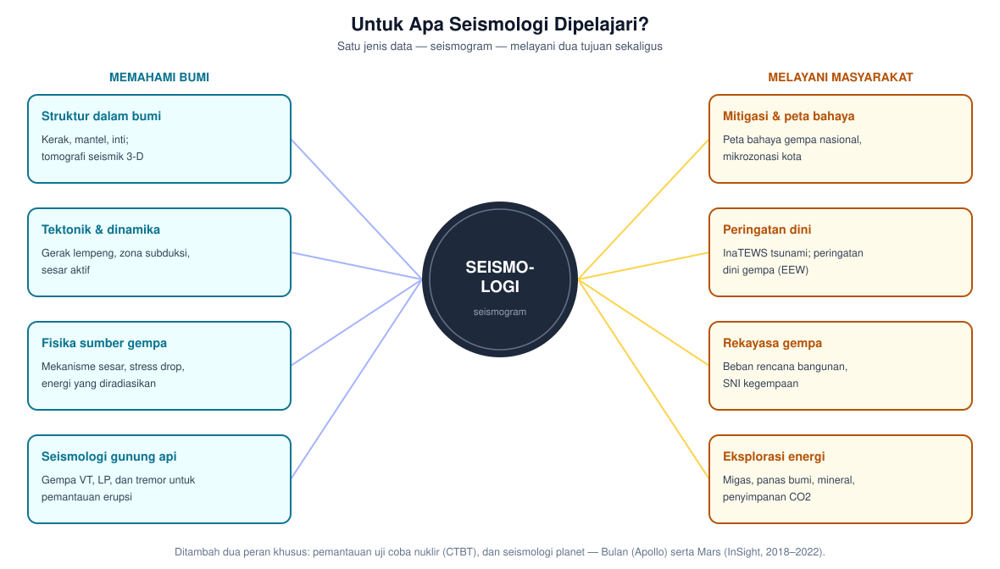

# Minggu 1 — Ruang Lingkup, Sejarah, dan Peran Seismologi

**Seismologi `PAGF262413`** · Senin 07:15–08:55, Ruang Kelas 209
Pokok Bahasan 1 · **CPMK5** · Bloom **C2** (memahami) dan **A4** (mengorganisasi nilai)

> **Sasaran pertemuan ini.** Di akhir 100 menit, mahasiswa dapat (a) menjelaskan apa yang dipelajari seismologi dan posisinya dalam geofisika, (b) membedakan masalah maju dan masalah balik serta menjelaskan mengapa yang kedua lebih sulit, (c) menyebutkan tonggak sejarah yang mengubah seismologi menjadi ilmu kuantitatif, dan (d) menjelaskan mengapa ilmu ini penting khusus bagi Indonesia.

---

## 0 · Pembuka: satu peta, satu pertanyaan · 10 menit

217.801 gempa, katalog BMKG 1998–2024. Warna = kedalaman hiposenter. Dibuat dengan [`skrip/peta_seismisitas_bmkg.py`](skrip/peta_seismisitas_bmkg.py).

Tampilkan peta ini **tanpa penjelasan apa pun**. Beri mahasiswa dua menit untuk mengamati, lalu ajukan empat pertanyaan:

1. Mengapa titik-titiknya **berkelompok membentuk busur**, bukan tersebar merata?
2. Mengapa warnanya **berubah dari merah ke kuning lalu hijau** ke arah utara di Jawa dan Banda?
3. Ada 217.801 titik di peta ini. **Dari mana kita tahu** posisi tiap satu di antaranya?
4. Mengapa Kalimantan hampir kosong?

Biarkan mereka menebak. **Jangan dijawab.** Tutup dengan:

> *"Tidak satu pun dari titik ini yang dilihat orang secara langsung. Semuanya dihitung dari getaran tanah yang direkam ratusan hingga ribuan kilometer jauhnya. Bagaimana caranya — itulah isi satu semester ke depan. Di minggu ke-12 kalian akan menghitung sendiri titik seperti ini, dan hasilnya akan saya bandingkan dengan katalog BMKG."*

*Catatan mengajar:* pembukaan ini sengaja menciptakan **jurang pengetahuan yang disadari**. Pertanyaan yang belum bisa dijawab jauh lebih melekat daripada definisi yang langsung diberikan.

---

## 1 · Apa itu seismologi? · 15 menit

### 1.1 Dari arti katanya

**Seismologi** = *seismos* (σεισμός, gempa bumi) + *logos* (λόγος, ilmu). Secara harfiah: **ilmu tentang gempa bumi**.

Tetapi definisi harfiah ini sudah lama terlalu sempit. Seismologi modern juga mempelajari getaran yang **bukan** gempa: ledakan tambang, uji coba nuklir, letusan gunung api, longsoran es, hantaman meteor, deru lalu lintas kota, bahkan gemuruh gelombang laut yang menggetarkan seluruh planet sepanjang waktu.

### 1.2 Dua jalur definisi (Båth, 1979)

| | Definisi | Fokusnya |
|:--|:--|:--|
| **1** | Ilmu tentang gempa bumi, termasuk sifat fisis interior bumi yang dilalui gelombangnya | **Sumbernya** — mengapa dan bagaimana bumi bergetar |
| **2** | Ilmu tentang penjalaran gelombang elastik dalam bumi | **Mediumnya** — apa yang dilewati gelombang itu |

Kedua jalur ini memakai **data yang sama persis** — seismogram — untuk menjawab dua pertanyaan berbeda. Satu memandang gelombang sebagai *pesan tentang pengirimnya*; satu lagi sebagai *pesan tentang jalan yang dilewatinya*.

### 1.3 Posisi dalam pohon ilmu kebumian

Seismologi adalah salah satu cabang **Solid-Earth Physics**, bersanding dengan vulkanologi, geomagnetik, geoelektrik, tektonofisika, gravimetri, geotermi, dan geokronologi.

*Bahan diskusi:* bagan ini berumur lebih dari 45 tahun. Apa yang **belum ada** di sana? (Jawaban yang diharapkan: geodesi satelit/GNSS, seismologi lingkungan, *ambient noise*, DAS, seismologi planet — sebagian akan kita bahas di Minggu 10.)

---

## 2 · Rantai dari gempa ke pengetahuan · 20 menit

**Ini bagian terpenting pertemuan hari ini.** Kalau hanya satu konsep yang boleh melekat dari Minggu 1, konsep inilah.

### 2.1 Rantai fisis

Setiap seismogram adalah hasil **tiga hal yang bercampur**: sifat sumbernya, sifat bumi yang dilewatinya, dan sifat alat yang merekamnya. Ketiganya masuk; satu sinyal keluar.

### 2.2 Arah yang kita butuhkan justru berlawanan

Alam mengerjakan rantai itu dari kiri ke kanan. Kita, sebagai ilmuwan, **selalu bekerja dari kanan ke kiri**.

Perbedaannya bukan sekadar teknis:

| | Masalah maju | Masalah balik |
|:--|:--|:--|
| Pertanyaan | Diketahui sumber dan struktur — seperti apa seismogramnya? | Diketahui seismogram — apa sumbernya, bagaimana strukturnya? |
| Jawaban | **Tunggal.** Fisika menentukannya | **Bisa banyak.** Beberapa model berbeda menghasilkan seismogram yang sama |
| Perannya | Alat bantu | **Inilah pekerjaan seismolog** |

### 2.3 Contoh konkret: satu stasiun tidak cukup

Dari **satu** stasiun, selisih waktu tiba gelombang S dan P memberi tahu kita **jarak** ke sumber — tapi tidak arahnya. Gempa itu bisa berada di mana saja pada sebuah lingkaran.

Dari **dua** stasiun: dua lingkaran, berpotongan di dua titik. Masih ambigu.
Dari **tiga** stasiun: satu titik. Itulah metode lingkaran yang akan kalian kerjakan di praktikum.

Dan kedalamannya? Kedalaman tetap yang paling sulit — bahkan dengan sepuluh stasiun sekalipun, kalau semuanya berada jauh dari episenter. **Kita akan kembali ke soal ini di Minggu 12.**

> **Pesan yang ingin ditanam:** dalam seismologi, "tidak tahu" bukan kegagalan — ia besaran yang harus dihitung dan dilaporkan. Angka tanpa ketidakpastian adalah angka yang belum selesai.

---

## 3 · Bagaimana seismologi menjadi ilmu · 25 menit

### Babak 1 — Fondasi teori, tanpa satu pun data (1638–1830)

Galileo mengamati balok berbeban yang melengkung. Hooke merumuskan *ut tensio, sic vis* — regangan sebanding gaya. Navier dan Cauchy membangun teori elastisitas yang matang; Cauchy memberi kita tensor tegangan yang akan kalian pelajari **minggu depan**.

Puncaknya di tangan **Poisson (1828)**: dari persamaan elastisitas murni, ia meramalkan bahwa medium elastik meloloskan **dua jenis gelombang dengan kecepatan berbeda** — satu mampat, satu geser. Gelombang P dan S diramalkan di atas kertas **69 tahun sebelum** ada orang yang benar-benar melihatnya pada rekaman.

### Babak 2 — Seismologi turun ke lapangan (1755–1889)

**Gempa dan tsunami Lisbon, 1 November 1755**, menewaskan puluhan ribu orang dan mengguncang pemikiran Eropa. Untuk pertama kalinya gempa diperlakukan sebagai **gejala alam yang bisa diselidiki**, bukan hukuman ilahi. Ini kelahiran seismologi sebagai ilmu pengamatan.

**Robert Mallet** menyelidiki gempa Napoli 1857 secara sistematis dan menciptakan kosakata yang kita pakai sampai hari ini: *seismology*, *epicentre*, *isoseismal*.

Lalu alatnya menyusul. **Milne, Ewing, dan Gray** membangun seismograf modern di Jepang sekitar 1880. Dan pada 1889, **von Rebeur-Paschwitz** menemukan sesuatu yang mengubah segalanya: alatnya di Jerman merekam gempa yang terjadi di **Jepang**. Untuk pertama kalinya terbukti bahwa gelombang gempa **menembus seluruh planet** — dan berarti bisa dipakai untuk memeriksa isinya.

### Babak 3 — Membedah bumi tanpa melubanginya (1897–1936)

Begitu seismogram tersedia, interior bumi terbuka dengan kecepatan yang menakjubkan:

- **1897** Oldham memisahkan P, S, dan gelombang permukaan pada rekaman — 69 tahun setelah Poisson meramalkannya.
- **1906** Oldham menyimpulkan bumi punya **inti**.
- **1909** Mohorovičić menemukan **diskontinuitas Moho**, batas kerak–mantel.
- **1912** Gutenberg menempatkan batas inti pada **2900 km** — angka yang bertahan sampai sekarang.
- **1935** Richter memberi kita **skala magnitudo**.
- **1936** Inge Lehmann menemukan **inti dalam yang padat**.

Dalam 39 tahun, struktur besar planet ini terpetakan — seluruhnya dari getaran yang direkam di permukaan. Lubang bor terdalam yang pernah dibuat manusia hanya mencapai 12 km. Moho pun tak pernah tersentuh.

### Babak 4 — Jaringan, digital, dan sekarang (1960–kini)

**WWSSN (1961)** — jaringan seismik global pertama yang terstandar — lahir dari kebutuhan politik: memverifikasi larangan uji coba nuklir. Salah satu contoh terbaik bagaimana kepentingan strategis membiayai ilmu dasar.

Dari sana: mode normal bumi teramati setelah gempa Chile M9,5 (1960), tomografi seismik pada 1980-an, jaringan *broadband* digital, lalu **Aceh–Andaman M9,1 (2004)** yang melahirkan **InaTEWS**. Hari ini: *ambient noise*, pembelajaran mesin, dan **DAS** yang menyulap serat optik telekomunikasi menjadi ribuan sensor.

> **Pola yang layak digarisbawahi:** teori mendahului alat hampir 250 tahun. Seismologi baru menjadi kuantitatif setelah instrumen ada. Ini pengingat bahwa dalam geofisika, **kemajuan alat ukur sering membuka pintu lebih lebar daripada kemajuan teori.**

---

## 4 · Untuk apa seismologi dipelajari? · 20 menit

### Dan mengapa ini bukan soal akademis bagi Indonesia

Indonesia duduk di pertemuan **empat lempeng utama**: Eurasia, Indo-Australia, Pasifik, dan Filipina. Peta pembuka tadi adalah konsekuensinya.

| Peristiwa | Yang perlu dicatat |
|:--|:--|
| **Aceh–Andaman 2004**, M9,1 | Tsunami Samudra Hindia; pemicu lahirnya InaTEWS |
| **Yogyakarta 2006**, M6,3 | Magnitudo sedang, korban sangat besar — bukti bahwa kedalaman dangkal dan kondisi tanah setempat lebih menentukan daripada magnitudo |
| **Palu–Donggala 2018**, M7,5 | Sesar mendatar memicu tsunami dan likuefaksi masif — di luar dugaan model saat itu |
| **Lombok 2018**, rentetan | Rangkaian gempa kuat beruntun, bukan pola gempa utama–susulan yang biasa |
| **Cianjur 2022**, M5,6 | Magnitudo kecil, kerusakan berat — sesar dangkal tepat di bawah permukiman |

*Bahan diskusi (10 menit, berpasangan):* Yogyakarta 2006 hanya M6,3, sementara Aceh 2004 M9,1 — beda energi lebih dari **20.000 kali lipat**. Mengapa gempa yang jauh lebih kecil bisa menewaskan ribuan orang di Bantul?

Kumpulkan jawaban di papan. Sebagian besar akan benar sebagian. Katakan bahwa jawaban lengkapnya perlu Minggu 13 (magnitudo vs intensitas) dan Minggu 15 (risiko = bahaya × kerentanan × keterpaparan). **Sekali lagi: buka jurangnya, jangan tutup.**

---

## 5 · Kontrak belajar dan aturan asesmen · 10 menit

Bagian ini **wajib disampaikan hari ini juga**, tidak boleh ditunda.

**AI boleh dipakai sebebasnya** untuk tugas, koding, dan belajar — bahkan didorong. Syaratnya satu: **dokumentasikan pemakaiannya**.

Tetapi nilai tidak datang dari artefak:

| Komponen | Bobot | Sifat |
|:--|:--:|:--|
| Produk berbantuan AI (tugas, laporan) | **25%** | Gerbang — boleh pakai AI |
| Verifikasi tanpa bantuan atas konstruk yang sama | **75%** | Penentu — 20 menit di kelas, tanpa perangkat |

Ditambah: tiap mahasiswa memperoleh **event gempa berbeda** untuk tugas hitungannya, dan jawabannya diadu dengan katalog BMKG/ISC. Ada pula **viva 5 menit** yang dijalankan pada sampel terpicu **dan** 15% sampel acak — jadi dipanggil viva adalah hal biasa, bukan tuduhan.

📄 Aturan lengkap: [`Asesmen_Era_AI_Seismologi.md`](Asesmen_Era_AI_Seismologi.md)

> Sampaikan terus terang: *"Sistem ini bukan untuk menangkap kalian. Ini supaya kalian bisa memakai AI habis-habisan tanpa kehilangan kemampuan sendiri. Yang memakai AI untuk benar-benar belajar akan lolos verifikasi dengan mudah."*

---

## Tugas Minggu 1

### T1.1 — Prediksi terkunci (dikumpulkan sebelum Minggu 2)

Jawab dari nalar sendiri, **sebelum** membaca atau bertanya ke siapa pun — termasuk AI. Salah tidak mengurangi nilai; yang dinilai adalah **kejujuran menebak lebih dulu dan mutu penjelasan selisihnya nanti**.

1. Menurutmu, berapa kecepatan gelombang P di kerak bumi? Beri **selang**, bukan satu angka.
2. Gelombang mana yang tiba lebih dulu, P atau S? Mengapa?
3. Kalau gempa terjadi di Bantul dan direkam di stasiun Yogyakarta (± 25 km), berapa detik selisih tiba S dan P?
4. Berapa dalam manusia pernah mengebor bumi? Berapa tebal kerak bumi?

Sesudah menyetorkan, barulah cari jawabannya. Tulis satu paragraf: **mana tebakan yang paling meleset, dan mengapa nalarmu membawamu ke sana?**

### T1.2 — Bacaan wajib

| Sumber | Bagian |
|:--|:--|
| Stein & Wysession (2003) | 1.1.1 *Overview* (h. 1), 1.1.2 *Models in seismology* (h. 5), 1.2 *Seismology and society* (h. 9) |
| Shearer (2019) | 1.1 *A Brief History of Seismology*, 1.1.1 *Recent Advances* |

### T1.3 — Persiapan studi kasus (kelompok, dipresentasikan Minggu 15)

Pilih satu gempa merusak di Indonesia. Minggu ini cukup kumpulkan **fakta dasar**: tanggal, waktu asal, koordinat, kedalaman, magnitudo, jumlah korban, dan **sumber datanya**. Perhatikan apakah angka dari BMKG, USGS, dan ISC saling berbeda — **kalau berbeda, catat selisihnya.** Itu bahan diskusi kita nanti.

---

## Sumber daring

| Sumber | Kegunaan |
|:--|:--|
| [Peta gempa BMKG](https://www.bmkg.go.id/) | Katalog dan informasi gempa Indonesia |
| [USGS Earthquake Map](https://earthquake.usgs.gov/earthquakes/map/) | Peta gempa global waktu-nyata |
| [ISC Bulletin](http://www.isc.ac.uk/) | Katalog rujukan internasional |
| [EarthScope Education](https://www.iris.edu/hq/inclass/search) | Animasi dan bahan ajar seismologi |
| [Seismo-Live](https://seismo-live.github.io/) | Notebook Jupyter seismologi siap jalan |

---

## Catatan waktu

| Bagian | Menit | Kumulatif |
|:--|:--:|:--:|
| 0 · Pembuka: peta dan pertanyaan | 10 | 10 |
| 1 · Apa itu seismologi | 15 | 25 |
| 2 · Rantai gempa → pengetahuan | 20 | 45 |
| 3 · Sejarah | 25 | 70 |
| 4 · Untuk apa, dan konteks Indonesia | 20 | 90 |
| 5 · Kontrak belajar dan asesmen | 10 | 100 |

---

**Minggu depan:** Tegangan, regangan, dan elastisitas — kita mulai dari tensor Cauchy yang muncul di Babak 1 tadi. Siapkan kembali catatan Mekanika Medium Kontinu; akan ada kuis diagnostik singkat di awal kelas.

Seismologi PAGF262413 · Program Studi Sarjana Geofisika FMIPA UGM · Kurikulum 2026
