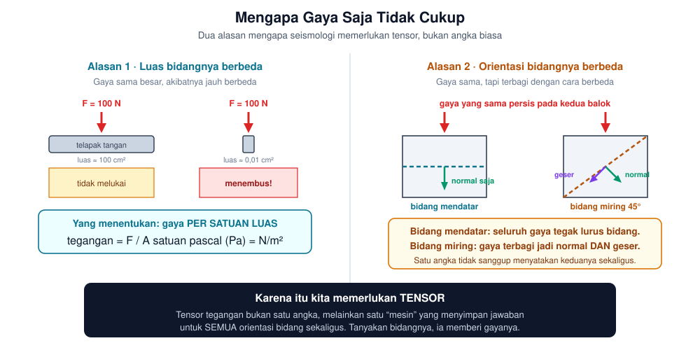
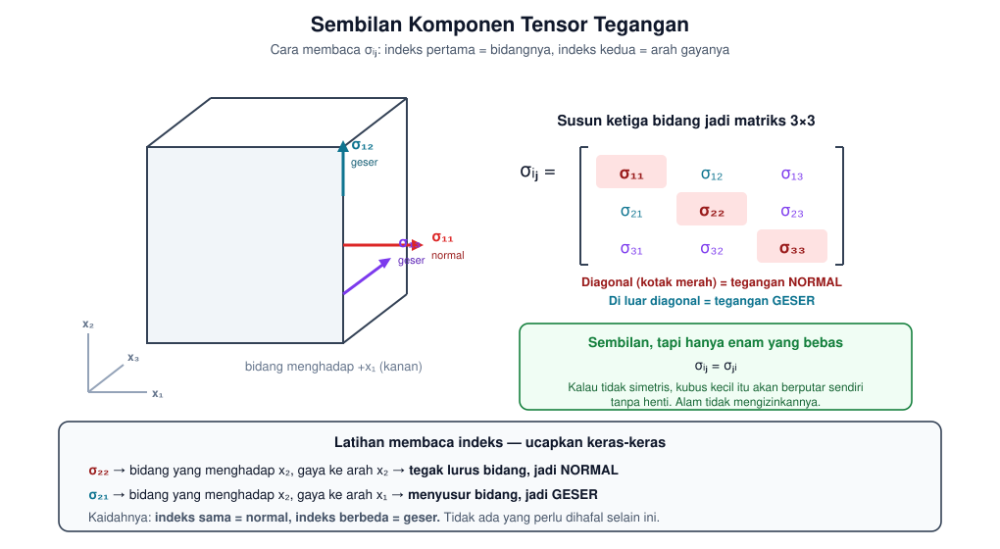
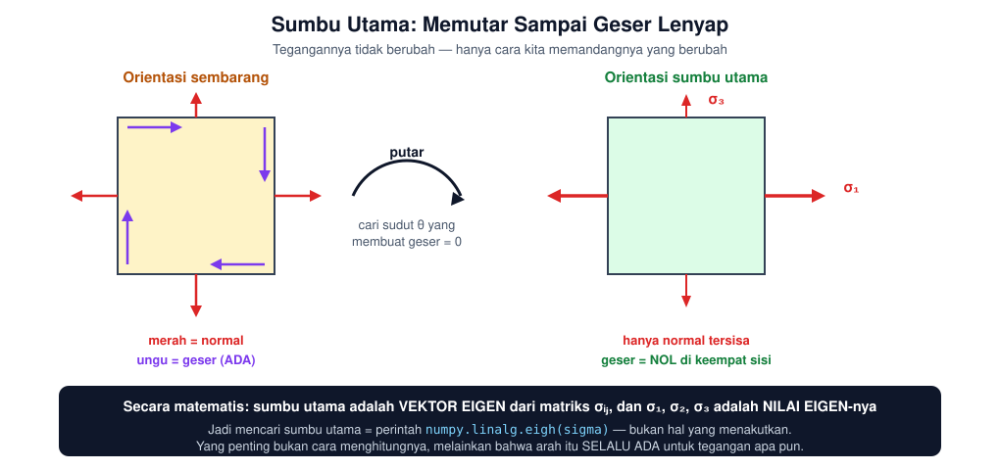
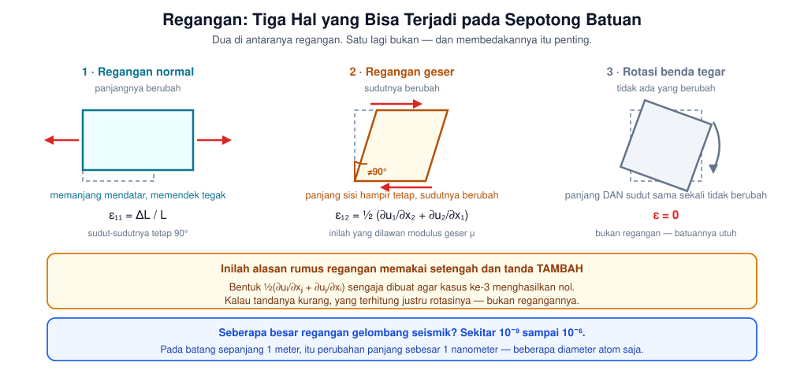
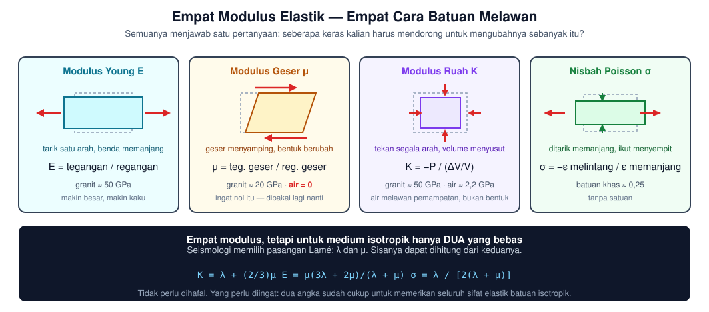
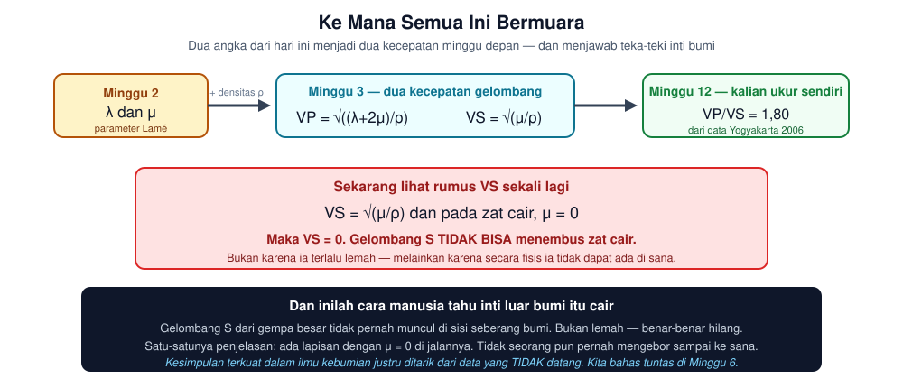

# Minggu 2 — Tegangan, Regangan, dan Elastisitas

**Seismologi `PAGF262413`** · Senin 07:15–08:55, Ruang Kelas 209
Pokok Bahasan 1→2 · **CPMK1** · Bloom **C2–C3**

> **Sasaran pertemuan.** Di akhir 100 menit mahasiswa dapat (a) menjelaskan **mengapa** tegangan harus berupa tensor dan bukan angka biasa, (b) membaca setiap komponen σᵢⱼ dan menyebut mana yang normal dan mana yang geser, (c) menjelaskan arti sumbu utama, (d) membedakan regangan normal, regangan geser, dan rotasi benda tegar, dan (e) menyebutkan empat modulus elastik beserta apa yang dilawan masing-masing.

---

## ⚠️ Catatan sebelum mulai — untuk pengajar

Materi ini **prasyaratnya berat** (Mekanika Medium Kontinu `PAGF262307`), dan pengalaman menunjukkan sebagian mahasiswa datang dengan bekal yang belum tuntas. Pertemuan ini karena itu dirancang **membangun dari nol**, bukan mengulang.

Tiga aturan yang menentukan berhasil-tidaknya:

1. **Jangan mulai dari matriks.** Mulai dari paku dan telapak tangan. Notasi tensor baru masuk setelah mahasiswa merasa memerlukannya.
2. **Setiap kali muncul indeks, ucapkan artinya keras-keras.** "Sigma dua satu" tidak berarti apa-apa; "bidang yang menghadap sumbu dua, gayanya ke arah sumbu satu" langsung berarti.
3. **Ada empat kotak "Berhenti dan periksa" di materi ini.** Jangan dilewati. Itu titik di mana mahasiswa yang tertinggal masih bisa diselamatkan.

Kalau kelas ternyata sangat lemah, §4 (regangan) dapat dipadatkan dan §5 (modulus) dijadikan bacaan mandiri — tetapi **§1 sampai §3 jangan dikorbankan**, karena seluruh semester bertumpu di sana.

---

## 0 · Pembuka: mengapa bumi bisa mengantarkan gelombang · 10 menit

Ajukan satu pertanyaan, lalu **jangan dijawab**:

> *"Kenapa gelombang gempa bisa merambat lewat batuan, tapi tidak bisa lewat lautan — padahal air juga bisa merambatkan bunyi?"*

Biarkan mereka menebak beberapa menit. Jawabannya baru akan muncul lengkap di **§6**, dan mereka akan sampai ke sana dengan rumus, bukan hafalan.

Petunjuk yang boleh diberikan sekarang: *air bisa ditekan, tetapi tidak bisa "dipelintir".* Batuan bisa keduanya. Perbedaan satu itulah yang melahirkan seluruh seismologi.

---

## 1 · Dari gaya ke tegangan: mengapa perlu tensor · 20 menit



### Alasan pertama: luas bidang

Tekan telapak tangan ke meja dengan gaya 100 newton — tidak terjadi apa-apa. Tekan ujung paku ke meja dengan gaya **yang sama persis** — paku menancap.

Gayanya identik. Yang berbeda **luas bidang tempat gaya itu bekerja**. Karena itu besaran yang bermakna secara fisis bukanlah gaya, melainkan gaya dibagi luas:

$$\text{tegangan} = \frac{F}{A} \qquad \text{satuan: pascal (Pa)} = \text{N/m}^2$$

Sampai di sini masih sederhana — tegangan tampak seperti "tekanan biasa", satu angka.

### Alasan kedua: orientasi bidang

Sekarang bagian yang membuatnya berbeda.

Ambil sebuah balok batu dan tekan dari atas. Sekarang tanyakan: **berapa tegangan di dalam balok itu?**

Pertanyaan itu **belum lengkap**, dan mahasiswa perlu merasakan ketidaklengkapannya. Tegangan di titik yang sama akan berbeda tergantung **bidang khayal mana** yang kita tanyakan:

| Bidang yang ditanya | Yang terjadi |
|:--|:--|
| Bidang **mendatar** | Seluruh gaya tegak lurus bidang → hanya tegangan **normal** |
| Bidang **miring 45°** | Gaya terbagi dua: sebagian tegak lurus, sebagian menyusur → ada normal **dan** geser |
| Bidang **tegak** | Pembagian yang berbeda lagi |

Satu titik, satu keadaan tegangan, tetapi **jawaban berbeda untuk tiap orientasi bidang**.

### Karena itu: tensor

Tensor tegangan bukanlah satu angka. Ia lebih tepat dibayangkan sebagai **mesin penjawab**: kalian masukkan orientasi bidang, ia mengeluarkan gaya per satuan luas pada bidang itu.

$$T_i = \sigma_{ij}\, n_j$$

Di sini \$\hat{n}\$ adalah arah tegak lurus bidang yang kalian tanyakan, dan \$\vec{T}\$ adalah **vektor traksi** — jawabannya.

> **Berhenti dan periksa ①**
> Sebelum lanjut, pastikan mahasiswa bisa menjawab: *"Mengapa satu angka tidak cukup untuk menyatakan tegangan di satu titik?"*
> Jawaban yang benar menyebut **orientasi bidang**. Kalau yang keluar hanya "karena tiga dimensi", pemahamannya belum masuk — ulangi contoh balok miring.

---

## 2 · Membaca sembilan komponen · 20 menit



Bayangkan kubus sangat kecil di dalam batuan. Kubus itu punya tiga pasang sisi, masing-masing menghadap satu sumbu. Pada tiap sisi, gaya bisa menuju tiga arah. Tiga bidang × tiga arah = **sembilan komponen**.

### Aturan membaca indeks — satu-satunya yang perlu dihafal

$$\sigma_{ij}: \quad i = \text{bidangnya menghadap ke mana}, \qquad j = \text{gayanya ke arah mana}$$

Ucapkan keras-keras beberapa kali di kelas:

| Simbol | Dibaca | Jenis |
|:--|:--|:--|
| σ₁₁ | bidang menghadap x₁, gaya ke x₁ | **normal** (tegak lurus bidang) |
| σ₁₂ | bidang menghadap x₁, gaya ke x₂ | **geser** (menyusur bidang) |
| σ₂₂ | bidang menghadap x₂, gaya ke x₂ | **normal** |
| σ₃₁ | bidang menghadap x₃, gaya ke x₁ | **geser** |

**Kaidahnya cuma satu:** indeks sama → normal. Indeks berbeda → geser.

Karena itu **diagonal matriks selalu tegangan normal**, dan **semua yang di luar diagonal selalu geser**. Tidak ada yang perlu dihafal lagi.

### Mengapa hanya enam yang bebas

Matriksnya simetris: \$\sigma_{ij} = \sigma_{ji}\$.

Alasannya fisis dan mudah dibayangkan: kalau σ₁₂ tidak sama dengan σ₂₁, akan ada momen gaya sisa pada kubus kecil itu. Kubus itu akan **berputar makin cepat tanpa henti**, tanpa ada yang memutarnya. Alam tidak mengizinkan hal semacam itu terjadi.

Jadi dari sembilan komponen, hanya **enam yang bebas**.

### Tegangan normal: tekan atau tarik?

Perjanjian tanda dalam seismologi: **positif berarti tarikan**, negatif berarti tekanan. Karena di dalam bumi hampir semuanya tertekan, komponen normalnya hampir selalu negatif.

Sebagian buku geologi memakai perjanjian terbalik. **Selalu periksa perjanjian tanda yang dipakai sebuah tulisan** sebelum membandingkan angka.

> **Berhenti dan periksa ②**
> Minta mahasiswa menuliskan sendiri apa arti **σ₂₃**, lalu menyebutkan apakah ia normal atau geser. Kalau lebih dari seperempat kelas keliru, ulangi kubus di papan tulis sekali lagi. **Jangan lanjut sebelum ini beres** — seluruh materi berikutnya memakai notasi ini.

---

## 3 · Sumbu utama: memutar sampai geser lenyap · 20 menit



Inilah gagasan terpenting hari ini.

Untuk **keadaan tegangan apa pun**, selalu ada satu orientasi kubus di mana **seluruh komponen gesernya menjadi nol**. Yang tersisa hanya tiga tegangan normal, disebut **tegangan utama**:

$$\sigma_1 \ge \sigma_2 \ge \sigma_3$$

Arah-arah itu disebut **sumbu utama**.

**Yang berubah bukan tegangannya, melainkan cara kita memandangnya.** Batuannya sama, gayanya sama; kita hanya memilih sistem koordinat yang membuat gambarannya paling sederhana.

### Hubungannya dengan aljabar linear

Kalau mahasiswa pernah bertemu nilai eigen, sebutkan sekarang — dan kalau belum, katakan bahwa yang perlu mereka tahu hanya ini:

- **Sumbu utama** = vektor eigen dari matriks σᵢⱼ
- **Tegangan utama** = nilai eigennya

Di komputer ini satu baris:

```python
import numpy as np
nilai, arah = np.linalg.eigh(sigma)   # sigma matriks 3x3
```

Yang penting **bukan cara menghitungnya**, melainkan kenyataan bahwa arah semacam itu **selalu ada**, untuk keadaan tegangan apa pun. Itu jaminan matematis, bukan kebetulan.

### Tegangan deviatorik: memisahkan yang menekan dari yang merusak

Pecah tensor menjadi dua bagian:

$$\sigma_{ij} = \underbrace{\frac{1}{3}\sigma_{kk}\,\delta_{ij}}_{\text{isotropik}} + \underbrace{\sigma_{ij}^{\text{dev}}}_{\text{deviatorik}}$$

| Bagian | Yang dilakukannya |
|:--|:--|
| **Isotropik** | Menekan batuan dari segala arah sama besar; mengubah **volume**, tidak mengubah bentuk |
| **Deviatorik** | Mengubah **bentuk** — dan inilah yang membuat batuan pecah |

**Angka yang layak dicatat.** Pada kedalaman 10 km, tekanan litostatik sekitar **270 MPa**. Sementara *stress drop* gempa — pelepasan tegangan saat gempa terjadi — hanya **1–10 MPa** (kalian akan menghitungnya di Minggu 13).

> Artinya: gempa bumi adalah **riak sangat kecil di atas tekanan yang jauh lebih besar**. Gempa tidak "melepaskan seluruh tegangan"; ia hanya menyerut sedikit bagian atasnya.

### Tegangan geser maksimum dan arah sesar

Tegangan geser terbesar bekerja pada bidang **45°** terhadap σ₁, dengan besar \$(\sigma_1-\sigma_3)/2\$.

Tetapi sesar nyata di batuan biasanya terbentuk pada **25°–35°** terhadap σ₁, bukan 45°. Sebabnya: bidang sesar juga harus melawan **gesekan**, dan sudut yang paling "murah" secara energi bergeser dari 45°. Ini kriteria Mohr–Coulomb.

**Ke mana ini bermuara:** di Minggu 14 mahasiswa membaca bola fokal gempa Indonesia dan menyimpulkan arah tegangan utama daerah itu. Hubungan orientasi sesar dengan σ₁ yang baru saja dibahas inilah dasarnya.

---

## 4 · Regangan: tiga hal yang bisa terjadi · 20 menit



Tegangan adalah **sebab**; regangan adalah **akibat**.

Perhatikan baik-baik ketiga panel pada gambar. Dua di antaranya regangan, satu **bukan** — dan membedakannya adalah titik yang paling sering membingungkan.

| | Yang terjadi | Regangan? |
|:--|:--|:--|
| **Normal** | Panjangnya berubah, sudutnya tetap 90° | Ya, ε₁₁ = ΔL/L |
| **Geser** | Panjang sisi hampir tetap, **sudutnya** berubah | Ya, ε₁₂ |
| **Rotasi benda tegar** | Panjang **dan** sudut sama sekali tidak berubah | **Bukan** — ε = 0 |

### Mengapa rumusnya berbentuk begitu

$$\varepsilon_{ij} = \frac{1}{2}\left( \frac{\partial u_i}{\partial x_j} + \frac{\partial u_j}{\partial x_i} \right)$$

Mahasiswa sering menganggap bentuk ini sebagai rumus yang harus dihafal. Padahal ia punya alasan yang tegas:

Gradien perpindahan \$\partial u_i/\partial x_j\$ memuat **dua hal tercampur**: perubahan bentuk **dan** rotasi. Bentuk simetris dengan tanda **tambah** dan faktor **setengah** sengaja dirancang agar bagian rotasinya **saling meniadakan** dan menghasilkan nol.

Kalau tandanya diganti kurang, yang terhitung justru rotasinya — bukan regangannya. Itulah tensor rotasi, dan ia bukan yang kita inginkan.

> **Berhenti dan periksa ③**
> *"Sebuah batu dibawa naik lift dan berputar pelan. Apakah ia mengalami regangan?"*
> Jawaban benar: **tidak** — tidak ada perubahan bentuk maupun panjang. Kalau ada yang menjawab "ya, karena bergerak", itu tanda pembedaan regangan dan perpindahan belum masuk.

### Seberapa kecil regangan gelombang seismik

| Peristiwa | Regangan khas |
|:--|:--|
| Gelombang seismik dari gempa jauh | **10⁻⁹ – 10⁻⁶** |
| Gelombang dekat sumber gempa besar | 10⁻⁴ |
| Batuan mulai retak | ~10⁻⁴ |

Untuk merasakan seberapa kecil 10⁻⁹: pada batang sepanjang **satu meter**, itu perubahan panjang sebesar **satu nanometer** — beberapa diameter atom saja.

**Konsekuensinya besar dan sering diremehkan.** Pada regangan sekecil itu, batuan berperilaku **linear sempurna**: gandakan tegangan, regangannya tepat berlipat dua. Sifat inilah yang mengizinkan seluruh kerangka konvolusi di Minggu 11 — \$u(t) = s(t) * g(t) * i(t) + n(t)\$ — berlaku. Tanpa linearitas itu, seismologi seperti yang kita kenal tidak akan ada.

Dan itu pula sebabnya asumsi ini **gugur** di dekat sumber gempa besar, di mana regangannya mencapai 10⁻⁴ dan batuan mulai berperilaku tidak linear.

---

## 5 · Empat modulus elastik · 15 menit



Hukum Hooke menghubungkan sebab dengan akibat:

$$\sigma_{ij} = c_{ijkl}\,\varepsilon_{kl}$$

Tensor \$c_{ijkl}\$ punya 81 komponen. Simetri memangkasnya jadi 21. Dan untuk medium **isotropik** — sifatnya sama ke segala arah — hanya tersisa **dua bilangan bebas**.

Empat modulus yang lazim dipakai hanyalah cara berbeda menyatakan kedua bilangan itu:

| Modulus | Melawan apa | Nilai khas |
|:--|:--|:--|
| **Young, E** | Peregangan sepanjang satu sumbu | granit ≈ 50 GPa |
| **Geser, μ** | **Perubahan bentuk** | granit ≈ 20 GPa · **air = 0** |
| **Ruah, K** | Perubahan volume | granit ≈ 50 GPa · air ≈ 2,2 GPa |
| **Poisson, σ** | (perbandingan penyempitan melintang) | batuan ≈ 0,25, tanpa satuan |

Seismologi memakai pasangan **Lamé**: **λ** dan **μ**. Sisanya dapat dihitung darinya:

$$K = \lambda + \tfrac{2}{3}\mu, \qquad E = \frac{\mu(3\lambda+2\mu)}{\lambda+\mu}, \qquad \sigma = \frac{\lambda}{2(\lambda+\mu)}$$

**Rumus-rumus ini tidak perlu dihafal.** Yang perlu diingat hanya: **dua angka sudah cukup** untuk memerikan seluruh sifat elastik batuan isotropik.

### Perhatikan satu angka: μ air = 0

Tandai baik-baik. Air melawan pemampatan (K-nya 2,2 GPa, tidak nol), tetapi **sama sekali tidak melawan perubahan bentuk**. Aduk air sebanyak apa pun, ia tidak "melenting" kembali ke bentuk semula.

Angka nol itu akan menjelaskan segalanya di menit berikutnya.

---

## 6 · Ke mana semua ini bermuara · 15 menit



Minggu depan kita akan menurunkan persamaan gelombang seismik. Hasilnya — dan ini janji yang boleh disampaikan sekarang — adalah **dua kecepatan**:

$$V_P = \sqrt{\frac{\lambda + 2\mu}{\rho}}, \qquad V_S = \sqrt{\frac{\mu}{\rho}}$$

Kedua besaran dari hari ini, λ dan μ, ditambah densitas, langsung menjadi kecepatan gelombang.

### Sekarang jawab pertanyaan pembuka

Lihat rumus \$V_S\$ sekali lagi. Ia **hanya memuat μ**.

Dan pada zat cair, **μ = 0**.

$$V_S = \sqrt{\frac{0}{\rho}} = 0$$

**Gelombang S tidak dapat menembus zat cair.** Bukan karena ia terlalu lemah, bukan karena teredam — melainkan karena secara fisis ia **tidak dapat ada di sana**. Tidak ada yang melawan perubahan bentuk, jadi tidak ada yang bisa merambatkannya.

Itulah jawaban pertanyaan pembuka tadi, dan mahasiswa sampai ke sana lewat rumus, bukan hafalan.

### Dan inilah cara manusia tahu inti bumi itu cair

Gelombang S dari gempa besar **tidak pernah muncul** di sisi seberang bumi. Bukan lemah — benar-benar hilang. Satu-satunya penjelasan: ada lapisan dengan μ = 0 di jalannya.

Tidak seorang pun pernah mengebor sampai ke sana. Lubang terdalam yang pernah dibuat manusia hanya 12 km, sementara batas inti berada pada 2891 km.

> Kesimpulan terkuat dalam ilmu kebumian justru ditarik dari data yang **tidak datang**. Kita bahas tuntas di Minggu 6.

Dan di **Minggu 12**, mahasiswa akan mengukur \$V_P/V_S = 1{,}80\$ dari data gempa Yogyakarta 2006 dengan tangan mereka sendiri — yang berarti nisbah Poisson 0,276 untuk kerak di bawah Bantul. Angka itu bukan hafalan dari buku; itu hasil pengukuran mereka.

---

## Kesalahan yang paling sering terjadi

Bahas terbuka di kelas. Menamai kesalahan lebih efektif daripada sekadar mengajarkan yang benar.

| Kesalahan | Mengapa keliru |
|:--|:--|
| "Tegangan itu sama dengan gaya" | Tegangan adalah gaya **per satuan luas**, dan bergantung **orientasi bidang** |
| "σ₁₂ dan σ₂₁ itu beda" | Sama, karena tensornya simetris — dan alasannya fisis, bukan kesepakatan |
| "Benda yang berputar mengalami regangan" | Rotasi benda tegar memberi ε = 0. Itulah sebabnya rumus regangan disimetriskan |
| "Regangan seismik itu besar, kan bisa merobohkan rumah" | Regangannya 10⁻⁹–10⁻⁶. Yang merobohkan rumah adalah **percepatan**, bukan regangan |
| "Air tidak punya modulus, kan cair" | Air punya K = 2,2 GPa. Yang nol hanya **μ** |
| "Kalau μ = 0 maka gelombang P juga hilang" | \$V_P = \sqrt{(\lambda+2\mu)/\rho}\$ — masih ada λ. P tetap merambat di zat cair; itulah bunyi |

---

## Daftar lambang

| Lambang | Nama | Satuan |
|:--|:--|:--|
| σᵢⱼ | Tensor tegangan | Pa |
| Tᵢ | Vektor traksi | Pa |
| nⱼ | Normal satuan bidang | — |
| εᵢⱼ | Tensor regangan | tanpa satuan |
| uᵢ | Perpindahan | m |
| λ, μ | Parameter Lamé | Pa |
| K, E | Modulus ruah, modulus Young | Pa |
| σ (huruf tunggal) | Nisbah Poisson | tanpa satuan |
| ρ | Densitas | kg/m³ |

⚠️ **Awas:** huruf σ dipakai untuk **dua hal berbeda** — tensor tegangan (berindeks, σᵢⱼ) dan nisbah Poisson (tanpa indeks). Ini membingungkan, tetapi sudah menjadi kelaziman internasional. Selalu perhatikan ada-tidaknya indeks.

---

## Tugas Minggu 2

### T2.1 — Prediksi terkunci (sebelum membaca apa pun)

Jawab dari nalar sendiri lebih dahulu. Salah tidak mengurangi nilai; yang dinilai adalah **mutu penjelasan selisihnya nanti**.

1. Berapa besar regangan pada batuan saat dilewati gelombang seismik dari gempa jauh? Beri **selang**, bukan satu angka.
2. Kalau modulus geser suatu bahan nol, gelombang apa yang masih bisa lewat?
3. Tekanan litostatik pada kedalaman 10 km kira-kira berapa MPa?
4. Sesar terbentuk pada sudut berapa terhadap tegangan utama terbesar?

### T2.2 — Hitungan dengan tangan

Diberikan tensor tegangan (dalam MPa):

$$\sigma = \begin{pmatrix} -40 & 12 & 0 \\ 12 & -25 & 0 \\ 0 & 0 & -30 \end{pmatrix}$$

**Kerjakan dengan tangan dan kalkulator dulu**, baru periksa dengan `numpy.linalg.eigh`.

1. Sebutkan mana komponen normal dan mana geser.
2. Apakah tensornya simetris? Tunjukkan.
3. Hitung tegangan utama σ₁, σ₂, σ₃.
4. Hitung tegangan geser maksimum.
5. Hitung tegangan isotropik dan tuliskan bagian deviatoriknya.
6. Berdasarkan tandanya, apakah keadaan ini menekan atau menarik?

*Petunjuk untuk (3):* karena baris dan kolom ketiga sudah kosong di luar diagonal, −30 MPa **sudah** merupakan salah satu tegangan utama. Sisanya tinggal masalah 2×2, yang bisa diselesaikan dengan rumus akar persamaan kuadrat biasa.

### T2.3 — Menulis, bukan menghitung

Jelaskan **dengan kalimat sendiri, tanpa satu pun rumus**, dalam satu paragraf: mengapa gelombang S tidak dapat menembus inti luar bumi. Bayangkan kalian sedang menjelaskannya kepada mahasiswa semester satu.

Tugas ini bobotnya sama dengan T2.2. Kemampuan menjelaskan tanpa rumus adalah bukti paling jujur bahwa sesuatu benar-benar dipahami.

### T2.4 — Bacaan

| Sumber | Bagian |
|:--|:--|
| Shearer | 2.1 *The Stress Tensor* (termasuk contoh 2.1.1 dan 2.1.3), 2.2 *The Strain Tensor*, 2.3 *The Linear Stress–Strain Relationship* |
| Stein & Wysession | 2.3.1–2.3.10 (h. 38–51), terutama **2.3.5 *Maximum shear stress and faulting*** (h. 43) |

---

## Catatan waktu

| Bagian | Menit | Kumulatif |
|:--|:--:|:--:|
| 0 · Pembuka: pertanyaan yang digantung | 10 | 10 |
| 1 · Dari gaya ke tegangan; mengapa perlu tensor | 20 | 30 |
| 2 · Membaca sembilan komponen | 20 | 50 |
| 3 · Sumbu utama dan tegangan deviatorik | 20 | 70 |
| 4 · Tiga jenis perubahan bentuk | 20 | 90 |
| 5 · Empat modulus elastik | 15 | 105 |
| 6 · Ke mana semua ini bermuara | 15 | 120 |

⚠️ **Totalnya 120 menit, melebihi jatah 100 menit.** 

- **Kelas dengan prasyarat kuat** → §1 dapat dipadatkan menjadi 10 menit, §5 menjadi 10 menit. Total 105 menit, masih dapat dikejar.
- **Kelas dengan prasyarat lemah** → **jangan memotong §1–§3**. Sebaliknya, jadikan **§5 sebagai bacaan mandiri** dan padatkan §4 menjadi 12 menit. Kehilangan §5 dapat ditambal minggu depan; kehilangan §2 tidak dapat ditambal sama sekali.

**Yang paling penting: §6 jangan pernah dilewati.** Bagian itulah yang membuat seluruh aljabar hari ini terasa ada gunanya. Kalau waktu benar-benar habis, potong §4 dan langsung ke §6 — lebih baik mahasiswa pulang membawa satu wawasan utuh daripada lima potongan rumus.

---

**Minggu depan:** kedua parameter Lamé menjadi dua kecepatan gelombang, ramalan Poisson 1828 dibuktikan, dan kita melihat gelombang P serta S pada rekaman gempa Yogyakarta 2006.

<sub>Seismologi PAGF262413 · Program Studi Sarjana Geofisika FMIPA UGM · Kurikulum 2026</sub>
