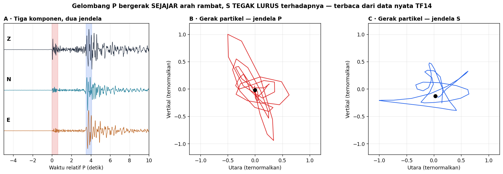

# Minggu 3 — Persamaan Gelombang Seismik; Gelombang P dan S

**Seismologi `PAGF262413`** · Senin 07:15–08:55, Ruang Kelas 209
Pokok Bahasan 2 · **CPMK1** · Bloom **C3**

> **Sasaran.** Mahasiswa dapat (a) menurunkan persamaan gelombang seismik dari persamaan momentum dan Hukum Hooke, (b) menjelaskan dekomposisi potensial dan mengapa ia memisahkan P dari S, (c) menyebutkan kecepatan keduanya dalam parameter elastik, dan (d) **mengenali P dan S dari gerak partikel pada data nyata**.

---

## 0 · Pembuka: ramalan yang menunggu 69 tahun · 10 menit

Di Minggu 1 kita melihat garis waktu: **Poisson meramalkan dua jenis gelombang pada 1828**, murni dari matematika elastisitas. **Oldham baru melihatnya pada seismogram tahun 1897.**

Hari ini kita ulangi penurunan Poisson dalam 40 menit — lalu di §4 kita lihat kedua gelombang itu pada rekaman Yogyakarta 2006, persis seperti yang dilihat Oldham.

---

## 1 · Dari momentum ke gelombang · 25 menit

Hukum Newton untuk elemen medium kontinu:

24973\rho \frac{\partial^2 u_i}{\partial t^2} = \frac{\partial \sigma_{ij}}{\partial x_j} + f_i24973

Masukkan Hukum Hooke isotropik $\sigma_{ij} = \lambda \varepsilon_{kk}\delta_{ij} + 2\mu\varepsilon_{ij}$ dari Minggu 2, lalu ganti regangan dengan turunan perpindahan. Untuk medium homogen tanpa gaya luar:

24973\rho \ddot{\mathbf{u}} = (\lambda + \mu)\,\nabla(\nabla \cdot \mathbf{u}) + \mu \nabla^2 \mathbf{u}24973

Persamaan ini **belum terpisah** — komponen perpindahan masih saling terkait.

---

## 2 · Dekomposisi potensial: pemisahnya · 20 menit

Teorema Helmholtz: setiap medan vektor dapat diuraikan menjadi bagian tak-berotasi dan bagian tak-berdivergensi,

24973\mathbf{u} = \nabla\phi + \nabla \times \boldsymbol{\psi}24973

Masukkan ke persamaan tadi, dan keajaibannya terjadi — persamaannya **pecah menjadi dua persamaan gelombang bebas**:

24973\nabla^2 \phi = \frac{1}{\alpha^2}\ddot{\phi}, \qquad \nabla^2 \boldsymbol{\psi} = \frac{1}{\beta^2}\ddot{\boldsymbol{\psi}}24973

24973\alpha = V_P = \sqrt{\frac{\lambda+2\mu}{\rho}}, \qquad \beta = V_S = \sqrt{\frac{\mu}{\rho}}24973

**Dua gelombang, bukan satu.** Itulah ramalan Poisson.

Karena $\lambda + 2\mu > \mu$ selalu, maka $V_P > V_S$ **selalu** — P tiba lebih dulu, di mana pun, tanpa kecuali. Inilah yang membuat selisih S−P di Minggu 12 dapat dipakai sebagai penggaris jarak.

---

## 3 · Gelombang bidang, bola, dan polarisasi · 20 menit

**Gelombang bidang** $\mathbf{u} = \mathbf{A}\,e^{i(\mathbf{k}\cdot\mathbf{x} - \omega t)}$ adalah alat baku analisis. **Gelombang bola** dari sumber titik meluruh sebagai $1/r$ — dan di Minggu 7 mahasiswa mengukur bahwa peluruhan sebenarnya lebih curam daripada itu.

**Polarisasi:**

| | Arah gerak partikel | Sifat |
|:--|:--|:--|
| **P** | **Sejajar** arah rambat | Mampat–regang, longitudinal |
| **S** | **Tegak lurus** arah rambat | Geser, transversal, punya dua komponen bebas (SV dan SH) |

S punya dua polarisasi bebas — dan pemisahannya menjadi SV dan SH inilah yang memungkinkan rotasi ZNE → ZRT di Minggu 11 serta pemisahan gelombang Love dari Rayleigh di Minggu 5.

---

## 4 · Melihatnya pada data nyata · 20 menit

Stasiun TF14, gempa susulan Yogyakarta 2006. Panel B dan C memplot gerak partikel — utara terhadap vertikal — pada dua jendela: satu tepat setelah P, satu tepat setelah S.

Bentuk lintasan partikel pada jendela P memanjang searah datangnya gelombang; pada jendela S ia berayun pada arah yang berbeda. **Ini bukan gambar buku teks — ini rekaman gempa di Bantul.**

*Aktivitas:* mahasiswa memplot ulang untuk stasiun lain di notebook Minggu 11 dan membandingkan orientasi lintasan partikelnya dengan azimut stasiun.

> Perhatikan juga bahwa polarisasinya **tidak sebersih teori**. Struktur berlapis, konversi gelombang, dan derau membuatnya berantakan. Itu wajar — dan mengetahui seberapa jauh data nyata menyimpang dari model ideal adalah bagian dari keahlian.

---

## Tugas

**T3.1 Prediksi terkunci.** (a) Kalau $\lambda = \mu$, berapa $V_P/V_S$? (b) Berapa nisbah Poisson yang bersesuaian? (c) Bandingkan dengan 1,80 yang diukur di Yogyakarta — batuan di sana lebih kaku atau lebih lunak dari medium Poisson?

**T3.2 Bacaan.** Shearer 3.1–3.6 (**lewati 3.7†**) · Stein & Wysession 2.2 (h. 29), 2.4.1 (h. 53), 2.4.4 (h. 56), 2.4.5 (h. 61).

**T3.3 Demonstrasi.** Jalankan animasi polarisasi P dan S di [Seismo-Live](https://seismo-live.github.io/).

---

## Catatan waktu

| Bagian | Menit | Kumulatif |
|:--|:--:|:--:|
| 0 · Pembuka: ramalan Poisson | 10 | 10 |
| 1 · Momentum ke gelombang | 25 | 35 |
| 2 · Dekomposisi potensial | 20 | 55 |
| 3 · Gelombang bidang, bola, polarisasi | 20 | 75 |
| 4 · Melihatnya pada data nyata | 20 | 95 |
| Penutup dan tanya jawab | 5 | 100 |

**Minggu depan:** apa yang terjadi ketika gelombang menemui batas — Hukum Snell, dan kurva waktu tempuh dari data kalian sendiri.

Seismologi PAGF262413 · Program Studi Sarjana Geofisika FMIPA UGM · Kurikulum 2026
