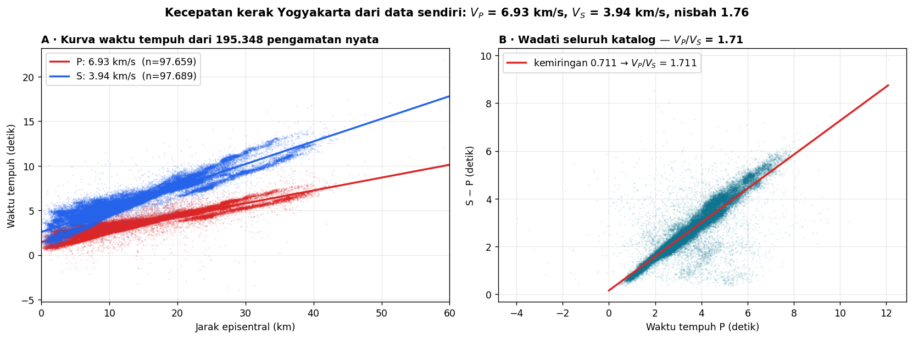

# Minggu 4 — Hukum Snell, Jalur Sinar, dan *Head Wave*

**Seismologi `PAGF262413`** · Senin 07:15–08:55, Ruang Kelas 209
Pokok Bahasan 2 · **CPMK2** · Bloom **C3–C4**

> **Sasaran.** Mahasiswa dapat (a) menerapkan Hukum Snell dan menjelaskan parameter sinar sebagai besaran yang lestari, (b) membaca kurva waktu tempuh untuk memperoleh kecepatan lapisan, (c) menjelaskan pembentukan *head wave* dan dasar seismik refraksi, dan (d) **menurunkan kecepatan kerak Yogyakarta dari 195.348 pengamatan nyata**.

---

## 0 · Pembuka: mengukur kerak bumi dengan penggaris · 10 menit

Ini bukan gambar dari buku. Ini **195.348 pengamatan waktu tiba** dari gempa susulan Yogyakarta 2006 — 97.659 fase P dan 97.689 fase S.

Kemiringan garisnya langsung memberi kecepatan:

| Fase | Kemiringan | Kecepatan semu |
|:--|--:|--:|
| P | 0,144 s/km | **6,93 km/s** |
| S | 0,254 s/km | **3,94 km/s** |

Nisbahnya **1,76** — dan panel B, diagram Wadati atas seluruh katalog, memberi angka yang sebanding.

*Tanyakan:* dari dua kemiringan garis, kita baru saja menyimpulkan sifat elastik kerak bumi sedalam belasan kilometer di bawah kaki kita. Bagaimana itu mungkin tanpa mengebor?

---

## 1 · Hukum Snell dan parameter sinar · 25 menit

Ketika gelombang menyeberangi batas antara dua medium berkecepatan berbeda, sudutnya berubah menurut

25044\frac{\sin i_1}{V_1} = \frac{\sin i_2}{V_2} = p25044

Besaran $p$ ini disebut **parameter sinar** (atau *ray parameter*), dan ia **lestari sepanjang seluruh lintasan** — melewati berapa pun lapisan. Itulah yang membuatnya begitu berguna: satu bilangan mencirikan seluruh perjalanan sebuah sinar.

Untuk medium berlapis mendatar, $p = \sin i / V$ juga sama dengan **kelambatan semu** (*apparent slowness*) yang terukur di permukaan, yaitu $dT/dX$ — kemiringan kurva waktu tempuh.

### Sudut kritis

Ketika $V_2 > V_1$, ada sudut datang saat sinar biasnya merambat **sejajar batas**:

25044i_c = \arcsin\left(\frac{V_1}{V_2}\right)25044

Di atas sudut itu tidak ada lagi sinar yang menembus — seluruh energi terpantul (*total internal reflection*).

---

## 2 · *Head wave* dan seismik refraksi · 20 menit

Tepat pada sudut kritis, gelombang merambat sepanjang batas dengan kecepatan $V_2$ sambil terus-menerus memancarkan energi kembali ke atas. Inilah **gelombang kepala** (*head wave*).

Untuk dua lapis mendatar, waktu tiba gelombang kepala:

25044T = \frac{X}{V_2} + \frac{2h\sqrt{V_2^2 - V_1^2}}{V_1 V_2}25044

Garis lurus dengan kemiringan $1/V_2$ dan intersep yang memuat ketebalan $h$. **Ukur keduanya, dapatkan kecepatan lapisan bawah dan kedalaman batasnya** — itulah seluruh gagasan seismik refraksi, dan cara Mohorovičić menemukan Moho pada 1909.

*Aktivitas kelas (15 menit):* diberikan kurva waktu tempuh dua-lapis di kertas milimeter, mahasiswa mengukur kedua kemiringan dan intersepnya, lalu menghitung $V_1$, $V_2$, dan $h$. Kerja tangan; kalkulator saja.

---

## 3 · Jalur sinar dalam medium bergradien · 20 menit

Di bumi nyata kecepatan naik bertahap, bukan melompat. Sinar melengkung terus-menerus dan akhirnya **berbalik ke atas** pada kedalaman di mana $V(z) = 1/p$ — disebut *turning point*.

Jarak dan waktu tempuh diperoleh dengan integrasi:

25044X(p) = 2\int_0^{z_p} \frac{p\,V\,dz}{\sqrt{1-p^2V^2}}, \qquad T(p) = 2\int_0^{z_p} \frac{dz}{V\sqrt{1-p^2V^2}}25044

Fungsi $\tau(p) = T - pX$ sering lebih mudah dipakai karena selalu bernilai tunggal.

### Zona berkecepatan rendah

Kalau kecepatan justru **turun** pada suatu kedalaman, tidak ada sinar yang berbalik di sana — lapisan itu menjadi **tak terlihat** oleh gelombang langsung, dan muncul *shadow zone* pada kurva waktu tempuh. Bumi punya beberapa; yang paling terkenal ada di astenosfer.

> Ini contoh lain dari pola yang berulang sepanjang semester: **ada hal yang secara mendasar tidak dapat diketahui dari data yang kita punya.**

---

## 4 · Prinsip Fermat dan Huygens · 15 menit

**Fermat:** sinar menempuh lintasan berwaktu-tempuh stasioner. Konsekuensi praktisnya besar — galat kecil pada lintasan hanya menghasilkan galat orde kedua pada waktu tempuh, yang membuat waktu tiba jauh lebih andal daripada amplitudo.

**Huygens:** tiap titik pada muka gelombang menjadi sumber sekunder. Dari sini difraksi dapat dijelaskan — termasuk mengapa gelombang tetap sampai ke daerah yang secara geometris terhalang.

---

## Tugas

**T4.1 Prediksi terkunci.** (a) Kalau $V_1 = 4$ dan $V_2 = 6$ km/s, berapa sudut kritisnya? (b) Pada jarak berapa gelombang kepala mulai mendahului gelombang langsung? (c) Kalau kecepatan turun terhadap kedalaman, apa yang terjadi pada sinar?

**T4.2 Hitungan.** Dari kurva waktu tempuh yang dibagikan, tentukan $V_1$, $V_2$, dan kedalaman Moho. Bandingkan dengan nilai terbitan untuk Jawa Tengah.

**T4.3 Bacaan.** Shearer 4.1–4.4 (**lewati 4.6†**) · Stein & Wysession 2.5.3–2.5.10 (h. 65–72), 3.2.1 *Flat layer method* (h. 120).

---

## Catatan waktu

| Bagian | Menit | Kumulatif |
|:--|:--:|:--:|
| 0 · Pembuka: kurva waktu tempuh nyata | 10 | 10 |
| 1 · Snell dan parameter sinar | 25 | 35 |
| 2 · *Head wave* dan refraksi (termasuk kerja tangan) | 20 | 55 |
| 3 · Medium bergradien dan zona kecepatan rendah | 20 | 75 |
| 4 · Fermat dan Huygens | 15 | 90 |
| Penutup | 10 | 100 |

**Minggu depan:** apa yang terjadi pada energinya di batas — koefisien refleksi dan transmisi — serta gelombang yang hanya hidup di permukaan.

Seismologi PAGF262413 · Program Studi Sarjana Geofisika FMIPA UGM · Kurikulum 2026
