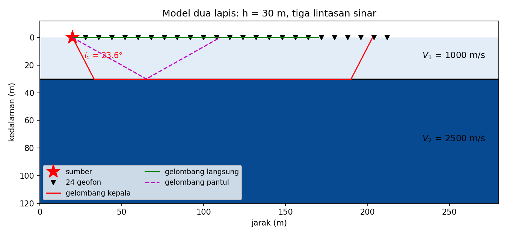
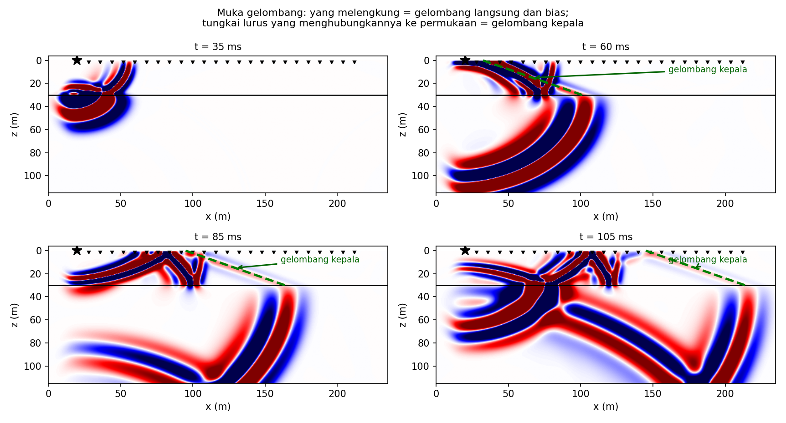
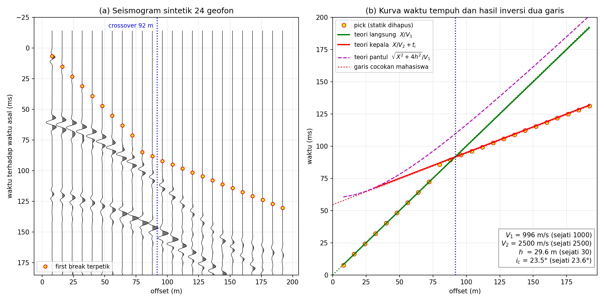

# Minggu 4 — Hukum Snell, Jalur Sinar, dan *Head Wave*

**Seismologi `PAGF262413`** · Senin 07:15–08:55, Ruang Kelas 209
Pokok Bahasan 2 · **CPMK2** · Bloom **C3–C4**

> **Sasaran.** Mahasiswa dapat (a) menerapkan Hukum Snell dan menjelaskan parameter sinar sebagai besaran yang lestari, (b) membaca kurva waktu tempuh untuk memperoleh kecepatan lapisan, (c) menjelaskan pembentukan *head wave* dan dasar seismik refraksi, (d) **menurunkan kecepatan kerak Yogyakarta dari 195.348 pengamatan nyata**, dan (e) **memodelkan sendiri perambatan gelombang pada model dua lapis dan menguji ramalan Snell terhadap seismogram hasil simulasi**.

---

## 0 · Pembuka: mengukur kerak bumi dengan penggaris · 10 menit


Ini bukan gambar dari buku. Ini **195.348 pengamatan waktu tiba** dari gempa susulan Yogyakarta 2006 — 97.659 fase P dan 97.689 fase S.

Kemiringan garisnya langsung memberi kecepatan:

| Fase | Kemiringan | Kecepatan semu |
|:--|--:|--:|
| P | 0,144 s/km | **6,93 km/s** |
| S | 0,254 s/km | **3,94 km/s** |

Nisbahnya **1,76** — dan panel B, diagram Wadati atas seluruh katalog, memberi angka yang sebanding.

*Tanyakan:* dari dua kemiringan garis, kita baru saja menyimpulkan sifat elastik kerak bumi sedalam belasan kilometer di bawah kaki kita. Bagaimana itu mungkin tanpa mengebor?

---

## 1 · Hukum Snell dan parameter sinar · 25 menit

Ketika gelombang menyeberangi batas antara dua medium berkecepatan berbeda, sudutnya berubah menurut

```math
\frac{\sin i_1}{V_1} = \frac{\sin i_2}{V_2} = p
```

Besaran $p$ ini disebut **parameter sinar** (atau *ray parameter*), dan ia **lestari sepanjang seluruh lintasan** — melewati berapa pun lapisan. Itulah yang membuatnya begitu berguna: satu bilangan mencirikan seluruh perjalanan sebuah sinar.

Untuk medium berlapis mendatar, $p = \sin i / V$ juga sama dengan **kelambatan semu** (*apparent slowness*) yang terukur di permukaan, yaitu $dT/dX$ — kemiringan kurva waktu tempuh.

### Sudut kritis

Ketika $V_2 > V_1$, ada sudut datang saat sinar biasnya merambat **sejajar batas**:

```math
i_c = \arcsin\left(\frac{V_1}{V_2}\right)
```

Di atas sudut itu tidak ada lagi sinar yang menembus — seluruh energi terpantul (*total internal reflection*).

---

## 2 · *Head wave* dan seismik refraksi · 20 menit

Tepat pada sudut kritis, gelombang merambat sepanjang batas dengan kecepatan $V_2$ sambil terus-menerus memancarkan energi kembali ke atas. Inilah **gelombang kepala** (*head wave*).

Untuk dua lapis mendatar, waktu tiba gelombang kepala:

```math
T = \frac{X}{V_2} + \frac{2h\sqrt{V_2^2 - V_1^2}}{V_1 V_2}
```

Garis lurus dengan kemiringan $1/V_2$ dan intersep yang memuat ketebalan $h$. **Ukur keduanya, dapatkan kecepatan lapisan bawah dan kedalaman batasnya** — itulah seluruh gagasan seismik refraksi, dan cara Mohorovičić menemukan Moho pada 1909.

*Aktivitas kelas (15 menit):* diberikan kurva waktu tempuh dua-lapis di kertas milimeter, mahasiswa mengukur kedua kemiringan dan intersepnya, lalu menghitung $V_1$, $V_2$, dan $h$. Kerja tangan; kalkulator saja.

---

## 3 · Jalur sinar dalam medium bergradien · 15 menit

Di bumi nyata kecepatan naik bertahap, bukan melompat. Sinar melengkung terus-menerus dan akhirnya **berbalik ke atas** pada kedalaman di mana $V(z) = 1/p$ — disebut *turning point*.

Jarak dan waktu tempuh diperoleh dengan integrasi:

```math
X(p) = 2\int_0^{z_p} \frac{p\,V\,dz}{\sqrt{1-p^2V^2}}, \qquad T(p) = 2\int_0^{z_p} \frac{dz}{V\sqrt{1-p^2V^2}}
```

Fungsi $\tau(p) = T - pX$ sering lebih mudah dipakai karena selalu bernilai tunggal.

### Zona berkecepatan rendah

Kalau kecepatan justru **turun** pada suatu kedalaman, tidak ada sinar yang berbalik di sana — lapisan itu menjadi **tak terlihat** oleh gelombang langsung, dan muncul *shadow zone* pada kurva waktu tempuh. Bumi punya beberapa; yang paling terkenal ada di astenosfer.

> Ini contoh lain dari pola yang berulang sepanjang semester: **ada hal yang secara mendasar tidak dapat diketahui dari data yang kita punya.**

---

## 4 · Membuktikannya sendiri: pemodelan numerik dua lapis · 20 menit

Sampai di sini semuanya rumus. Sekarang kita **memaksa persamaan gelombang menghasilkan ketiga
gelombang itu sendiri**, lalu memeriksa apakah Hukum Snell benar-benar meramalkan apa yang keluar.

Yang dimodelkan adalah survei refraksi dangkal yang paling lazim: satu tembakan di permukaan,
**24 geofon**, dua lapis mendatar.

| Besaran | Nilai | |
|:--|--:|:--|
| $V_1$ pelapukan | 1000 m/s | |
| $V_2$ batuan dasar | 2500 m/s | |
| Tebal $h$ | 30 m | |
| Sumber | Ricker 100 Hz di permukaan | $\lambda_1$ = 10 m, jauh lebih kecil daripada $h$ |
| Geofon | 24 buah, offset 8–192 m, spasi 8 m | melewati crossover |



Tiga lintasan pada gambar itu persis tiga fase yang akan muncul di rekaman: hijau menyusur permukaan
(langsung), ungu turun-naik memantul di batas (pantul), merah turun pada sudut kritis lalu merayap
di batas sebelum naik lagi (kepala).

**Mengapa 100 Hz.** Panjang gelombang harus jauh lebih pendek daripada lapisan yang ingin dilihat.
Pada 100 Hz, $\lambda_1$ = 10 m terhadap $h$ = 30 m: ketiga fase terpisah bersih. Turunkan ke 40 Hz
dan $\lambda_1$ menjadi 25 m — hampir setebal lapisannya sendiri — sehingga fase saling menindih dan
seismogramnya kabur. Ini bukan urusan estetika: itulah alasan survei refraksi teknik sipil memakai
palu godam dan geofon 100 Hz, bukan sensor periode panjang.

### 4.1 Skema numeriknya

Skema acuannya **SPECFEM2D** — metode elemen spektral, yang dipakai luas untuk seismologi karena
akurasinya tinggi pada batas bebas dan geometri berlapis. Berkas masukannya lengkap di
[`skrip/w04_specfem2d/`](skrip/w04_specfem2d/): `interfaces_dua_lapis.dat`, `SOURCE`, `STATIONS`
24 geofon, dan `siapkan_par_file.py` yang menyunting `Par_file` bawaan instalasi kalian.

Bagi yang belum memasang SPECFEM2D, tersedia **pengganti mandiri** berbasis beda-hingga akustik yang
menjalankan eksperimen yang sama dan selesai dalam delapan detik:

```bash
python3 skrip/w04_gelombang_dua_lapis.py
```

> Rekaman yang tersimpan di `data/W04_seismogram_dua_lapis.npz` — yang dipakai di notebook praktik —
> berasal dari skrip beda-hingga itu, **bukan** dari SPECFEM2D. Berkas SPECFEM2D disediakan untuk
> kalian jalankan sendiri dan belum diuji-jalan oleh pengampu.

### 4.2 Melihat gelombang kepala terbentuk



Empat potret medan gelombang. Perhatikan urutannya:

- **t = 35 ms** — muka gelombang masih bulat di lapisan atas, baru menyentuh batas.
- **t = 60 ms** — muka gelombang di lapisan bawah sudah **berlari mendahului** karena $V_2 > V_1$.
- **t = 85 dan 105 ms** — muncul **tungkai lurus** yang menghubungkan muka bias yang berlari di batas
  ke permukaan. Itulah **gelombang kepala**, dan garis putus-putus hijau adalah ramalan Snell untuk
  posisinya: bersudut $i_c$ terhadap **bidang batas**, ujung bawahnya menempel pada muka bias.

Perhatikan pula amplitudonya: tungkai itu jauh lebih pucat daripada muka gelombang lain. Gelombang
kepala memang lemah — ia terus-menerus membocorkan energi ke atas sepanjang perjalanannya di batas.
Itu sebabnya *first break* di offset jauh sulit dipetik, dan mengapa ambang pemetik harus rendah.

### 4.3 Rekaman dan ujinya terhadap Snell



Panel (a) adalah penampang rekaman 24 geofon dengan *first break* terpetik. Panel (b)
membandingkannya dengan ketiga kurva Snell:

```math
T_\text{langsung} = \frac{X}{V_1}, \qquad
T_\text{pantul}   = \frac{\sqrt{X^2+4h^2}}{V_1}, \qquad
T_\text{kepala}   = \frac{X}{V_2} + t_i
```

Tiga hal yang harus kalian baca dari panel (b):

1. **Patahan kemiringan pada 92 m.** Di bawah jarak itu yang tiba pertama adalah gelombang langsung;
   di atasnya gelombang kepala. Itulah *crossover distance* dari §2, sekarang terlihat sebagai
   patahan nyata pada data, bukan sebagai rumus.
2. **Kurva pantul melengkung, dua lainnya lurus** — dan kurva pantul mendekati kurva langsung secara
   asimtotik pada offset besar, karena pada jarak jauh lintasan pantul hampir berimpit dengan
   lintasan langsung.
3. **Inversi dua garis memulihkan modelnya.** Dari kemiringan dan intersep saja:

| Besaran | Dipulihkan | Sejati | Galat |
|:--|--:|--:|--:|
| $V_1$ | 996 m/s | 1000 m/s | −0,4% |
| $V_2$ | 2500 m/s | 2500 m/s | −0,0% |
| $h$ | 29,6 m | 30 m | −1,3% |
| $i_c$ | 23,5° | 23,58° | −0,3% |

Inilah keseluruhan seismik refraksi dalam satu gambar: dari dua kemiringan garis dan satu intersep,
kita memperoleh kecepatan dua lapisan dan kedalaman batasnya — tanpa mengebor sedikit pun. Yang
Mohorovičić lakukan pada 1909 persis ini, dengan skala kilometer alih-alih meter.

### 4.4 Praktiknya

Kerjakan [`Minggu04_Praktik.ipynb`](Minggu04_Praktik.ipynb). Kalian **tidak** diberi $V_1$, $V_2$,
dan $h$ — angka itu terkunci di `data/W04_model_sejati.json` dan baru boleh dibuka di bagian terakhir.
Notebook itu meminta kalian memetik, membalikkan, meramalkan ulang dengan Snell, lalu **menumpangkan
ramalan itu ke gelombang simulasi** dan menilai sendiri seberapa cocok.

Dua jebakan sengaja dipasang di sana, dan keduanya nyata di lapangan:

- **Geofon di sekitar crossover** memberi pick yang tidak mewakili cabang mana pun, karena dua fase
  tiba nyaris bersamaan dan saling mengganggu. Harus dibuang.
- **Garis gelombang langsung wajib lewat titik asal.** Kalau intersepnya bukan nol, itu statik — dan
  statik yang tidak dihapus tidak merusak kecepatan, tetapi merusak kedalaman.

---

## 5 · Prinsip Fermat dan Huygens · 10 menit

**Fermat:** sinar menempuh lintasan berwaktu-tempuh stasioner. Konsekuensi praktisnya besar — galat kecil pada lintasan hanya menghasilkan galat orde kedua pada waktu tempuh, yang membuat waktu tiba jauh lebih andal daripada amplitudo.

**Huygens:** tiap titik pada muka gelombang menjadi sumber sekunder. Dari sini difraksi dapat dijelaskan — termasuk mengapa gelombang tetap sampai ke daerah yang secara geometris terhalang.

---

## Tugas

**T4.1 Prediksi terkunci.** (a) Kalau $V_1 = 4$ dan $V_2 = 6$ km/s, berapa sudut kritisnya? (b) Pada jarak berapa gelombang kepala mulai mendahului gelombang langsung? (c) Kalau kecepatan turun terhadap kedalaman, apa yang terjadi pada sinar?

**T4.2 Hitungan.** Dari kurva waktu tempuh yang dibagikan, tentukan $V_1$, $V_2$, dan kedalaman Moho. Bandingkan dengan nilai terbitan untuk Jawa Tengah.

**T4.3 Pemodelan numerik.** Kerjakan [`Minggu04_Praktik.ipynb`](Minggu04_Praktik.ipynb) sampai
Bagian 6. Laporkan $V_1$, $V_2$, $h$, dan $i_c$ **dengan selang keyakinan 80%**, lalu jawab: apakah
nilai sejatinya masuk ke dalam selang kalian? Kalau tidak, bagian mana dari ketidakpastian yang
kalian remehkan?

**T4.4 Percobaan sendiri (pilihan, nilai tambahan).** Ubah satu parameter di
`skrip/w04_gelombang_dua_lapis.py` lalu jalankan ulang, dan jelaskan perubahan pada seismogramnya:
(a) turunkan `F0` ke 40 Hz — mengapa fase-fasenya jadi menindih? (b) buat $V_2$ = 1200 m/s — ke mana
crossover-nya pindah, dan apakah masih tertangkap 24 geofon? (c) buat lapisan bawah **lebih lambat**
daripada lapisan atas — ke mana gelombang kepalanya menghilang, dan mengapa itu sesuai §3?

**T4.5 Bacaan.** Shearer 4.1–4.4 (**lewati 4.6†**) · Stein & Wysession 2.5.3–2.5.10 (h. 65–72), 3.2.1 *Flat layer method* (h. 120).

---

## Catatan waktu

| Bagian | Menit | Kumulatif |
|:--|:--:|:--:|
| 0 · Pembuka: kurva waktu tempuh nyata | 10 | 10 |
| 1 · Snell dan parameter sinar | 25 | 35 |
| 2 · *Head wave* dan refraksi (termasuk kerja tangan) | 20 | 55 |
| 3 · Medium bergradien dan zona kecepatan rendah | 15 | 70 |
| 4 · **Pemodelan numerik dua lapis** (demo + baca gambar) | 20 | 90 |
| 5 · Fermat dan Huygens | 10 | 100 |

**Minggu depan:** apa yang terjadi pada energinya di batas — koefisien refleksi dan transmisi — serta gelombang yang hanya hidup di permukaan.

<sub>Seismologi PAGF262413 · Program Studi Sarjana Geofisika FMIPA UGM · Kurikulum 2026</sub>
