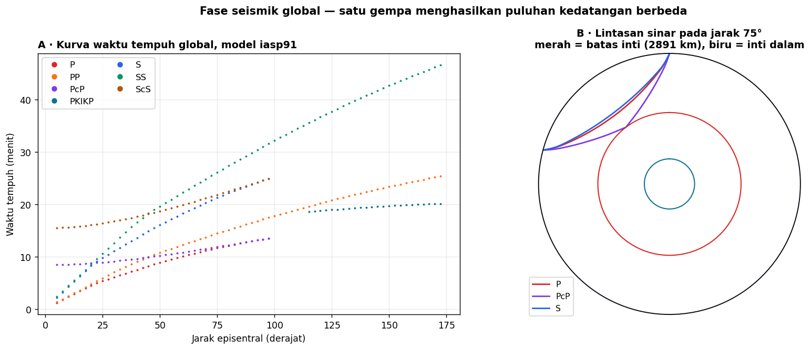

# Minggu 6 — Struktur Dalam Bumi dan Fase Seismik Global

**Seismologi `PAGF262413`** · Senin 07:15–08:55, Ruang Kelas 209
Pokok Bahasan 3 · **CPMK2** · Bloom **C4**

> **Sasaran.** Mahasiswa dapat (a) membaca tata nama fase seismik dan menelusuri lintasannya, (b) menjelaskan bagaimana diskontinuitas besar bumi ditemukan dari kurva waktu tempuh, (c) menjelaskan *shadow zone* inti dan apa yang dibuktikannya, dan (d) memakai model referensi seperti iasp91 atau PREM untuk meramalkan waktu tiba.

---

## 0 · Pembuka: dua belas kedatangan dari satu gempa · 10 menit

Satu gempa. Satu stasiun. **Belasan kedatangan berbeda**, masing-masing menempuh lintasan sendiri melalui bagian bumi yang berbeda.

Panel B menunjukkan tiga di antaranya pada jarak 75°: P menembus mantel, PcP memantul di batas inti, S merambat lebih lambat pada lintasan serupa.

*Tanyakan:* kalau kalian hanya punya satu seismogram dari satu stasiun, berapa banyak yang bisa kalian pelajari tentang bagian dalam bumi? Jawabannya jauh lebih banyak daripada dugaan mereka — karena tiap fase adalah satu sampel berbeda.

---

## 1 · Tata nama fase · 25 menit

Aturannya sistematis dan patut dihafal:

| Huruf | Arti |
|:--|:--|
| **P**, **S** | Gelombang badan di mantel |
| **c** | Pantulan di batas inti–mantel (CMB) |
| **K** | Melewati inti **luar** (hanya P, karena inti luar cair) |
| **I**, **J** | Melewati inti **dalam** (P dan S) |
| **i** | Pantulan di batas inti luar–inti dalam |
| huruf ganda | Pantulan di permukaan (PP, SS) |
| huruf kecil awal | Fase kedalaman: pP, sS — naik dulu, pantul di permukaan |

Contoh membacanya: **PKIKP** = P di mantel → inti luar → inti dalam → inti luar → mantel. **ScS** = S turun, memantul di CMB, kembali sebagai S.

**Fase kedalaman pP dan sS sangat berguna praktis:** selisih waktunya terhadap P memberi **kedalaman hiposenter** jauh lebih baik daripada inversi biasa. Ini jawaban langsung atas masalah kedalaman yang menyulitkan di Minggu 12 — untuk gempa jauh, fase kedalaman menyelamatkannya.

### Fase kerak

Untuk jarak dekat: **Pg** (langsung di kerak atas), **Pn** (kepala di Moho), **PmP** (pantulan di Moho). Perpotongan Pg dan Pn pada kurva waktu tempuh memberi kedalaman Moho — persis metode Minggu 4.

---

## 2 · Bagaimana bumi terpetakan · 25 menit

Tiga penemuan besar, semuanya dari kurva waktu tempuh:

| Tahun | Penemu | Temuan | Bukti |
|:--|:--|:--|:--|
| 1909 | Mohorovičić | **Moho**, batas kerak–mantel | Dua garis pada kurva waktu tempuh gempa Kupa Valley |
| 1912 | Gutenberg | Batas inti pada **2891 km** | *Shadow zone* P antara 103° dan 143° |
| 1936 | Lehmann | **Inti dalam yang padat** | Kedatangan lemah di dalam shadow zone (PKIKP) |

### *Shadow zone*: bukti bahwa inti itu cair

Antara 103° dan 143° dari sumber, gelombang P langsung **tidak terdeteksi**. Sebabnya: kecepatan turun tajam saat masuk inti luar, sehingga sinar dibelokkan menjauh.

Dan gelombang **S sama sekali tidak menembus** inti luar. Kembali ke Minggu 2: $V_S = \sqrt{\mu/\rho}$, dan zat cair punya $\mu = 0$. **Inti luar bumi cair — dibuktikan bukan dengan mengebor, melainkan dengan gelombang yang tidak datang.**

> Ini salah satu penalaran terindah dalam ilmu kebumian: kesimpulan terkuat justru ditarik dari **ketiadaan** data.

---

## 3 · Model referensi bumi · 20 menit

**PREM** (*Preliminary Reference Earth Model*, Dziewonski & Anderson 1981) dan **iasp91** adalah model satu-dimensi: kecepatan, densitas, dan atenuasi sebagai fungsi kedalaman saja.

Lapisan utamanya: kerak, mantel atas, zona transisi (diskontinuitas 410 dan 660 km), mantel bawah, D″, inti luar, inti dalam.

**Model referensi dipakai untuk apa:**

1. Meramalkan waktu tiba — inilah yang dilakukan `obspy.taup` pada panel A
2. Menjadi patokan tomografi: yang dipetakan adalah **simpangan** terhadap model referensi
3. Menjadi model awal penentuan lokasi (Minggu 12)

> Ingatlah keterbatasannya. Model 1-D menganggap bumi bersimetri bola sempurna. Padahal justru **penyimpangannya** — slab yang menghunjam, gumpalan panas — yang paling menarik. Katalog lokasi apa pun membawa sidik jari model yang dipakainya, seperti yang terlihat pada penampang VELEST di Minggu 12.

---

## 4 · Membaca seismogram teleseismik · 15 menit

*Aktivitas:* mahasiswa mengunduh satu rekaman gempa jauh dari [IRIS/EarthScope DMC](https://ds.iris.edu/ds/nodes/dmc/), menghitung jarak episentralnya, lalu memakai `obspy.taup` untuk meramalkan waktu tiba P, PP, S, dan ScS — dan menandainya sendiri pada seismogram.

Ini latihan yang jujur: sebagian fase akan mudah dikenali, sebagian lagi tersembunyi dalam derau. Keduanya pelajaran.

---

## Tugas

**T6.1 Prediksi terkunci.** (a) Berapa lama P menempuh 90°? (b) Fase mana yang lebih dulu tiba pada 60°, PP atau S? (c) Mengapa tidak ada fase bernama "SKS" yang melewati inti sebagai S?

**T6.2 Bacaan.** Shearer 4.5, 4.7, 4.8, Appendix A (PREM) · Stein & Wysession 3.4.1–3.4.3 (h. 157–161), 3.5.1–3.5.5 (h. 163–174).

**T6.3 Praktik.** Pelabelan fase pada rekaman teleseismik nyata dengan `obspy.taup`.

---

## Catatan waktu

| Bagian | Menit | Kumulatif |
|:--|:--:|:--:|
| 0 · Pembuka: belasan kedatangan | 10 | 10 |
| 1 · Tata nama fase | 25 | 35 |
| 2 · Bagaimana bumi terpetakan | 25 | 60 |
| 3 · Model referensi | 20 | 80 |
| 4 · Membaca seismogram teleseismik | 15 | 95 |
| Penutup | 5 | 100 |

**Minggu depan:** mengapa amplitudo berkurang lebih cepat daripada yang diramalkan geometri — atenuasi dan derau bumi.

Seismologi PAGF262413 · Program Studi Sarjana Geofisika FMIPA UGM · Kurikulum 2026
