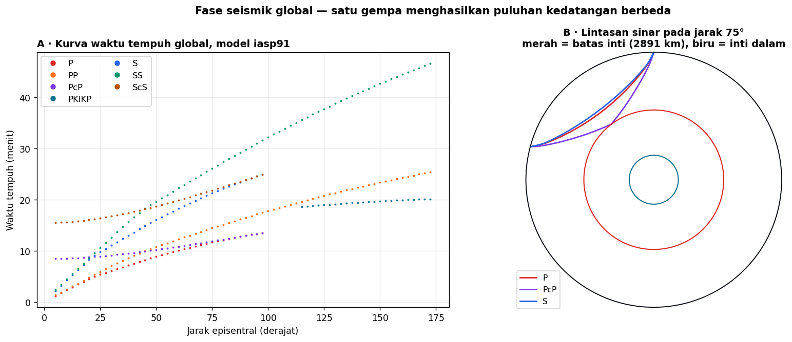
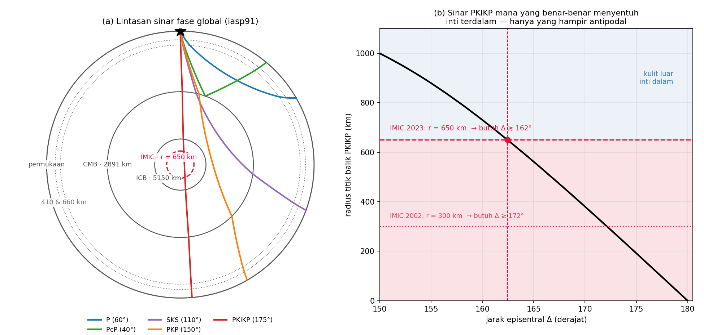
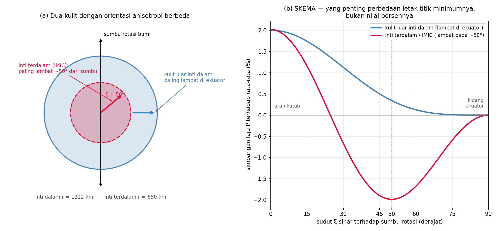

# Minggu 6 — Struktur Dalam Bumi dan Fase Seismik Global

**Seismologi `PAGF262413`** · Senin 07:15–08:55, Ruang Kelas 209
Pokok Bahasan 3 · **CPMK2** · Bloom **C4**

> **Sasaran.** Mahasiswa dapat (a) membaca tata nama fase seismik dan menelusuri lintasannya, (b) menjelaskan bagaimana diskontinuitas besar bumi ditemukan dari kurva waktu tempuh, (c) menjelaskan *shadow zone* inti dan apa yang dibuktikannya, (d) memakai model referensi seperti iasp91 atau PREM untuk meramalkan waktu tiba, (e) **menyebutkan enam keluarga metode pencitraan interior bumi beserta jangkauan dan keterbatasannya**, dan (f) **menjelaskan bukti seismologis bagi inti terdalam (IMIC) dan mengapa buktinya sulit diperoleh**.

> **Notebook pendamping:** [`Struktur.ipynb`](Struktur.ipynb) — pengantar struktur bumi dari seismologi, lengkap dengan latihan menghitung kecepatan P di kerak dan mantel dari rekaman YOGI (22,5 km) dan DNP (500 km) gempa Yogyakarta 2006. Latihan itu adalah Hukum Snell Minggu 4 yang dipakai pada skala benua: dua stasiun, dua lapisan, satu jawaban.

---

## 0 · Pembuka: dua belas kedatangan dari satu gempa · 10 menit



Satu gempa. Satu stasiun. **Belasan kedatangan berbeda**, masing-masing menempuh lintasan sendiri melalui bagian bumi yang berbeda.

Panel B menunjukkan tiga di antaranya pada jarak 75°: P menembus mantel, PcP memantul di batas inti, S merambat lebih lambat pada lintasan serupa.

*Tanyakan:* kalau kalian hanya punya satu seismogram dari satu stasiun, berapa banyak yang bisa kalian pelajari tentang bagian dalam bumi? Jawabannya jauh lebih banyak daripada dugaan mereka — karena tiap fase adalah satu sampel berbeda.

---

## 1 · Tata nama fase · 20 menit

Aturannya sistematis dan patut dihafal:

| Huruf | Arti |
|:--|:--|
| **P**, **S** | Gelombang badan di mantel |
| **c** | Pantulan di batas inti–mantel (CMB) |
| **K** | Melewati inti **luar** (hanya P, karena inti luar cair) |
| **I**, **J** | Melewati inti **dalam** (P dan S) |
| **i** | Pantulan di batas inti luar–inti dalam |
| huruf ganda | Pantulan di permukaan (PP, SS) |
| huruf kecil awal | Fase kedalaman: pP, sS — naik dulu, pantul di permukaan |

Contoh membacanya: **PKIKP** = P di mantel → inti luar → inti dalam → inti luar → mantel. **ScS** = S turun, memantul di CMB, kembali sebagai S.

**Fase kedalaman pP dan sS sangat berguna praktis:** selisih waktunya terhadap P memberi **kedalaman hiposenter** jauh lebih baik daripada inversi biasa. Ini jawaban langsung atas masalah kedalaman yang menyulitkan di Minggu 12 — untuk gempa jauh, fase kedalaman menyelamatkannya.

### Fase kerak

Untuk jarak dekat: **Pg** (langsung di kerak atas), **Pn** (kepala di Moho), **PmP** (pantulan di Moho). Perpotongan Pg dan Pn pada kurva waktu tempuh memberi kedalaman Moho — persis metode Minggu 4.

---

## 2 · Bagaimana bumi terpetakan · 15 menit

Tiga penemuan besar, semuanya dari kurva waktu tempuh:

| Tahun | Penemu | Temuan | Bukti |
|:--|:--|:--|:--|
| 1909 | Mohorovičić | **Moho**, batas kerak–mantel | Dua garis pada kurva waktu tempuh gempa Kupa Valley |
| 1912 | Gutenberg | Batas inti pada **2891 km** | *Shadow zone* P antara 103° dan 143° |
| 1936 | Lehmann | **Inti dalam yang padat** | Kedatangan lemah di dalam shadow zone (PKIKP) |

### *Shadow zone*: bukti bahwa inti itu cair

Antara 103° dan 143° dari sumber, gelombang P langsung **tidak terdeteksi**. Sebabnya: kecepatan turun tajam saat masuk inti luar, sehingga sinar dibelokkan menjauh.

Dan gelombang **S sama sekali tidak menembus** inti luar. Kembali ke Minggu 2: $V_S = \sqrt{\mu/\rho}$, dan zat cair punya $\mu = 0$. **Inti luar bumi cair — dibuktikan bukan dengan mengebor, melainkan dengan gelombang yang tidak datang.**

> Ini salah satu penalaran terindah dalam ilmu kebumian: kesimpulan terkuat justru ditarik dari **ketiadaan** data.

---

## 3 · Model referensi bumi · 10 menit

**PREM** (*Preliminary Reference Earth Model*, Dziewonski & Anderson 1981) dan **iasp91** adalah model satu-dimensi: kecepatan, densitas, dan atenuasi sebagai fungsi kedalaman saja.

Lapisan utamanya: kerak, mantel atas, zona transisi (diskontinuitas 410 dan 660 km), mantel bawah, D″, inti luar, inti dalam.

**Model referensi dipakai untuk apa:**

1. Meramalkan waktu tiba — inilah yang dilakukan `obspy.taup` pada panel A
2. Menjadi patokan tomografi: yang dipetakan adalah **simpangan** terhadap model referensi
3. Menjadi model awal penentuan lokasi (Minggu 12)

> Ingatlah keterbatasannya. Model 1-D menganggap bumi bersimetri bola sempurna. Padahal justru **penyimpangannya** — slab yang menghunjam, gumpalan panas — yang paling menarik. Katalog lokasi apa pun membawa sidik jari model yang dipakainya, seperti yang terlihat pada penampang VELEST di Minggu 12.

---

## 4 · Enam cara mencitrakan bagian dalam bumi · 25 menit

Sampai bagian 3, seluruh bumi kita ringkas menjadi satu kurva $v(z)$. Itu model 1-D — berguna,
tetapi menghapus justru hal yang paling menarik: slab yang menghunjam, gumpalan panas, dan
ketidakteraturan inti. Bagian ini mengumpulkan perkakas yang dipakai seismologi untuk melihatnya.

Setiap metode adalah **jawaban atas satu pertanyaan berbeda**, dengan jangkauan dan kebutaan
masing-masing. Tidak ada satu pun yang unggul untuk semuanya.

| # | Metode | Yang diukur | Yang dihasilkan | Jangkauan | Kebutaan utamanya |
|:--:|:--|:--|:--|:--|:--|
| 1 | **Tomografi waktu tempuh** | residual waktu tiba P dan S | peta 3-D simpangan kecepatan | kerak → mantel bawah | cakupan sinar tak merata; struktur ter-*smear* sepanjang sinar |
| 2 | **Tomografi gelombang permukaan & *ambient noise*** | kurva dispersi fase/grup | $V_S(z)$, sangat baik di mantel atas | 0 → ~300 km | resolusi vertikal rendah; tidak melihat inti |
| 3 | **Fungsi penerima** (*receiver function*) | konversi P→S di batas | kedalaman Moho dan 410/660 **di bawah stasiun** | kerak & mantel atas | hanya di titik stasiun; ada *trade-off* kedalaman–$V_P/V_S$ |
| 4 | **Prekursor SS dan PP** | pantulan bawah-permukaan sebelum fase utama | topografi 410 dan 660 **global**, termasuk di bawah samudra | zona transisi | amplitudo sangat kecil; butuh penumpukan ribuan rekaman |
| 5 | **Mode normal / osilasi bebas** | frekuensi "dentang" seluruh bumi | $\rho(z)$ — **satu-satunya** jalan menuju densitas | seluruh bumi | hanya struktur berskala sangat besar |
| 6 | **Inversi bentuk gelombang penuh** (*adjoint*) | seluruh bentuk gelombang, bukan hanya waktu tiba | model 3-D paling tajam yang kita punya | kerak → inti | biaya komputasi sangat besar; perlu solver kelas SPECFEM |
| 7 | **Korelasi coda dan derau** | medan gelombang coda/derau yang ditumpuk antar-stasiun | fase eksotis yang **tak terlihat** pada rekaman tunggal | inti dalam | hasilnya statistik atas banyak rekaman, bukan satu seismogram |

### 4.1 Tomografi: melihat lewat ribuan sinar

Gagasannya sederhana. Kalau gelombang tiba **lebih cepat** daripada ramalan model referensi, berarti
ia melewati sesuatu yang lebih cepat — biasanya lebih dingin. Kumpulkan jutaan residual dari banyak
gempa dan banyak stasiun, lalu selesaikan sistem persamaan besar untuk memperoleh $\delta v/v$ di
tiap sel.

```math
\delta t_i = \sum_j G_{ij}\,\frac{\delta v_j}{v_j}
```

Matriks $G$ memuat panjang sinar ke-$i$ di dalam sel ke-$j$ — persis jalur sinar yang kita hitung di
Minggu 4. **Inilah mengapa Hukum Snell penting:** tanpa kemampuan meramalkan jalur sinar, tidak ada
tomografi.

Tetapi perhatikan bentuk $G$-nya. Gempa terkumpul di tepi lempeng, stasiun terkumpul di daratan dan
di negara kaya. Ada sel yang dilewati ribuan sinar, ada yang tidak dilewati satu pun. **Peta tomografi
yang terlihat mulus belum tentu ter-resolusi mulus** — sering kali kemulusan itu berasal dari
*damping* yang dipasang demi menstabilkan inversi. Karena itu setiap makalah tomografi yang serius
menyertakan *checkerboard test*: masukkan pola kotak-kotak buatan, lihat berapa banyak yang berhasil
dipulihkan.

> Ini wajah lain dari pesan yang berulang sepanjang semester: **yang tidak disampel, tidak diketahui.**
> Sama seperti zona berkecepatan rendah di Minggu 4 dan *shadow zone* di bagian 2.

### 4.2 Fungsi penerima dan prekursor: memburu batas, bukan kecepatan

Tomografi pandai memetakan kecepatan yang berubah perlahan, tetapi **buruk menemukan batas tajam**.
Untuk batas, dipakai gelombang terkonversi dan terpantul — yang di Minggu 5 kalian pelajari
koefisiennya.

**Fungsi penerima** memakai P teleseismik yang terkonversi menjadi S di batas bawah stasiun. Selisih
waktu Ps terhadap P memberi kedalaman batas; ditumpuk atas banyak gempa dengan berbagai jarak,
diperoleh kedalaman Moho dan nisbah $V_P/V_S$ sekaligus (*H–κ stacking*). Teknik ini murah — satu
stasiun tiga komponen sudah cukup — sehingga paling banyak dipakai untuk memetakan kerak Indonesia.

**Prekursor SS** memakai gelombang yang memantul di sisi bawah diskontinuitas 410 dan 660, tiba
**sebelum** SS utama. Amplitudonya sekitar 1% dari SS, jadi mustahil dilihat pada satu rekaman —
harus ditumpuk atas ribuan. Imbalannya besar: titik pantulnya ada di tengah samudra, tempat tidak
ada stasiun sama sekali.

### 4.3 Mode normal: bumi sebagai lonceng

Gempa yang sangat besar membuat seluruh bumi berdenting pada frekuensi diskret — periode terpanjang
${}_0S_2$ sekitar 54 menit. Frekuensi dentang itu bergantung pada **densitas**, bukan hanya kecepatan.

Ini penting sekali: waktu tempuh tidak peka terhadap $\rho$. Tanpa mode normal, profil densitas dalam
PREM tidak akan pernah ada — dan tanpa densitas, tidak ada perhitungan massa inti maupun energi
gravitasi yang menggerakkan dinamo bumi.

### 4.4 Inversi bentuk gelombang penuh: memakai seluruh seismogram

Tomografi klasik membuang hampir semua isi seismogram dan menyisakan satu angka per fase: waktu tiba.
**Inversi bentuk gelombang penuh** membandingkan seismogram sintetik dan terukur **titik demi titik**,
lalu memakai metode *adjoint* untuk mengetahui ke arah mana model harus diubah.

Sintetiknya dihitung dengan solver numerik seperti yang kalian jalankan di Minggu 4 — hanya saja
dalam skala bumi utuh dan tiga dimensi. Hasilnya jauh lebih tajam, harganya jutaan jam-prosesor.

---

## 5 · Inti terdalam dari inti dalam · 15 menit



### 5.1 Sembilan puluh tahun penemuan bertingkat

| Tahun | Temuan | Pengamatan yang membuktikannya |
|:--|:--|:--|
| 1936 | Inti dalam itu **padat** (Lehmann) | kedatangan lemah di dalam *shadow zone* |
| 1983–86 | Inti dalam **anisotropik** | PKIKP lewat kutub tiba sampai ~3 **detik** lebih awal daripada lewat ekuator |
| 1992 | Kekuatannya **~3%** | selisih waktu PKP–PKIKP, yang menghapus pengaruh sumber dan mantel |
| 2002 | Ada **inti terdalam** (IMIC), $r$ ≈ 300 km | model anisotropi gagal memuaskan hanya pada Δ = 173°–180° |
| 2023 | IMIC **$r$ ≈ 650 km**, orientasinya berbeda | gelombang yang memantul bolak-balik hingga **lima kali** menembus pusat bumi |

Perhatikan bahwa angkanya sendiri berkembang. Poupinet dkk. (1983) hanya melihat bahwa lintasan kutub
lebih cepat. Morelli dkk. (1986) menaksir anisotropi silindris sekitar **1%** dari residual waktu
tempuh mutlak — dan pada tahun yang sama Woodhouse dkk. menemukan pembelahan mode normal yang sejalan,
sebuah pembuktian silang dari metode yang sama sekali berbeda (nomor 5 pada tabel bagian 4). Taksiran
naik menjadi sekitar **3%** setelah Creager (1992) memakai **selisih** waktu PKP–PKIKP, karena
selisih itu menghapus galat sumber dan mantel yang mencemari waktu tempuh mutlak.

Panel (b) menjelaskan mengapa ini sulit. **Radius titik balik PKIKP bergantung pada jarak
episentral.** Dihitung dengan `obspy.taup` pada iasp91:

| Δ | radius titik balik |
|--:|--:|
| 150° | 999 km |
| 160° | 730 km |
| **162°** | **650 km ← batas IMIC (2023)** |
| 170° | 380 km |
| **172°** | **305 km ← batas IMIC (2002)** |
| 180° | 0 km (pusat bumi) |

Jadi menyentuh inti terdalam menuntut sumber dan penerima yang **hampir antipodal**. Perhatikan
konsistensinya: Ishii & Dziewoński (2002) melaporkan modelnya gagal tepat pada Δ = 173°–180°, dan
hitungan di atas memberi $r$ ≈ 300 km pada Δ ≈ 172°. Angka mereka dan angka kita cocok.

Masalahnya, pasangan gempa–stasiun yang hampir antipodal itu **langka**. Bumi punya terlalu banyak
laut di tempat yang salah. Inilah kemacetan yang bertahan dua dekade.

### 5.2 Terobosannya: gelombang yang memantul lima kali

Phạm & Tkalčić (2023) menyiasatinya dengan cara yang tidak lazim. Alih-alih mencari PKIKP tunggal
pada jarak antipodal, mereka memburu gelombang yang **terus memantul di dalam bumi**: setelah muncul
di antipode, sebagian energinya dipantulkan permukaan bebas dan kembali menembus pusat bumi.

| Fase | Perjalanan | Yang disampel |
|:--|:--|:--|
| PKIKP | sekali menembus diameter bumi | inti dalam, sekali |
| PKIKP₂ | dua kali | dua kali |
| … | … | … |
| PKIKP₅ | **lima kali** | inti dalam, lima kali |

Kuncinya: setiap tambahan lintasan **melipatgandakan kepekaan** terhadap anisotropi inti dalam,
sementara bagian mantelnya saling meniadakan pada selisih waktu antar-pasangan. Satu pasangan
antipodal yang langka jadi bernilai lima kali lipat.

Amplitudonya? Praktis nol pada seismogram tunggal. Fase ini hanya muncul setelah bentuk gelombang
dari **jaringan rapat** — Alaska, Amerika Serikat daratan, dan Eropa — ditumpuk untuk 16 gempa.
Inilah metode nomor 7 pada tabel bagian 4 yang bekerja: **fase yang tidak ada pada satu seismogram
pun, muncul dari tumpukan ribuan.**

### 5.3 Apa yang ditemukan, dan mengapa itu penting



Hasilnya bukan sekadar "anisotropinya lebih kuat di tengah". Yang berubah adalah **orientasinya**:

- **Kulit luar inti dalam** — arah paling lambat berada di **bidang ekuator**.
- **Inti terdalam, $r$ ≈ 650 km** — arah paling lambat pada **ξ ≈ 50°** dari sumbu rotasi, dengan
  beda sekitar **4%** terhadap arah kutub.

Perbedaan **arah**, bukan sekadar besar, itulah buktinya. Kekuatan anisotropi bisa berubah perlahan
karena tekanan atau suhu. Sumbu lambat yang berpindah puluhan derajat menuntut penjelasan lain:
tekstur kristal besi yang **tumbuh dengan orientasi berbeda**.

Inti dalam tumbuh dengan cara membeku dari inti luar, dari dalam ke luar. Maka kulit terdalamnya
adalah bagian **tertua**. Orientasi kristal yang berbeda di sana adalah **fosil**: rekaman bahwa
syarat pembekuan inti pernah berubah secara global — peristiwa yang mungkin berkaitan dengan sejarah
medan magnet bumi.

> Renungkan sejenak apa yang baru saja terjadi. Dari getaran di permukaan, kita menyimpulkan
> **orientasi kristal besi pada kedalaman 5700 kilometer**, dan membaca darinya sebuah peristiwa
> dalam sejarah purba planet ini. Tidak ada cabang ilmu kebumian lain yang bisa melakukannya.

### 5.4 Seberapa yakin kita harus percaya?

Wajib bersikap jujur di sini, dan inilah bagian yang paling layak didiskusikan di kelas:

- **16 gempa.** Bukan enam belas ribu. Cakupan sudut ξ-nya tetap tidak lengkap.
- **Model transversal isotropik** dianggap berlaku. Anisotropi sungguhan bisa lebih rumit.
- **Batas tajam atau gradien?** Data yang ada belum dapat membedakan cangkang berbatas tegas dari
  perubahan tekstur yang berangsur. Angka "650 km" adalah parameter model, bukan sesuatu yang
  terlihat langsung.
- **Radiusnya berubah dua kali lipat lebih** antara terbitan 2002 (~300 km) dan 2023 (~650 km).
  Itu sehat — begitulah ilmu bekerja — tetapi juga peringatan agar angka hari ini jangan dihafal
  sebagai kebenaran akhir.

Penelitian pendukung dengan metode berbeda (korelasi coda global, Costa de Lima dkk. 2022) memperoleh
arah lambat ~55° dan kekuatan ~3,3% — cukup dekat untuk saling menguatkan, cukup berbeda untuk
mengingatkan bahwa ketidakpastiannya nyata.

### 5.5 Inti dalam juga bergerak

Dua temuan lain dari dekade ini, keduanya dari seismogram gempa berulang:

- **Rotasi yang berubah** (Yang & Song 2023) — inti dalam sempat berputar lebih cepat daripada mantel,
  lalu melambat; sekitar 2009 lajunya nyaris sama dengan mantel.
- **Bentuk yang berubah** (Vidale dkk. 2025) — permukaan inti dalam tampak **berubah bentuk** pada
  skala waktu manusia, kemungkinan karena diseret aliran turbulen inti luar. Artinya inti dalam bukan
  bola beku yang kaku.

Keduanya memakai *earthquake doublet*: dua gempa di tempat yang hampir sama, terpisah bertahun-tahun.
Kalau bentuk gelombangnya berubah padahal sumbernya praktis sama, yang berubah pastilah **bumi di
antaranya**.

---

## 6 · Membaca seismogram teleseismik · 10 menit

*Aktivitas:* mahasiswa mengunduh satu rekaman gempa jauh dari [IRIS/EarthScope DMC](https://ds.iris.edu/ds/nodes/dmc/), menghitung jarak episentralnya, lalu memakai `obspy.taup` untuk meramalkan waktu tiba P, PP, S, dan ScS — dan menandainya sendiri pada seismogram.

Ini latihan yang jujur: sebagian fase akan mudah dikenali, sebagian lagi tersembunyi dalam derau. Keduanya pelajaran.

---

## Tugas

**T6.1 Prediksi terkunci.** (a) Berapa lama P menempuh 90°? (b) Fase mana yang lebih dulu tiba pada 60°, PP atau S? (c) Mengapa tidak ada fase bernama "SKS" yang melewati inti sebagai S? (d) **Sebelum menghitung:** menurut kalian pada jarak episentral berapa PKIKP mulai menyentuh bola berradius 650 km di pusat bumi — 120°, 150°, atau di atas 160°? Tuliskan alasannya.

**T6.2 Hitungan jangkauan inti terdalam.** Dengan `obspy.taup` dan model iasp91, hitung radius titik balik PKIKP untuk Δ = 150° sampai 180°, lalu gambarkan kurvanya. (a) Pada Δ berapa sinar mulai menyentuh IMIC versi 2023 ($r$ = 650 km) dan versi 2002 ($r$ = 300 km)? (b) Bandingkan dengan rentang Δ = 173°–180° yang dilaporkan Ishii & Dziewoński — cocok? (c) Cari di katalog USGS satu pasangan gempa–stasiun nyata dengan Δ > 165°. Berapa banyak yang kalian temukan dalam setahun terakhir, dan apa artinya bagi kecepatan kemajuan bidang ini?

> Skrip acuannya ada di [`skrip/figur_minggu06.py`](skrip/figur_minggu06.py) — **jangan dibuka sebelum mencoba sendiri.**

**T6.3 Metode pencitraan.** Pilih **satu** metode dari tabel bagian 4 yang bukan tomografi waktu tempuh. Dalam satu halaman: apa yang diukurnya, mengapa metode lain tidak bisa mengukur itu, dan satu contoh penerapannya di Indonesia beserta pustakanya.

**T6.4 Diskusi kritis.** Bagian 5.4 menyebut empat alasan untuk berhati-hati terhadap temuan IMIC. Pilih satu, lalu jelaskan **pengamatan seperti apa** yang akan menyelesaikannya. Jawaban "perlu data lebih banyak" tidak diterima — sebutkan data apa, dari mana, dan mengapa itu memutuskan.

**T6.5 Praktik.** Pelabelan fase pada rekaman teleseismik nyata dengan `obspy.taup`, dilanjutkan latihan pada [`Struktur.ipynb`](Struktur.ipynb).

**T6.6 Bacaan.** Shearer 4.5, 4.7, 4.8, Appendix A (PREM) · Stein & Wysession 3.4.1–3.4.3 (h. 157–161), 3.5.1–3.5.5 (h. 163–174).

---

## Pustaka bagian 4 dan 5

- Poupinet, G., Pillet, R. & Souriau, A. (1983). Possible heterogeneity of the Earth's core deduced from PKIKP travel times. *Nature* **305**, 204–206.
- Morelli, A., Dziewoński, A. M. & Woodhouse, J. H. (1986). Anisotropy of the inner core inferred from PKIKP travel times. *GRL* **13**, 1545–1548. [doi:10.1029/GL013i013p01545](https://doi.org/10.1029/GL013i013p01545)
- Creager, K. C. (1992). Anisotropy of the inner core from differential travel times of the phases PKP and PKIKP. *Nature* **356**, 309–314. [doi:10.1038/356309a0](https://doi.org/10.1038/356309a0)
- Ishii, M. & Dziewoński, A. M. (2002). The innermost inner core of the earth: evidence for a change in anisotropic behavior at the radius of about 300 km. *PNAS* **99**, 14026–14030. [doi:10.1073/pnas.172508499](https://doi.org/10.1073/pnas.172508499)
- Tkalčić, H. & Phạm, T.-S. (2018). Shear properties of Earth's inner core constrained by a detection of J waves in global correlation wavefield. *Science* **362**, 329–332. [doi:10.1126/science.aau7649](https://doi.org/10.1126/science.aau7649)
- Costa de Lima, T., Waszek, L. & Tkalčić, H. (2022). A new probe into the innermost inner core anisotropy via the global coda-correlation wavefield. *JGR Solid Earth* **127**, e2021JB023540. [doi:10.1029/2021JB023540](https://doi.org/10.1029/2021JB023540)
- **Phạm, T.-S. & Tkalčić, H. (2023). Up-to-fivefold reverberating waves through the Earth's center and distinctly anisotropic innermost inner core. *Nature Communications* **14**, 754.** [doi:10.1038/s41467-023-36074-2](https://doi.org/10.1038/s41467-023-36074-2)
- Yang, Y. & Song, X. (2023). Multidecadal variation of the Earth's inner-core rotation. *Nature Geoscience* **16**, 182–187. [doi:10.1038/s41561-022-01112-z](https://doi.org/10.1038/s41561-022-01112-z)
- Vidale, J. E., Wang, W., Wang, R., Pang, G. & Koper, K. (2025). Annual-scale variability in both the rotation rate and near surface of Earth's inner core. *Nature Geoscience*. [doi:10.1038/s41561-025-01642-2](https://doi.org/10.1038/s41561-025-01642-2)
- Dziewoński, A. M. & Anderson, D. L. (1981). Preliminary reference Earth model. *PEPI* **25**, 297–356.

---

## Catatan waktu

| Bagian | Menit | Kumulatif |
|:--|:--:|:--:|
| 0 · Pembuka: belasan kedatangan | 10 | 10 |
| 1 · Tata nama fase | 20 | 30 |
| 2 · Bagaimana bumi terpetakan | 15 | 45 |
| 3 · Model referensi | 10 | 55 |
| 4 · **Enam cara mencitrakan interior bumi** | 25 | 80 |
| 5 · **Inti terdalam dari inti dalam** | 15 | 95 |
| 6 · Membaca seismogram teleseismik + penutup | 5 | 100 |

**Minggu depan:** mengapa amplitudo berkurang lebih cepat daripada yang diramalkan geometri — atenuasi dan derau bumi.

<sub>Seismologi PAGF262413 · Program Studi Sarjana Geofisika FMIPA UGM · Kurikulum 2026</sub>
