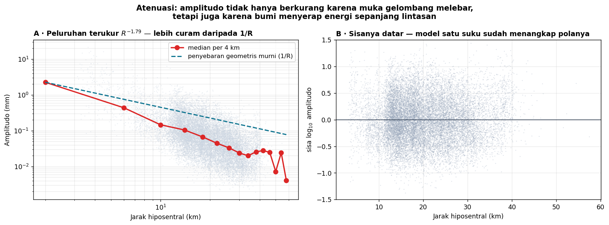

# Minggu 7 — Gempa Lokal, Regional, Teleseismik; Atenuasi dan Mikroseismik

**Seismologi `PAGF262413`** · Senin 07:15–08:55, Ruang Kelas 209
Pokok Bahasan 3 · **CPMK2** · Bloom **C4**

> **Sasaran.** Mahasiswa dapat (a) membedakan gempa lokal, regional, dan teleseismik dari tampilan seismogramnya, (b) memisahkan penyebaran geometris dari atenuasi intrinsik, (c) menjelaskan faktor kualitas $Q$ dan $t^*$, dan (d) menjelaskan asal derau latar bumi serta bagaimana ia berubah dari gangguan menjadi sumber data.

---

## 0 · Pembuka: energi yang hilang lebih cepat dari seharusnya · 10 menit

Teori dasar mengatakan amplitudo gelombang bola meluruh sebagai $1/R$ — semata karena muka gelombangnya melebar. Garis biru putus-putus pada panel A menunjukkan ramalan itu.

Data nyata — puluhan ribu pembacaan amplitudo Yogyakarta 2006 — meluruh sebagai **$R^{-1{,}79}$**, jauh lebih curam.

*Tanyakan:* ke mana perginya selisihnya?

Jawabannya adalah isi pertemuan hari ini: bumi tidak hanya menyebarkan energi, ia **menyerapnya**.

---

## 1 · Tiga rezim jarak · 20 menit

| Rezim | Jarak | Ciri seismogram |
|:--|:--|:--|
| **Lokal** | < 100 km | S−P beberapa detik; frekuensi tinggi (5–45 Hz); durasi pendek |
| **Regional** | 100–1000 km | Fase kerak Pg, Pn, Lg menonjol; frekuensi menengah |
| **Teleseismik** | > 1000 km (> 10°) | S−P menit; frekuensi rendah (< 2 Hz); gelombang permukaan panjang |

Perhatikan pola frekuensinya: **semakin jauh, semakin rendah**. Itu bukan sifat sumbernya melainkan akibat atenuasi — komponen frekuensi tinggi diserap lebih dulu.

Di Minggu 11 mahasiswa sudah mengalaminya sendiri: gempa mikro pada 20 km berenergi di 15–45 Hz, sedangkan pita "baku" 2–15 Hz justru gagal. Sekarang mereka tahu sebabnya.

---

## 2 · Memisahkan penyebab peluruhan · 25 menit

Amplitudo berkurang karena beberapa sebab berbeda, dan memisahkannya adalah pekerjaan nyata:

| Penyebab | Sifat | Bergantung frekuensi? |
|:--|:--|:--|
| **Penyebaran geometris** | Muka gelombang melebar; $1/R$ untuk gelombang badan | Tidak |
| **Atenuasi intrinsik** | Energi berubah jadi panas akibat gesekan internal | **Ya** — frekuensi tinggi hilang lebih cepat |
| **Hamburan** | Energi teracak oleh heterogenitas kecil | Ya |
| ***Multipathing*** | Energi terbagi ke beberapa lintasan | Tidak langsung |

Yang terukur di panel A adalah **jumlah semuanya**. Memisahkan atenuasi intrinsik dari hamburan menuntut analisis koda dan berada di luar cakupan mata kuliah ini.

---

## 3 · Faktor kualitas $Q$ dan $t^*$ · 25 menit

$Q$ didefinisikan lewat pecahan energi yang hilang tiap siklus:

25080\frac{1}{Q} = -\frac{1}{2\pi}\frac{\Delta E}{E}25080

Amplitudo meluruh sebagai

25080A(f) = A_0 \exp\left(-\frac{\pi f t}{Q}\right) = A_0\,e^{-\pi f t^*}, \qquad t^* = \frac{t}{Q}25080

**Perhatikan $f$ pada eksponennya.** Itulah yang membuat gelombang berfrekuensi tinggi lenyap lebih dulu, dan itulah yang menjelaskan tabel rezim jarak di §1.

Nilai khas: $Q$ sekitar 100–1000 di kerak, beberapa ribu di mantel bawah, dan **sangat rendah di astenosfer** — yang justru menjadikannya terdeteksi.

### Dispersi karena anelastisitas

Konsekuensi yang sering mengejutkan: penyerapan **memaksa** kecepatan bergantung frekuensi (hubungan Kramers–Kronig). Medium yang menyerap tidak bisa punya kecepatan tunggal. Karena itu kecepatan seismik harus selalu disebut beserta pita frekuensinya.

---

## 4 · Derau bumi: dari gangguan jadi data · 15 menit

Bumi tidak pernah diam. Sumber derau utamanya:

| Pita | Sumber |
|:--|:--|
| **Mikroseisme primer** ~14 s | Gelombang laut menghantam pantai |
| **Mikroseisme sekunder** ~7 s | Interaksi gelombang laut yang berlawanan arah — **derau terkuat di bumi** |
| **Derau budaya** > 1 Hz | Lalu lintas, mesin, kegiatan manusia; siang-malam berbeda tegas |

Selama satu abad ini semata gangguan. Sejak 2005 semuanya berubah: **korelasi silang derau ambien** antara dua stasiun ternyata menghasilkan fungsi Green — seolah salah satu stasiunnya adalah sumber gempa buatan.

Akibatnya besar: struktur bawah permukaan dapat dipetakan **tanpa menunggu gempa**. Metode ini kini dipakai luas untuk mikrozonasi kota, termasuk di Yogyakarta.

> Pola yang layak ditandai: apa yang selama seabad dibuang sebagai derau ternyata memuat informasi yang setara dengan gempa. Selalu tanyakan apa yang sedang kalian buang.

---

## Tugas

**T7.1 Prediksi terkunci.** (a) Gelombang 20 Hz dan 1 Hz menempuh 100 km — mana yang tersisa lebih besar? (b) Kalau $Q = 200$ dan waktu tempuh 20 s, berapa $t^*$? (c) Kapan derau budaya paling kecil?

**T7.2 Bacaan.** Shearer 6.6 (**lewati 6.6.3†, 6.6.4†**), 12.1, 12.2 · Stein & Wysession 3.7.1–3.7.6 (h. 185–192), 5.4.2 *Earthquakes in subducting slabs* (h. 312).

**T7.3 Analisis.** Bandingkan tiga seismogram — gempa lokal Yogyakarta, regional Jawa, dan teleseismik — dari stasiun yang sama. Ukur kandungan frekuensi masing-masing dan kaitkan dengan $t^*$.

---

## Catatan waktu

| Bagian | Menit | Kumulatif |
|:--|:--:|:--:|
| 0 · Pembuka: peluruhan yang terlalu cepat | 10 | 10 |
| 1 · Tiga rezim jarak | 20 | 30 |
| 2 · Memisahkan penyebab peluruhan | 25 | 55 |
| 3 · $Q$ dan $t^*$ | 25 | 80 |
| 4 · Derau bumi | 15 | 95 |
| Penutup dan pengarahan UTS | 5 | 100 |

**Minggu depan: Ujian Tengah Semester.** Kisi-kisi ada di [`Minggu08_UTS.md`](Minggu08_UTS.md).

Seismologi PAGF262413 · Program Studi Sarjana Geofisika FMIPA UGM · Kurikulum 2026
