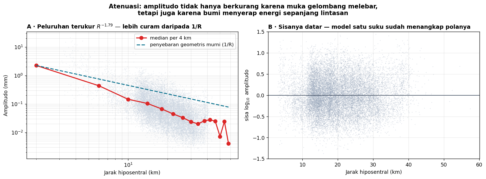
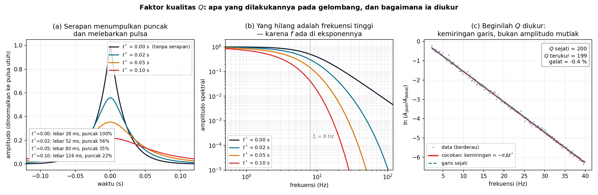

# Minggu 7 — Gempa Lokal, Regional, Teleseismik; Atenuasi dan Mikroseismik

**Seismologi `PAGF262413`** · Senin 07:15–08:55, Ruang Kelas 209
Pokok Bahasan 3 · **CPMK2** · Bloom **C4**

> **Sasaran.** Mahasiswa dapat (a) membedakan gempa lokal, regional, dan teleseismik dari tampilan seismogramnya, (b) memisahkan penyebaran geometris dari atenuasi intrinsik, (c) menjelaskan faktor kualitas $Q$ dan $t^*$ serta **menghitung keduanya dari data**, (d) **menyebutkan tiga cara $Q$ diukur dan menjelaskan mengapa metode nisbah spektral paling kokoh**, (e) **membedakan serapan dari hamburan lewat analisis koda**, dan (f) menjelaskan asal derau latar bumi serta bagaimana ia berubah dari gangguan menjadi sumber data.

---

## 0 · Pembuka: energi yang hilang lebih cepat dari seharusnya · 10 menit



Teori dasar mengatakan amplitudo gelombang bola meluruh sebagai $1/R$ — semata karena muka gelombangnya melebar. Garis biru putus-putus pada panel A menunjukkan ramalan itu.

Data nyata — puluhan ribu pembacaan amplitudo Yogyakarta 2006 — meluruh sebagai **$R^{-1{,}79}$**, jauh lebih curam.

*Tanyakan:* ke mana perginya selisihnya?

Jawabannya adalah isi pertemuan hari ini: bumi tidak hanya menyebarkan energi, ia **menyerapnya**.

---

## 1 · Tiga rezim jarak · 15 menit

| Rezim | Jarak | Ciri seismogram |
|:--|:--|:--|
| **Lokal** | < 100 km | S−P beberapa detik; frekuensi tinggi (5–45 Hz); durasi pendek |
| **Regional** | 100–1000 km | Fase kerak Pg, Pn, Lg menonjol; frekuensi menengah |
| **Teleseismik** | > 1000 km (> 10°) | S−P menit; frekuensi rendah (< 2 Hz); gelombang permukaan panjang |

Perhatikan pola frekuensinya: **semakin jauh, semakin rendah**. Itu bukan sifat sumbernya melainkan akibat atenuasi — komponen frekuensi tinggi diserap lebih dulu.

Di Minggu 11 mahasiswa sudah mengalaminya sendiri: gempa mikro pada 20 km berenergi di 15–45 Hz, sedangkan pita "baku" 2–15 Hz justru gagal. Sekarang mereka tahu sebabnya.

---

## 2 · Memisahkan penyebab peluruhan · 15 menit

Amplitudo berkurang karena beberapa sebab berbeda, dan memisahkannya adalah pekerjaan nyata:

| Penyebab | Sifat | Bergantung frekuensi? |
|:--|:--|:--|
| **Penyebaran geometris** | Muka gelombang melebar; $1/R$ untuk gelombang badan | Tidak |
| **Atenuasi intrinsik** | Energi berubah jadi panas akibat gesekan internal | **Ya** — frekuensi tinggi hilang lebih cepat |
| **Hamburan** | Energi teracak oleh heterogenitas kecil | Ya |
| ***Multipathing*** | Energi terbagi ke beberapa lintasan | Tidak langsung |

Yang terukur di panel A adalah **jumlah semuanya**. Karena itu setiap $Q$ yang diperoleh dari peluruhan amplitudo sebenarnya adalah **$Q$ semu**:

```math
\frac{1}{Q_\text{semu}} = \frac{1}{Q_\text{intrinsik}} + \frac{1}{Q_\text{hamburan}} + \dots
```

Karena semua sukunya positif, $Q_\text{semu}$ selalu **lebih kecil** daripada $Q$ intrinsik yang sesungguhnya. Memisahkan keduanya bukan hal mustahil — caranya ada di bagian 4.

---

## 3 · Faktor kualitas $Q$ dan $t^*$ · 25 menit

$Q$ didefinisikan lewat pecahan energi yang hilang tiap siklus:

```math
\frac{1}{Q} = -\frac{1}{2\pi}\frac{\Delta E}{E}
```

Amplitudo meluruh sebagai

```math
A(f) = A_0 \exp\left(-\frac{\pi f t}{Q}\right) = A_0\,e^{-\pi f t^*}, \qquad t^* = \frac{t}{Q}
```

**Perhatikan $f$ pada eksponennya.** Itulah yang membuat gelombang berfrekuensi tinggi lenyap lebih dulu, dan itulah yang menjelaskan tabel rezim jarak di §1.

Nilai khas: $Q$ sekitar 100–1000 di kerak, beberapa ribu di mantel bawah, dan **sangat rendah di astenosfer** — yang justru menjadikannya terdeteksi.




Panel (a) memberi angkanya. Sebuah pulsa dengan frekuensi sudut 8 Hz, setelah dikenai serapan:

| $t^*$ | Puncak tersisa | Lebar setengah puncak |
|--:|--:|--:|
| 0,00 s | 100% | 28 ms |
| 0,02 s | 56% | 52 ms |
| 0,05 s | 35% | 80 ms |
| 0,10 s | 22% | 124 ms |

Dua akibat sekaligus: **puncaknya tumpul** dan **pulsanya melebar**. Keduanya berasal dari satu sebab — frekuensi tinggi dibuang. Inilah mengapa gempa jauh "terdengar" seperti dentuman panjang, sedangkan gempa dekat terasa seperti ledakan tajam.

### 3.1 Bagaimana $Q$ sungguh-sungguh diukur

Persamaan di atas memuat $A_0$, amplitudo sumber — yang tidak pernah kita ketahui. Seluruh seni pengukuran $Q$ adalah **menyingkirkan $A_0$**.

**(1) Nisbah spektral — cara paling kokoh.** Ambil gempa yang **sama** direkam dua stasiun berjarak berbeda. Spektrum sumbernya identik, jadi ia lenyap ketika dibagi:

```math
\ln\frac{A_2(f)}{A_1(f)} = -\pi f\,(t^*_2 - t^*_1) + \text{tetapan}
```

Plot ruas kiri terhadap $f$: hasilnya **garis lurus**, dan kemiringannya $-\pi\,\Delta t^*$. Itulah panel (c). Yang diukur adalah kemiringan, bukan amplitudo mutlak — sehingga penguatan alat, ukuran gempa, dan pola radiasi sumber semuanya tercoret.

**(2) Peluruhan spektral satu stasiun.** Kalau hanya ada satu rekaman, cocokkan spektrum terukur dengan model sumber (misalnya Brune $\omega^2$) dikalikan $e^{-\pi f t^*}$, lalu cari $t^*$ yang paling pas. Lebih murah, tetapi hasilnya **bercampur** dengan taksiran frekuensi sudut sumber: $f_c$ yang keliru langsung menjadi $Q$ yang keliru.

**(3) Peluruhan koda.** Dibahas di bagian 4 — satu-satunya dari ketiganya yang dapat memisahkan serapan dari hamburan.

> **Yang harus diingat dari panel (c):** $Q$ diperoleh dari **kemiringan garis pada kawasan frekuensi**, bukan dari seberapa kecil amplitudonya. Mahasiswa yang mencoba mengukur $Q$ dari amplitudo mutlak akan selalu gagal, karena ia tidak tahu $A_0$.

### 3.2 $Q$ bergantung frekuensi

Pada rentang frekuensi seismologi, $Q$ ternyata **tidak tetap**. Pengamatan di banyak wilayah memenuhi

```math
Q(f) = Q_0 \left(\frac{f}{f_0}\right)^{n}, \qquad f_0 = 1\ \text{Hz}
```

dengan $n$ positif — artinya medium **kurang menyerap** pada frekuensi tinggi daripada dugaan model $Q$ tetap. Polanya cukup konsisten:

| Wilayah | $Q_0$ | $n$ |
|:--|--:|--:|
| Aktif secara tektonik, kerak rekah (busur gunung api, zona sesar) | ~50–200 | 0,6–1,0 |
| Kerak stabil, kraton tua | > 600 | kecil, mendekati 0 |

$n$ yang besar adalah **sidik jari hamburan**: medium yang penuh heterogenitas berukuran mirip panjang gelombang. Karena itu $Q_0$ rendah dengan $n$ tinggi lazim ditemukan di busur gunung api — dan itu bukan kebetulan bagi Indonesia.

### 3.3 Dispersi karena anelastisitas

Konsekuensi yang sering mengejutkan: penyerapan **memaksa** kecepatan bergantung frekuensi (hubungan Kramers–Kronig). Medium yang menyerap tidak bisa punya kecepatan tunggal. Karena itu kecepatan seismik harus selalu disebut beserta pita frekuensinya.

Panel (a) pada gambar di atas sengaja digambar **berfasa nol** agar pelebarannya mudah dibaca. Serapan yang sesungguhnya bersifat **kausal**: selain menumpulkan, ia juga menggeser fasa. Gambar itu menyederhanakan; alamnya tidak.

### 3.4 Menutup pertanyaan pembuka

Sekarang kita bisa menjawab "ke mana perginya selisihnya" dengan angka. Ambil model gabungan

```math
A(R) = \frac{A_0}{R}\,\exp\!\left(-\frac{\pi f R}{Q\,\beta}\right)
```

lalu cari $Q$ yang membuat model itu **tampak** seperti $R^{-1{,}79}$ bila dicocokkan pangkat pada rentang $R$ = 3–60 km dengan $\beta$ = 3,5 km/s:

| Kalau frekuensi dominannya… | maka $Q_\text{semu}$ ≈ |
|--:|--:|
| 5 Hz | 95–125 |
| 10 Hz | 190–250 |
| 15 Hz | 285–370 |

(rentangnya muncul dari pilihan pembobotan pencocokan — seragam dalam $R$ atau dalam $\log R$.)

Angkanya **masuk akal** untuk kerak di busur gunung api: ratusan, bukan ribuan. Bandingkan dengan tabel §3.2.

Tetapi bacalah tabel itu dengan benar. Ia **bukan** pengukuran $Q(f)$. Amplitudo Wood–Anderson yang dipakai panel A adalah satu angka per rekaman, bukan spektrum, sehingga satu eksponen 1,79 itu berlaku untuk **satu pita frekuensi efektif yang tidak kita ketahui**. Ketiga baris di atas adalah jawaban atas pertanyaan "seandainya frekuensi dominannya sekian, berapa $Q$-nya" — bukan tiga pengukuran terpisah.

Justru di situ pelajarannya: **peluruhan amplitudo terhadap jarak saja tidak cukup untuk menentukan $Q$.** Menaksir frekuensi dominan keliru tiga kali lipat membuat $Q$ keliru tiga kali lipat pula. Untuk memperoleh $Q(f)$ yang sesungguhnya, kita harus bekerja di kawasan frekuensi — itulah metode nisbah spektral di §3.1, dan itulah sebabnya ia dipakai orang.

> **Tetapi jangan terlalu cepat senang.** Angka itu adalah $Q$ **semu**. Ia memuat hamburan, dan juga memuat kemungkinan bahwa penyebaran geometris di kerak berlapis memang lebih curam daripada $1/R$. Yang jujur dikatakan: $Q$ intrinsik sesungguhnya **lebih besar** daripada angka di tabel itu. Untuk memisahkannya, kita perlu koda.

---

## 4 · Serapan atau hamburan? Yang diceritakan koda · 15 menit

Perhatikan ekor seismogram gempa lokal — bagian panjang setelah S yang perlahan meredup. Itu **koda**, dan selama bertahun-tahun ia dianggap sampah.

Aki & Chouet (1975) menunjukkan sebaliknya. Koda bukan derau: ia adalah energi yang **terhambur balik** dari heterogenitas di seluruh volume batuan sekitar, lalu tiba terlambat karena menempuh jalan memutar. Amplitudonya meluruh sebagai

```math
A(f,t) = C(f)\,t^{-\alpha}\exp\!\left(-\frac{\pi f t}{Q_c}\right)
```

dengan $t$ diukur dari **waktu asal** gempa, dan $\alpha$ tetapan geometris (1 untuk hamburan badan, 0,5 untuk permukaan).

### 4.1 Mengapa koda begitu berguna

Koda punya satu sifat yang tidak dimiliki fase langsung: pada $t$ yang cukup besar, energi yang tiba telah **menjelajahi volume besar dari segala arah**. Akibatnya:

- **Pola radiasi sumber tercoret.** Energinya datang dari segala arah; arah pancaran awal tidak lagi penting.
- **Hasilnya stabil.** Dua gempa berbeda di daerah yang sama memberi $Q_c$ yang mirip, meski mekanisme sumbernya berlainan.
- **Satu stasiun sudah cukup.** Tidak perlu jaringan; ini alasan $Q_c$ sangat populer di negara dengan jaringan jarang.

Prosedurnya pun sederhana: saring rekaman pada beberapa pita frekuensi sempit, ambil selubung amplitudo setiap pita, koreksi suku $t^{-\alpha}$, lalu plot logaritmanya terhadap $t$. **Kemiringannya memberi $Q_c$** — sekali lagi kemiringan, bukan amplitudo mutlak.

### 4.2 Memisahkan $Q_i$ dari $Q_s$

$Q_c$ sendiri masih gabungan. Untuk benar-benar memisahkan serapan dari hamburan dipakai **MLTWA** (*Multiple Lapse Time Window Analysis*): energi total dibagi ke beberapa jendela waktu, lalu perbandingan energi antar-jendela dibandingkan dengan model transfer radiatif.

Logikanya elegan. **Hamburan mengacak energi tetapi tidak menghilangkannya** — ia hanya memindahkannya dari fase langsung ke koda. **Serapan menghilangkannya sama sekali.** Jadi: kalau energi langsung berkurang sementara koda menguat, penyebabnya hamburan; kalau keduanya berkurang, penyebabnya serapan.

> Inilah bentuk paling murni dari cara berpikir seismologi: dua proses yang **tampak sama** pada satu pengukuran dapat dipisahkan dengan mencari pengamatan yang membedakannya. Bandingkan dengan §5.4 Minggu 6 — pertanyaannya sama persis, hanya objeknya berbeda.

### 4.3 $\kappa$: serapan di seratus meter terakhir

Ada satu bagian lintasan yang pengaruhnya tak sebanding dengan panjangnya — **lapisan lapuk tepat di bawah stasiun**. Di sana $Q$ sangat rendah, dan gelombang melewatinya nyaris tegak lurus pada akhir perjalanannya.

Anderson & Hough (1984) merangkumnya menjadi satu parameter $\kappa$:

```math
A(f) \propto \exp(-\pi \kappa f)
```

Bentuknya identik dengan $e^{-\pi f t^*}$ — memang demikian: $\kappa$ adalah $t^*$ milik beberapa ratus meter teratas saja. Nilai khasnya 0,02–0,04 s di batuan keras dan jauh lebih besar di tanah lunak.

Kedengarannya sepele, tetapi **$\kappa$ menentukan batas frekuensi tertinggi yang bisa direkam sebuah stasiun**, dan karenanya masuk langsung ke dalam perhitungan bahaya gempa untuk bangunan kaku. Untuk Yogyakarta yang beralas sedimen tebal, ini bukan rincian akademis.

---

## 5 · Mengapa atenuasi menentukan pekerjaan sehari-hari · disisipkan sepanjang kuliah

Tiga tempat $Q$ muncul langsung dalam praktik:

| Di mana | Perannya |
|:--|:--|
| **Skala magnitudo** | Suku koreksi jarak $f(R)$ pada $M_L = \log_{10}A + f(R)$ (Minggu 13) **adalah** kurva atenuasi wilayah itu. Memakai rumus California di Jawa berarti memakai $Q$ yang salah. |
| **Persamaan peramalan gerak tanah (GMPE)** | Suku anelastiknya sebanding dengan $R/Q$. Nilai $Q$ yang keliru menggeser taksiran percepatan tanah, lalu menggeser peta bahaya gempa nasional. |
| **Tomografi $Q$** | Daerah ber-$Q$ sangat rendah menandai batuan panas, retak, atau mengandung lelehan sebagian — dipakai untuk membatasi kantong magma dan **reservoir panas bumi**. Kecepatan saja sering tidak cukup peka; $Q$ jauh lebih peka terhadap keberadaan fluida. |

Baris ketiga patut digarisbawahi: dalam eksplorasi panas bumi Indonesia, **anomali $Q$ rendah sering menjadi petunjuk yang lebih tajam daripada anomali kecepatan**, karena serapan sangat peka terhadap fluida dan lelehan sementara kecepatan tidak.

---

## 6 · Derau bumi: dari gangguan jadi data · 15 menit

Bumi tidak pernah diam. Sumber derau utamanya:

| Pita | Sumber |
|:--|:--|
| **Mikroseisme primer** ~14 s | Gelombang laut menghantam pantai |
| **Mikroseisme sekunder** ~7 s | Interaksi gelombang laut yang berlawanan arah — **derau terkuat di bumi** |
| **Derau budaya** > 1 Hz | Lalu lintas, mesin, kegiatan manusia; siang-malam berbeda tegas |

Selama satu abad ini semata gangguan. Sejak 2005 semuanya berubah: **korelasi silang derau ambien** antara dua stasiun ternyata menghasilkan fungsi Green — seolah salah satu stasiunnya adalah sumber gempa buatan.

Akibatnya besar: struktur bawah permukaan dapat dipetakan **tanpa menunggu gempa**. Metode ini kini dipakai luas untuk mikrozonasi kota, termasuk di Yogyakarta.

> Pola yang layak ditandai: apa yang selama seabad dibuang sebagai derau ternyata memuat informasi yang setara dengan gempa. Selalu tanyakan apa yang sedang kalian buang.

---

## Tugas

**T7.1 Prediksi terkunci.** (a) Gelombang 20 Hz dan 1 Hz menempuh 100 km — mana yang tersisa lebih besar? (b) Kalau $Q = 200$ dan waktu tempuh 20 s, berapa $t^*$? (c) Kapan derau budaya paling kecil? (d) **Sebelum menghitung:** kalau amplitudo terukur meluruh sebagai $R^{-1{,}79}$ sementara geometri hanya meramalkan $R^{-1}$, menurut kalian $Q$ kerak Bantul berorde puluhan, ratusan, atau ribuan? Tuliskan alasannya.

**T7.2 Hitungan $Q$ semu.** Dengan model $A(R) = (A_0/R)\exp(-\pi f R/(Q\beta))$, $\beta$ = 3,5 km/s, dan rentang $R$ = 3–60 km, cari nilai $Q$ yang membuat model itu tercocokkan sebagai $R^{-1{,}79}$. Kerjakan untuk $f$ = 5, 10, dan 15 Hz. (a) Bandingkan dengan tabel §3.4. (b) Ketiga jawaban kalian berbeda jauh padahal datanya satu dan sama — jelaskan mengapa, dan apa yang harus kalian ketahui lebih dulu agar hanya satu di antaranya yang benar. (c) **Mengapa hasil ini merupakan batas bawah**, bukan nilai $Q$ intrinsik?

**T7.3 Mengukur $Q$ dari nisbah spektral.** Bangkitkan dua spektrum sintetik dari satu sumber Brune untuk dua jarak berbeda dengan $Q$ yang kalian pilih sendiri, tambahkan derau, lalu **pulihkan kembali $Q$** dengan mencocokkan garis pada $\ln(A_2/A_1)$ terhadap $f$. Laporkan galatnya. (a) Apa yang terjadi bila pita pencocokan diperlebar melewati frekuensi tempat derau mendominasi? (b) Apa yang terjadi bila kedua stasiun punya $\kappa$ berbeda — masih bisakah kalian memisahkannya dari $Q$ lintasan?

> Skrip acuannya [`skrip/figur_minggu07.py`](skrip/figur_minggu07.py) — **jangan dibuka sebelum mencoba sendiri.**

**T7.4 Telaah pustaka Indonesia.** Cari satu terbitan yang mengukur $Q_c$ atau $Q_0$ dan $n$ untuk suatu wilayah Indonesia (Jawa, Sumatra, Sulawesi, atau busur gunung api mana pun). Laporkan nilainya, pita frekuensi pengukurannya, dan metodenya. Bandingkan dengan kisaran pada tabel §3.2 — cocok atau menyimpang, dan kalau menyimpang, apa penjelasan penulisnya?

**T7.5 Analisis.** Bandingkan tiga seismogram — gempa lokal Yogyakarta, regional Jawa, dan teleseismik — dari stasiun yang sama. Ukur kandungan frekuensi masing-masing dan kaitkan dengan $t^*$.

**T7.6 Bacaan.** Shearer 6.6 (**lewati 6.6.3†, 6.6.4†**), 12.1, 12.2 · Stein & Wysession 3.7.1–3.7.6 (h. 185–192), 5.4.2 *Earthquakes in subducting slabs* (h. 312).

---

## Pustaka

- Aki, K. & Chouet, B. (1975). Origin of coda waves: source, attenuation, and scattering effects. *JGR* **80**, 3322–3342. [doi:10.1029/JB080i023p03322](https://doi.org/10.1029/JB080i023p03322)
- Anderson, J. G. & Hough, S. E. (1984). A model for the shape of the Fourier amplitude spectrum of acceleration at high frequencies. *BSSA* **74**, 1969–1993.
- Brune, J. N. (1970). Tectonic stress and the spectra of seismic shear waves from earthquakes. *JGR* **75**, 4997–5009.
- Fehler, M. & Sato, H. (2003). Coda. *Pure and Applied Geophysics* **160**, 541–554. — pengantar ringkas MLTWA dan pemisahan $Q_i$ dari $Q_s$.
- Shapiro, N. M., Campillo, M., Stehly, L. & Ritzwoller, M. H. (2005). High-resolution surface-wave tomography from ambient seismic noise. *Science* **307**, 1615–1618. [doi:10.1126/science.1108339](https://doi.org/10.1126/science.1108339)

---

## Catatan waktu

| Bagian | Menit | Kumulatif |
|:--|:--:|:--:|
| 0 · Pembuka: peluruhan yang terlalu cepat | 10 | 10 |
| 1 · Tiga rezim jarak | 15 | 25 |
| 2 · Memisahkan penyebab peluruhan | 15 | 40 |
| 3 · $Q$, $t^*$, cara mengukurnya, dan $Q(f)$ | 25 | 65 |
| 4 · **Koda, pemisahan serapan–hamburan, dan $\kappa$** | 15 | 80 |
| 6 · Derau bumi | 15 | 95 |
| Penutup dan pengarahan UTS | 5 | 100 |

Bagian 5 (penerapan praktis) tidak diberi blok waktu sendiri — ia disisipkan sebagai contoh sepanjang bagian 3 dan 4.

**Minggu depan: Ujian Tengah Semester.** Kisi-kisi ada di [`Minggu08_UTS.md`](Minggu08_UTS.md).

<sub>Seismologi PAGF262413 · Program Studi Sarjana Geofisika FMIPA UGM · Kurikulum 2026</sub>
