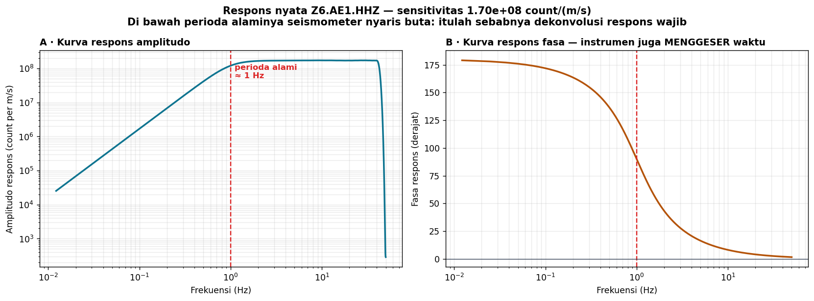

# Minggu 9 — Seismometer sebagai Osilator Harmonik Teredam

**Seismologi `PAGF262413`** · Senin 07:15–08:55, Ruang Kelas 209
Pokok Bahasan 4 · **CPMK3** · Bloom **C3**

> **Sasaran.** Mahasiswa dapat (a) menuliskan persamaan gerak seismometer dan menjelaskan peran perioda alami serta redaman, (b) membaca kurva respons amplitudo dan fasa, (c) menjelaskan mengapa dekonvolusi respons wajib sebelum mengukur besaran fisis, dan (d) membedakan seismograf perioda pendek, perioda panjang, dan *broadband*.

---

## 0 · Pembuka: alat yang tidak jujur · 10 menit

Ini kurva respons **nyata**, dibaca dari berkas StationXML sebuah stasiun di arsip UGM.

Perhatikan panel A: pada frekuensi tinggi responsnya datar — alat melaporkan kecepatan tanah dengan setia. Tetapi **di bawah perioda alaminya responsnya runtuh**. Gerakan tanah di sana tetap ada; alatnya yang tidak melihatnya.

Panel B lebih mengganggu lagi: instrumen juga **menggeser fasa**, dan pergeserannya berbeda tiap frekuensi. Artinya bentuk gelombang yang kalian lihat di layar **bukan bentuk gerakan tanah**.

*Tanyakan:* kalau begitu, apa sebenarnya yang kalian ukur selama ini?

Di Minggu 11 kita menulis $u(t) = s(t) * g(t) * i(t) + n(t)$. Hari ini kita bedah suku $i(t)$ itu.

---

## 1 · Persamaan geraknya · 25 menit

Seismometer sederhana adalah massa yang digantung pegas di dalam rangka yang ikut bergerak bersama tanah. Yang terukur adalah **gerak relatif** massa terhadap rangka:

25147\ddot{x} + 2\varepsilon\omega_0 \dot{x} + \omega_0^2 x = -\ddot{u}_{\text{tanah}}25147

dengan $\omega_0$ frekuensi sudut alami dan $\varepsilon$ faktor redaman.

Tiga rezim yang menentukan seluruh perilakunya:

| Rezim | Yang diukur massa | Konsekuensi |
|:--|:--|:--|
| $\omega \gg \omega_0$ | Sebanding **perpindahan** tanah | Datar untuk sinyal cepat |
| $\omega \approx \omega_0$ | Resonansi | Diredam agar tidak berdering |
| $\omega \ll \omega_0$ | Sebanding **percepatan** tanah | Peka runtuh — inilah lereng di panel A |

**Redaman kritis $\varepsilon \approx 0{,}707$** dipilih hampir universal: cukup untuk mencegah dering, tanpa mengorbankan lebar pita.

---

## 2 · Fungsi respons dan dekonvolusi · 25 menit

Dalam ranah frekuensi, seluruh perilaku instrumen terangkum dalam satu fungsi kompleks $I(\omega)$ — amplitudo dan fasa, seperti kedua panel tadi.

Karena $U(\omega) = S(\omega)\,G(\omega)\,I(\omega)$, membuang pengaruh alat berarti **membagi** dengan $I(\omega)$. Itulah dekonvolusi respons.

Instrumen nyata dinyatakan dengan **kutub dan nol** (*poles and zeros*) beserta faktor sensitivitas. Metadata itu disimpan dalam **StationXML** — berkas yang sama pentingnya dengan datanya sendiri.

> **Kaidah yang harus melekat:** angka mentah dalam berkas seismik bersatuan *count*, bukan m/s. Magnitudo, percepatan puncak, dan energi yang dihitung dari *count* tanpa dekonvolusi **selalu salah** — dan salahnya berbeda antar-stasiun karena instrumennya berbeda. Ini kesalahan paling sering di laporan praktikum.

*Aktivitas:* plot kurva respons dari StationXML dengan `obspy`, lalu bandingkan satu seismogram sebelum dan sesudah `remove_response()`.

---

## 3 · Jenis seismograf · 20 menit

| Jenis | Perioda alami | Pita | Kegunaan |
|:--|:--|:--|:--|
| **Perioda pendek** | ~1 s | 1–50 Hz | Gempa lokal, jaringan padat, gunung api |
| **Perioda panjang** | 15–30 s | 0,003–1 Hz | Gelombang permukaan, gempa jauh |
| **Broadband** | 120 s (atau 240 s) | 0,001–50 Hz | Baku modern; hampir semuanya |
| **Akselerometer** | — | DC–100 Hz | Guncangan kuat; tidak jenuh di dekat sumber |

**Mengapa akselerometer tetap diperlukan.** Seismometer *broadband* di dekat gempa besar akan **terpotong** (*clipped*) — massanya menabrak batas geraknya. Justru pada peristiwa terpenting, alat terbaik justru gagal. Akselerometer punya peka lebih rendah tetapi rentang dinamis jauh lebih lebar, sehingga bertahan.

Itulah sebabnya jaringan modern memasang keduanya berdampingan.

---

## 4 · Kalibrasi dan derau instrumen · 15 menit

Respons instrumen **berubah seiring waktu** — komponen menua, suhu bergeser, elektronik berganti. Kalibrasi berkala mutlak, dan StationXML menyimpan riwayat masa berlakunya (*epoch*).

Setiap sensor juga punya **derau sendiri**. Kurva NLNM/NHNM (*New Low/High Noise Model*, Peterson 1993) menjadi patokan universal: instrumen bagus di lokasi tenang mendekati NLNM. Membandingkan spektrum derau stasiun dengan NLNM adalah cara baku menilai mutu sebuah situs.

---

## Tugas

**T9.1 Prediksi terkunci.** (a) Seismometer perioda 1 s merekam gelombang perioda 20 s — berapa bagian sinyalnya yang tertangkap? (b) Mengapa redaman 0,707 dan bukan 1,0? (c) Apa yang terjadi pada seismometer *broadband* pada jarak 5 km dari gempa M7?

**T9.2 Praktik.** Plot kurva respons amplitudo dan fasa dari StationXML nyata. Lalu terapkan `remove_response()` pada satu seismogram dan bandingkan bentuk gelombang serta satuannya.

**T9.3 Bacaan.** Shearer 11.1–11.3 · Stein & Wysession 6.6.2–6.6.5 (h. 398–405).

---

## Catatan waktu

| Bagian | Menit | Kumulatif |
|:--|:--:|:--:|
| 0 · Pembuka: alat yang tidak jujur | 10 | 10 |
| 1 · Persamaan gerak dan rezim | 25 | 35 |
| 2 · Fungsi respons dan dekonvolusi | 25 | 60 |
| 3 · Jenis seismograf | 20 | 80 |
| 4 · Kalibrasi dan derau instrumen | 15 | 95 |
| Penutup | 5 | 100 |

**Minggu depan:** dari satu alat menjadi jaringan — dan teknologi yang mengubah kabel serat optik menjadi ribuan sensor.

Seismologi PAGF262413 · Program Studi Sarjana Geofisika FMIPA UGM · Kurikulum 2026
