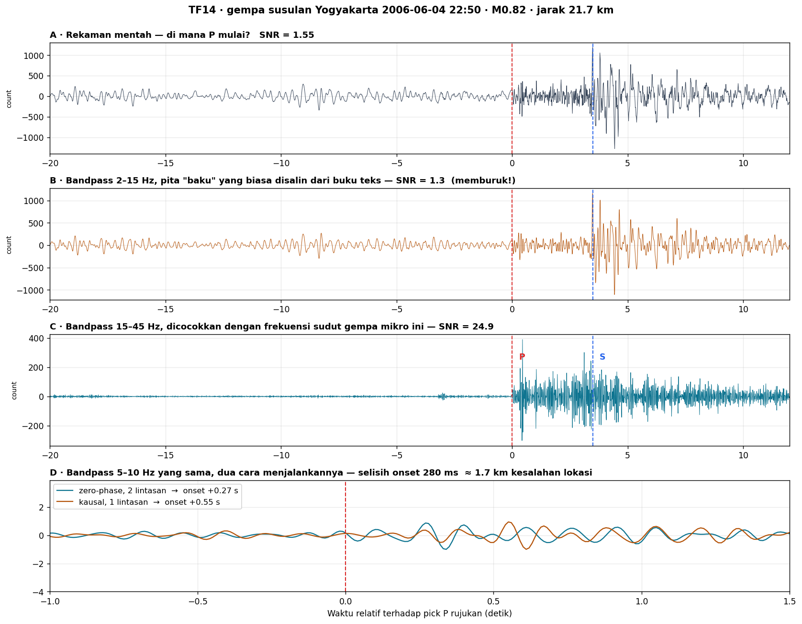
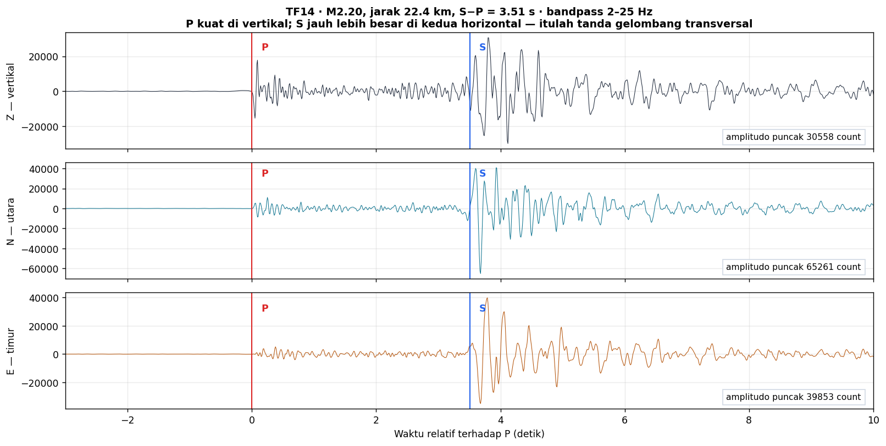
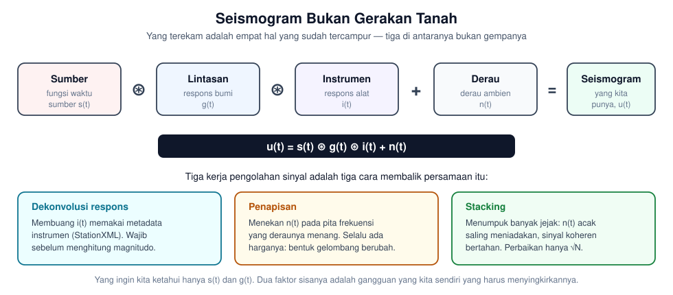
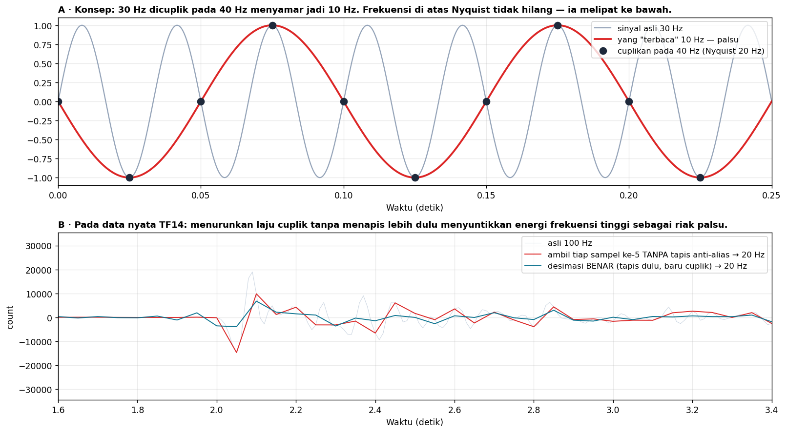
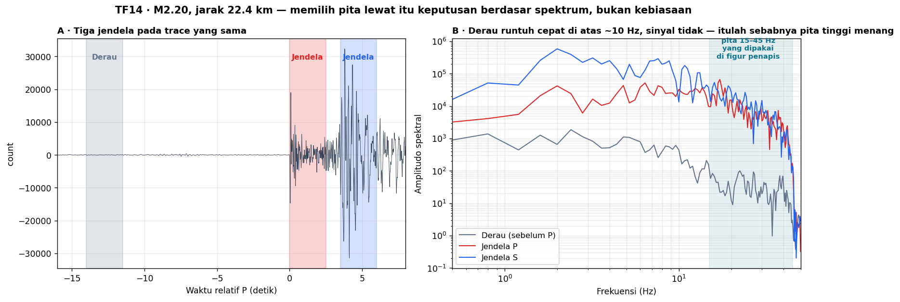
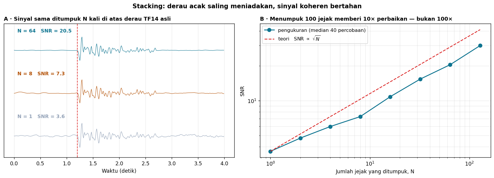

# Minggu 11 — Anatomi Seismogram dan Pemrosesan Sinyal Digital

**Seismologi `PAGF262413`** · Senin 07:15–08:55, Ruang Kelas 209
Pokok Bahasan 5 · **CPMK4** · Bloom **C4** (menganalisis) dan **P4** (artikulasi)
Menopang **Praktikum Acara 1 dan 2** · Milestone asesmen **M5** dimulai di sini

> **Sasaran pertemuan.** Di akhir 100 menit mahasiswa dapat (a) membaca ketiga komponen seismogram dan menjelaskan mengapa P dan S terbagi berbeda di antaranya, (b) menuliskan seismogram sebagai konvolusi dan menyebut apa yang dihilangkan dekonvolusi, (c) menjelaskan Nyquist dan aliasing serta akibat praktisnya, (d) membaca spektrum amplitudo untuk **memilih** pita lewat alih-alih menyalinnya, dan (e) menyebutkan harga yang dibayar setiap kali menapis.

**Semua figur dan data di pertemuan ini berasal dari gempa susulan Yogyakarta 2006**, stasiun TF14 jaringan YK — rekaman nyata, bukan sintetik, bukan contoh dari buku teks luar negeri.

---

## 0 · Pembuka: penapis memindahkan waktu tiba · 10 menit

Tampilkan **panel A saja** lebih dulu. Minta satu mahasiswa maju dan menunjuk di mana gelombang P mulai. SNR-nya 1,55 — praktis tidak mungkin. Biarkan beberapa orang menebak dan catat tebakannya di papan.

Lalu buka panel B: **bandpass 2–15 Hz, pita yang paling sering disalin dari buku teks.** SNR justru turun menjadi 1,3. Penapisnya membuat keadaan **lebih buruk**.

Lalu panel C: **bandpass 15–45 Hz**, dicocokkan dengan frekuensi sudut gempa mikro ini. SNR melonjak ke **24,9**. P dan S muncul begitu saja.

> Pesan pertama: **memilih pita lewat adalah keputusan berdasar spektrum, bukan kebiasaan.** Penapis yang salah tidak netral — ia merusak.

Terakhir panel D. Penapis yang **sama persis** (5–10 Hz), dijalankan dua cara:

| Cara | Onset terbaca |
|:--|:--|
| Zero-phase (dua lintasan, maju-mundur) | +0,27 s |
| Kausal (satu lintasan) | +0,55 s |

Selisih **280 milidetik**. Pada $V_P \approx 6$ km/s itu setara **1,7 km kesalahan lokasi episenter** — disebabkan oleh centang di kotak dialog, bukan oleh bumi.

> Pesan kedua, yang harus mereka bawa ke Minggu 12 dan Praktikum Acara 3: **waktu tiba yang kalian "ukur" sebagian adalah hasil pilihan pengolahan kalian sendiri.**

---

## 1 · Anatomi tiga komponen · 15 menit

Satu gempa, satu stasiun, tiga sensor saling tegak lurus. Perhatikan amplitudo puncaknya:

| Komponen | Puncak (count) |
|:--|--:|
| Z — vertikal | 30.558 |
| N — utara | 65.261 |
| E — timur | 39.853 |

P terlihat jelas di Z dan lemah di kedua horizontal. S justru **dua kali lebih besar** di horizontal daripada di vertikal.

*Tanyakan sebelum menjelaskan:* mengapa begitu? Jawabannya adalah definisi kedua gelombang itu sendiri — P bergerak **sejajar** arah rambat, S **tegak lurus** terhadapnya. Untuk gelombang yang datang dari bawah dengan sudut curam, komponen sejajar rambat lebih dekat ke vertikal, komponen tegak lurus lebih dekat ke horizontal.

**Rotasi ZNE → ZRT.** Dengan mengetahui azimut balik (*back-azimuth*) dari stasiun ke sumber, kedua horizontal dapat diputar menjadi **radial** (R, searah sumber) dan **transversal** (T, tegak lurus). Manfaatnya tegas:

- Gelombang **Love** hanya muncul di **T**
- Gelombang **Rayleigh** hanya di **Z dan R**
- **SH** terpisah dari **SV**

Rotasi ini bukan kosmetik — ia memisahkan jenis gelombang yang secara fisis berbeda, dan jadi prasyarat analisis mekanisme sumber di Minggu 14.

---

## 2 · Seismogram sebagai konvolusi · 20 menit

Di Minggu 1 kita menyimpulkan: *yang kita punya hanya seismogram*. Sekarang kelanjutannya yang kurang menyenangkan — **seismogram itu pun bukan gerakan tanah.**

$$u(t) = s(t) * g(t) * i(t) + n(t)$$

Dari empat suku itu, hanya **dua yang kita inginkan**: $s(t)$ sumber dan $g(t)$ lintasan. Dua sisanya, respons instrumen dan derau, adalah kotoran yang kita sendiri yang harus menyingkirkannya.

### Respons instrumen dan dekonvolusi

Seismometer bukan penggaris. Ia punya perioda alami dan redaman (Minggu 9), sehingga **memperkuat sebagian frekuensi dan meredam sebagian lainnya**. Angka mentah di berkas adalah *count* pencacah digital, bukan m/s.

Dekonvolusi respons memakai metadata **StationXML** untuk membalik $i(t)$ dan mengembalikan gerakan tanah sebenarnya.

> **Konsekuensi praktis yang sering diabaikan:** magnitudo yang dihitung dari *count* tanpa dekonvolusi respons **selalu salah**, dan salahnya berbeda-beda antar stasiun karena instrumennya berbeda. Ini kesalahan paling sering di laporan praktikum.

### Sistem linear

Persamaan di atas berlaku karena bumi dan instrumen keduanya **sistem linear tak berubah waktu** dalam rentang amplitudo yang kita hadapi. Sifat itulah yang mengizinkan pemisahan menjadi konvolusi. Untuk gempa sangat besar dekat sumber, asumsi itu mulai gugur — dan di situlah seismologi menjadi jauh lebih sulit.

---

## 3 · Dari kontinu ke angka: pencuplikan · 15 menit

Gerakan tanah kontinu; komputer hanya menyimpan cuplikan pada laju $f_s$. Batas Nyquist:

$$f_{\text{Nyquist}} = \frac{f_s}{2}$$

Frekuensi di atas Nyquist **tidak hilang**. Ia **melipat ke bawah** dan menyamar sebagai frekuensi rendah yang tidak pernah ada. Panel A: sinyal 30 Hz dicuplik pada 40 Hz terbaca sebagai 10 Hz — dan tidak ada cara apa pun untuk mengetahuinya dari data hasil cuplikan itu saja.

Panel B menunjukkan akibatnya pada data TF14 nyata. Menurunkan laju dari 100 Hz ke 20 Hz dengan **mengambil tiap sampel ke-5** menyuntikkan riak palsu. Desimasi yang benar **menapis dulu, baru mencuplik**.

> *Peringatan untuk praktikum:* `obspy` menyediakan `tr.decimate()` yang otomatis menapis lebih dulu, dan `tr.resample()`. Yang berbahaya adalah menuliskan `data[::5]` sendiri di NumPy. Kelihatan bekerja, hasilnya rusak diam-diam.

---

## 4 · Fourier: melihat sinyal dari sisi frekuensi · 20 menit

Setiap sinyal dapat diuraikan menjadi jumlahan sinus dan kosinus. Deret Fourier untuk sinyal periodik, transformasi Fourier untuk sinyal sembarang, **DFT** untuk data tercuplik, dan **FFT** sebagai algoritma cepat menghitungnya.

Yang penting bukan penurunan rumusnya — melainkan **apa yang terbaca dari spektrum**.

Ambil tiga jendela pada trace yang sama: derau sebelum P, jendela P, jendela S. Spektrumnya menceritakan sesuatu yang menentukan seluruh strategi pengolahan:

| Frekuensi | Amplitudo derau |
|:--|--:|
| 1 Hz | 1383 |
| 30 Hz | 20 |

**Derau runtuh hampir 70 kali lipat dari 1 Hz ke 30 Hz, sementara sinyal gempa mikro ini nyaris tidak turun.** Di situlah jawaban teka-teki panel C di pembukaan tadi: pita 15–45 Hz menang bukan karena angka keramat, tetapi karena di sanalah sinyal masih ada dan derau sudah habis.

> Ini keterampilan intinya: **lihat spektrum dulu, baru pilih penapis.** Urutan terbalik adalah menebak.

---

## 5 · Penapisan, dan harga yang harus dibayar · 15 menit

Tiga jenis penapis: lolos-rendah, lolos-tinggi, lolos-pita. Semua bekerja dengan menekan amplitudo di luar pita yang dipilih. Dan semuanya menagih bayaran.

| Efek samping | Akibatnya |
|:--|:--|
| **Pergeseran fasa** | Penapis kausal menunda seluruh bentuk gelombang. Onset terbaca **terlambat** |
| **Dering akausal** | Penapis zero-phase menyebar energi ke **kedua arah** — muncul osilasi *sebelum* onset sejati |
| **Semakin curam, semakin berdering** | Jumlah *corner* besar mempertajam pemisahan pita tetapi memperpanjang dering |
| **Kehilangan informasi** | Yang sudah ditapis keluar tidak bisa dikembalikan |

Kembali ke panel D: itulah selisih 280 ms yang tadi.

**Kaidah praktis yang layak dihafal:**

- Untuk **mem-*pick* waktu tiba** → pakai penapis **kausal**, karena dering akausal menciptakan onset palsu yang lebih awal.
- Untuk **mengukur amplitudo dan bentuk gelombang** → pakai **zero-phase**, karena ia tidak menggeser fasa.
- Apa pun pilihannya, **catat dan laporkan pita serta jenis penapisnya.** Tanpa itu, angka waktu tiba kalian tidak bisa direproduksi siapa pun.

---

## 6 · Stacking · 5 menit

Kalau derau acak dan sinyal koheren, menumpuk $N$ jejak membuat derau saling meniadakan sementara sinyal bertahan:

$$\text{SNR} \propto \sqrt{N}$$

Perhatikan konsekuensinya: **menumpuk 100 jejak hanya memberi perbaikan 10 kali, bukan 100 kali.** Pengukuran pada derau TF14 asli malah sedikit di bawah $\sqrt{N}$ — karena derau nyata tidak sepenuhnya acak dan tidak sepenuhnya saling bebas. Itu sendiri temuan yang layak didiskusikan.

---

## Tugas Minggu 11

### T11.1 — Prediksi terkunci (sebelum menyentuh komputer)

Jawab dari nalar, **sebelum** menjalankan kode apa pun atau bertanya ke AI:

1. Data TF14 dicuplik 100 Hz. Berapa frekuensi tertinggi yang dapat direkamnya dengan jujur?
2. Untuk gempa **M0,8 pada jarak 20 km**, di pita mana energinya menumpuk? Beri **selang**, bukan satu angka.
3. Kalau kalian menapis 1–5 Hz pada gempa itu, SNR akan naik atau turun? Mengapa?
4. Menumpuk 25 jejak memperbaiki SNR berapa kali?

### T11.2 — Notebook praktik

Kerjakan [`Minggu11_Praktik.ipynb`](Minggu11_Praktik.ipynb). Datanya ada di [`data/TF14_contoh.mseed`](data/) — **enam gempa nyata dengan offset P yang berbeda-beda**, jadi tidak ada pola posisi yang bisa dihafal.

**AI boleh dipakai sebebasnya.** Yang dinilai bukan kodenya, melainkan tiga angka: |Δt| pick kalian terhadap pick rujukan, ketepatan pita lewat yang kalian pilih, dan mutu penjelasan mengapa kalian memilihnya.

### T11.3 — Perburuan galat

Notebook berisi satu sel bertanda **SEL BERGALAT** — kode pengolahan yang tampak masuk akal tetapi mengandung tiga kesalahan. Temukan, perbaiki, dan jelaskan akibat masing-masing terhadap hasil akhir.

### T11.4 — Bacaan

| Sumber | Bagian |
|:--|:--|
| Stein & Wysession | 6.2 (h. 369), 6.3.1–6.3.2 (h. 377–379), 6.3.4 (h. 383), 6.4.1–6.4.5 (h. 385–390), 6.5 (h. 391) |
| Shearer | Appendix E — *Time Series and Fourier Transforms* |
| Kulhánek | *Anatomy of Seismograms* — atlas fase |
| NMSOP-2 | Bab 11 — tata cara *picking* baku observatori |

---

## Catatan waktu

| Bagian | Menit | Kumulatif |
|:--|:--:|:--:|
| 0 · Pembuka: penapis memindahkan onset | 10 | 10 |
| 1 · Anatomi tiga komponen | 15 | 25 |
| 2 · Seismogram sebagai konvolusi | 20 | 45 |
| 3 · Pencuplikan, Nyquist, aliasing | 15 | 60 |
| 4 · Fourier dan spektrum | 20 | 80 |
| 5 · Penapisan dan harganya | 15 | 95 |
| 6 · Stacking | 5 | 100 |

---

## Catatan untuk pengajar

**Tentang pick rujukan.** Label P dan S pada data ini dihasilkan **EqTransformer**, bukan analis manusia. Sebut selalu sebagai *pick rujukan*, jangan *pick benar*. Mahasiswa yang selisihnya besar belum tentu salah — dan itu justru pintu masuk yang bagus untuk membahas ketidakpastian. Untuk penilaian, toleransi |Δt| ≤ 0,5 s wajar; di bawah itu perbedaan manusia-vs-model tidak lagi bermakna.

**Sinkronisasi praktikum.** Acara 1 (dasar seismogram dan pemrosesan sinyal) sebaiknya berjalan minggu ini juga atau paling lambat minggu depan, selagi materinya masih hangat. Acara 2 (identifikasi fase dan waktu tiba) menyusul.

**Minggu depan:** penentuan episenter dan hiposenter. Waktu tiba yang mereka ukur minggu ini menjadi masukan langsung di sana — termasuk galatnya.

Seismologi PAGF262413 · Program Studi Sarjana Geofisika FMIPA UGM · Kurikulum 2026
