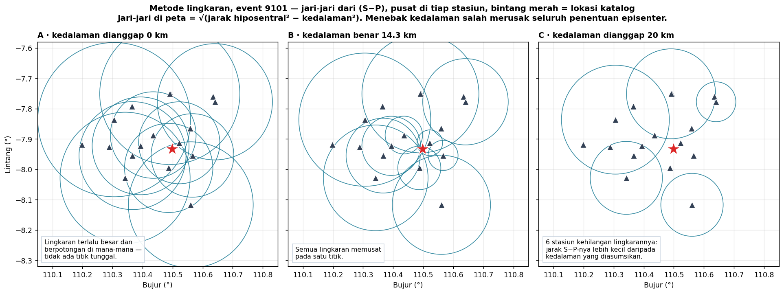
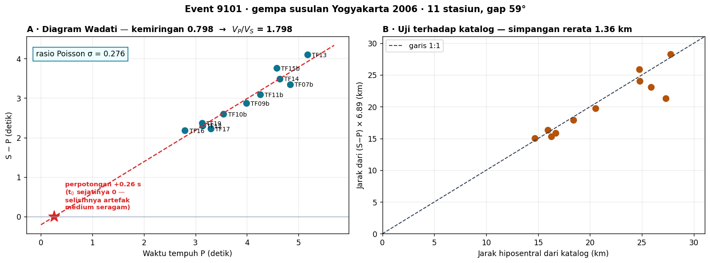
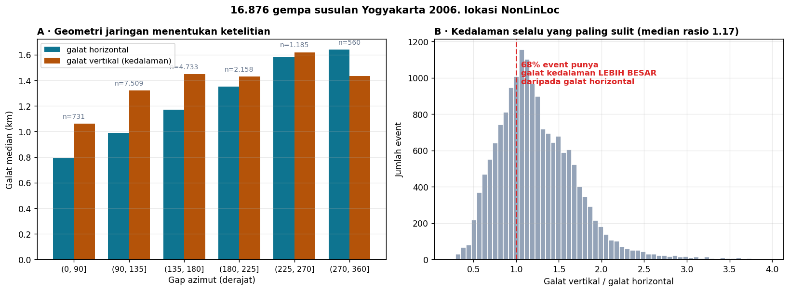
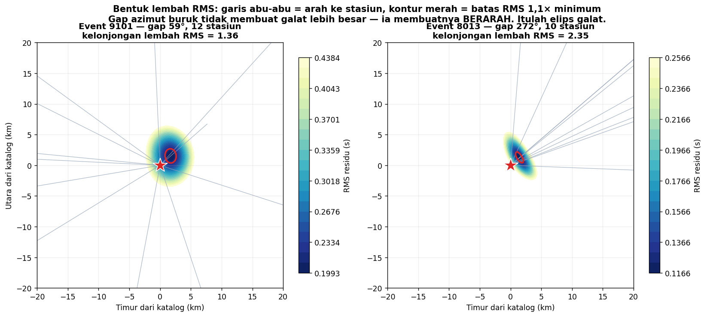
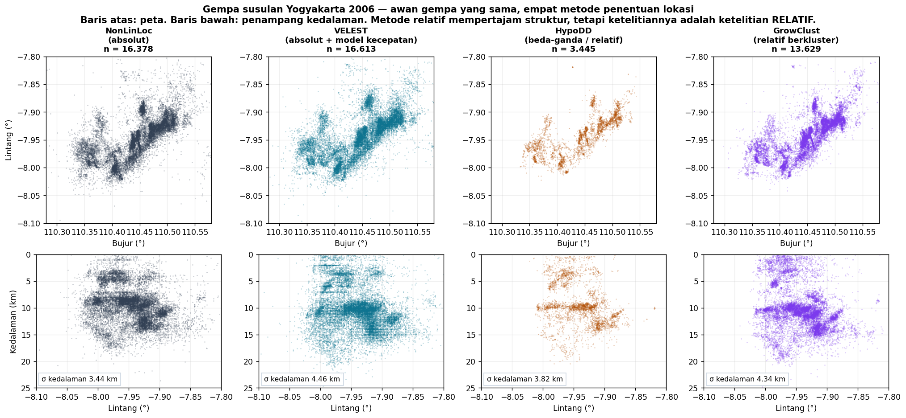

# Minggu 12 — Penentuan Episenter dan Hiposenter

**Seismologi `PAGF262413`** · Senin 07:15–08:55, Ruang Kelas 209
Pokok Bahasan 6 · **CPMK4** · Bloom **C3–C4** dan **P4**
Menopang **Praktikum Acara 3** · Milestone asesmen **M5** dijalankan penuh di sini

> **Sasaran pertemuan.** Di akhir 100 menit mahasiswa dapat (a) menurunkan jarak dan waktu asal dari selisih S−P menggunakan diagram Wadati, (b) menjalankan metode lingkaran dan menjelaskan mengapa ia gagal bila kedalaman ditebak salah, (c) menjelaskan metode Geiger sebagai inversi iteratif dan menyebut peran matriks turunan parsial, (d) menjelaskan bagaimana geometri jaringan menentukan ketelitian, dan (e) membedakan **presisi** dari **akurasi** pada metode lokasi relatif.

Seluruh data pertemuan ini berasal dari **gempa susulan Yogyakarta 2006**, jaringan YK 17 stasiun.

---

## 0 · Pembuka: satu tebakan salah merusak segalanya · 10 menit

Tiga panel, **satu gempa yang sama, waktu tiba yang sama persis**. Yang berbeda hanya satu angka: kedalaman yang diasumsikan.

| Asumsi | Yang terjadi |
|:--|:--|
| 0 km | Lingkaran terlalu besar, berpotongan di mana-mana |
| **14,3 km (benar)** | Semua lingkaran memusat di satu titik |
| 20 km | Lima stasiun **kehilangan lingkarannya** — jarak S−P-nya lebih kecil daripada kedalaman yang diasumsikan |

*Tanyakan:* kita ingin mencari **episenter** — posisi di permukaan. Mengapa menebak **kedalaman** bisa merusaknya?

Jawabannya adalah inti pertemuan hari ini: **keempat besaran itu tidak dapat dicari sendiri-sendiri.** Lintang, bujur, kedalaman, dan waktu asal terkunci satu sama lain di dalam satu persamaan. Menggeser salah satunya memaksa yang lain ikut bergeser.

> Melanjutkan alur kita: Minggu 1 — *yang kita punya hanya seismogram*. Minggu 11 — *dan seismogram itu bukan gerakan tanah*. Minggu 12 — **dan lokasi yang kalian hitung bukan sebuah titik, melainkan sebuah awan kemungkinan.**

---

## 1 · Dari S−P ke jarak: diagram Wadati · 20 menit

Gelombang P dan S berangkat **bersamaan** dari hiposenter tetapi merambat dengan kecepatan berbeda. Semakin jauh stasiun, semakin lebar jaraknya. Untuk medium berkecepatan seragam:

$$t_S - t_P = d \left( \frac{1}{V_S} - \frac{1}{V_P} \right)$$

### Diagram Wadati

Plot $(t_S - t_P)$ terhadap $t_P$ untuk semua stasiun. Hasilnya **garis lurus** dengan dua hadiah sekaligus:

- **Kemiringannya** = $V_P/V_S - 1$
- **Perpotongan dengan sumbu mendatar** = waktu asal $t_0$

Pada event 9101 dengan 11 stasiun, kemiringannya 0,798 sehingga

$$V_P/V_S = 1{,}798 \qquad \sigma_{\text{Poisson}} = 0{,}276$$

Nilai yang wajar untuk batuan kerak.

> **Bacalah perpotongannya dengan hati-hati.** Data yang kita pakai menyimpan **waktu tempuh**, bukan waktu tiba absolut — jadi waktu asal sejatinya **nol menurut konstruksi**. Namun garis Wadati memotong di **+0,26 s**. Selisih itu bukan kesalahan hitung: ia mengukur seberapa jauh anggapan "medium berkecepatan seragam" menyimpang dari bumi berlapis yang sebenarnya. Setiap kali kalian memaksakan model sederhana pada data nyata, sisa semacam ini muncul — dan membacanya adalah keterampilan tersendiri. **Perhatikan apa yang baru saja terjadi:** mahasiswa memperoleh sifat elastik kerak bumi di bawah Bantul hanya dari sebelas selisih waktu, dengan penggaris. Tidak ada kotak hitam, tidak ada perangkat lunak.

Panel B menguji hasilnya: jarak yang dihitung dari $(S-P) \times 6{,}89$ dibandingkan dengan jarak hiposentral katalog menyimpang rata-rata **1,36 km**. Cukup baik untuk tebakan awal, terlalu kasar untuk hasil akhir — dan itulah alasan kita memerlukan inversi.

> **Kaidah lapangan yang layak dihafal:** jarak dalam km ≈ 8 × (S−P) dalam detik. Untuk gempa lokal di Jawa itu tebakan awal yang cukup dekat.

---

## 2 · Metode lingkaran · 15 menit

Tiap stasiun memberi satu **jarak**, bukan arah. Maka tiap stasiun mendefinisikan sebuah lingkaran, dan lokasinya ada di perpotongan.

| Stasiun | Yang bisa disimpulkan |
|:--:|:--|
| 1 | Gempa ada di suatu tempat pada satu lingkaran |
| 2 | Dua titik potong — masih ambigu |
| **3** | **Satu titik** |

Tapi hati-hati dengan satu subtlety yang sering terlewat. Yang diberikan S−P adalah jarak **hiposentral** — jarak miring sampai ke kedalaman. Jari-jari lingkaran di peta adalah proyeksinya:

$$R_{\text{peta}} = \sqrt{d_{\text{hiposentral}}^2 - h^2}$$

Di situlah kedalaman menyusup masuk. Dan bila $h > d$, akar itu menjadi imajiner — lingkarannya **tidak ada sama sekali**, seperti panel C tadi. Ketiadaan lingkaran itu sendiri adalah bukti bahwa asumsi kedalaman kalian salah.

*Aktivitas kelas (10 menit):* bagikan waktu tiba tiga stasiun di kertas milimeter. Minta mahasiswa menggambar lingkarannya dengan jangka. Kerja tangan ini melekat jauh lebih lama daripada memanggil fungsi.

---

## 3 · Masalah balik: metode Geiger · 20 menit

Metode lingkaran tidak terpakai lagi begitu jumlah stasiun banyak dan datanya berderau — lingkarannya tidak pernah benar-benar berpotongan di satu titik. Yang kita butuhkan adalah **inversi**.

### Rumusan

Empat besaran yang dicari: $\mathbf{m} = (x, y, z, t_0)$. Untuk tiap stasiun $i$, waktu tiba hasil hitungan adalah

$$t_i^{\text{hitung}} = t_0 + T_i(x, y, z)$$

Residu adalah selisih antara pengamatan dan hitungan: $r_i = t_i^{\text{amat}} - t_i^{\text{hitung}}$.

### Linearisasi — gagasan Geiger

$T_i$ tidak linear terhadap posisi, jadi tidak bisa diselesaikan sekali jalan. Geiger (1912) mengusulkan: **mulai dari tebakan, lalu perbaiki sedikit demi sedikit.**

$$\mathbf{r} = \mathbf{G}\, \Delta\mathbf{m}, \qquad
G_{ij} = \frac{\partial T_i}{\partial m_j}$$

Matriks $\mathbf{G}$ berisi turunan parsial waktu tempuh terhadap keempat parameter. Solusi kuadrat terkecilnya

$$\Delta\mathbf{m} = (\mathbf{G}^\mathrm{T}\mathbf{G})^{-1}\mathbf{G}^\mathrm{T}\mathbf{r}$$

Perbarui $\mathbf{m}$, hitung ulang, ulangi sampai $\Delta\mathbf{m}$ mengecil. Biasanya cukup 3–6 iterasi.

### Dari mana galatnya datang

Matriks kovariansi $\mathbf{C} = \sigma^2 (\mathbf{G}^\mathrm{T}\mathbf{G})^{-1}$ memberi ketidakpastian keempat parameter — dan **korelasi antar-parameter**. Diagonalnya menjadi galat masing-masing; suku silangnya yang melahirkan **elips galat** dan menjelaskan mengapa kedalaman dan waktu asal begitu erat berkorelasi.

> Kolom kedalaman pada $\mathbf{G}$ hampir sebanding dengan kolom waktu asal ketika semua stasiun jauh. Artinya, **memperdalam hiposenter lalu memajukan waktu asal menghasilkan waktu tiba yang hampir sama.** Data tidak bisa membedakan keduanya. Inilah *trade-off* kedalaman–waktu asal, dan bukan kelemahan algoritma melainkan sifat masalahnya.

---

## 4 · Mengapa kedalaman selalu yang paling sulit · 20 menit

Diuji pada **16.876 gempa susulan** yang dilokasikan NonLinLoc:

### Geometri jaringan menentukan ketelitian

| Gap azimut | Galat horizontal median |
|:--|--:|
| 0–90° | **0,79 km** |
| 90–135° | 1,06 km |
| 135–180° | ~1,2 km |
| 180–270° | 1,43 km |
| 270–360° | **1,64 km** |

Galatnya **berlipat dua** dari jaringan yang mengepung sepenuhnya ke jaringan yang hanya melihat dari satu sisi. Ini bukan soal kualitas alat — semua event memakai jaringan yang sama. Yang berbeda hanya **posisi gempanya relatif terhadap jaringan**.

> **Konsekuensi praktis:** gempa di luar jaringan selalu lebih buruk lokasinya daripada gempa di dalamnya. Itu sebabnya gempa laut lepas pantai selatan Jawa lebih sulit dilokasikan daripada gempa daratan — jaringan hanya mengepungnya dari utara.

Tetapi hati-hati membacanya. Pada **satu event**, gap yang buruk tidak selalu membuat galatnya lebih besar — sering kali RMS minimumnya justru lebih kecil, karena stasiunnya lebih sedikit sehingga lebih mudah dicocokkan. Yang berubah adalah **bentuk** lembah RMS-nya.

| Event | Gap | Kelonjongan lembah RMS |
|:--|--:|--:|
| EV01 | 53° | **1,40** — hampir bulat |
| EV04 | 272° | **2,35** — jelas memanjang |

Perhatikan arah memanjangnya pada EV04: **tegak lurus terhadap arah kumpulan stasiunnya.** Di arah yang tidak diawasi stasiun mana pun, data tidak punya daya untuk membedakan posisi.

> Inilah makna sesungguhnya **elips galat**: gap azimut yang buruk tidak membuat lokasi sekadar "lebih meleset", ia membuat kemelesetannya **berarah**. Melaporkan satu angka galat untuk kasus semacam ini menyembunyikan yang paling penting.

**Dan satu kejujuran lagi yang layak disampaikan ke kelas.** Dari tiga event bergeometri buruk pada data praktik, hanya EV04 yang melonjong tegas. EV05 (gap 234°) dan EV06 (gap 188°) kelonjongannya hanya 1,27 dan 1,24 — hampir sama dengan yang bergeometri baik. Artinya **gap azimut adalah ringkasan yang kasar**: ia hanya mencatat celah terlebar, dan buta terhadap bagaimana stasiun tersebar di busur sisanya. Dua jaringan bergap sama bisa berperilaku sangat berbeda. Tren populasi pada 16.876 event tadi nyata, tetapi tidak bisa dipakai meramal satu event tertentu.

### Kedalaman kalah pada 68% event

Rasio galat vertikal terhadap galat horizontal bermedian **1,17**, dan pada **68% event** galat kedalaman lebih besar. Sebabnya sudah dijelaskan di §3: kedalaman berkorelasi kuat dengan waktu asal, sedangkan lintang dan bujur ditentukan jauh lebih kuat oleh geometri azimut.

**Cara mengatasinya**: satu stasiun yang sangat dekat — jarak lebih kecil daripada kedalaman — akan mengunci kedalaman, karena bagi stasiun itu sinar seismiknya menjalar hampir tegak lurus ke atas.

---

## 5 · Lokasi relatif, dan jebakan presisi · 15 menit

Awan gempa susulan yang sama, empat metode. Baris atas peta, baris bawah penampang kedalaman.

**Metode absolut** (NonLinLoc, VELEST) melokasikan tiap gempa sendiri-sendiri. Galat model kecepatan masuk penuh ke tiap event, dan awannya kabur.

**Metode relatif** (HypoDD, GrowClust) memakai **selisih waktu tiba antar-pasangan gempa berdekatan**. Karena gelombang dari dua gempa bertetangga menempuh lintasan yang hampir sama, galat model kecepatan **saling meniadakan**. Strukturnya jadi tajam — lineasi yang tak terlihat pada NonLinLoc muncul jelas pada HypoDD.

### Yang harus diperhatikan pada gambar itu

Lihat penampang kedalaman **VELEST**: ada **pita-pita mendatar** di kedalaman 2–7 km. Itu bukan geologi — itu **batas lapisan model kecepatan** yang memaku hiposenter. Setiap katalog membawa sidik jari model kecepatan yang dipakai membuatnya.

### Presisi bukan akurasi

Perhatikan galat yang dilaporkan tiap metode:

| Metode | Galat dilaporkan | Yang sebenarnya diukur |
|:--|--:|:--|
| NonLinLoc | ~1140 m | Ketidakpastian **absolut** |
| GrowClust | ~271 m | Ketelitian **relatif** antar-event |
| HypoDD | ~18 m | Ketelitian **relatif** antar-event |

Selisihnya dua orde besaran — dan **membandingkannya langsung adalah kekeliruan**. HypoDD tidak melokasikan gempa 60 kali lebih akurat daripada NonLinLoc. Ia mengukur **jarak antar-gempa** dengan sangat teliti, sementara seluruh awannya bisa saja tergeser 2 km secara serempak karena model kecepatannya keliru.

> **Kalimat yang layak dihafal:** metode relatif memberi bentuk yang tajam pada posisi yang mungkin salah. Untuk memetakan bidang sesar, itu tepat. Untuk menyatakan gempa berada di bawah desa mana, itu berbahaya.

---

## Tugas Minggu 12

### T12.1 — Prediksi terkunci (sebelum menyentuh komputer)

1. Gempa dengan S−P = 5 detik. Perkirakan jaraknya, beri **selang**.
2. Gempa berada tepat di tengah jaringan vs 50 km di luarnya. Besaran mana yang paling memburuk?
3. Kalau model kecepatan yang dipakai 5% terlalu tinggi, kedalaman hasil hitungan menjadi terlalu dalam atau terlalu dangkal?
4. Berapa stasiun paling sedikit untuk mendapatkan keempat parameter?

### T12.2 — Notebook praktik

Kerjakan [`Minggu12_Praktik.ipynb`](Minggu12_Praktik.ipynb). Data di [`data/`](data/): waktu tiba enam gempa nyata di 17 stasiun, plus katalog rujukan.

Tiga di antaranya bergeometri baik (gap 53–59°), tiga bergeometri buruk (gap 188–272°). **Bandingkan hasil dan galat kalian antara keduanya** — itu inti tugasnya.

### T12.3 — Milestone M5

Ini asesmen berbobot penuh pertama dengan data unik. Yang diukur:

| Metrik | Ambang lulus |
|:--|:--|
| Galat episenter terhadap katalog | ≤ 15 km (inversi) |
| Rasio retensi $R = U/A$ | ≥ 0,60 |
| Viva (bila terpicu atau tersampel) | ≥ 6 dari 9 |
| Laju cakupan selang keyakinan | mendekati 0,80 |

**Kedalaman dinilai lewat kalibrasi, bukan ketepatan.** Laporkan selang, bukan satu angka. Selang sempit yang meleset bernilai lebih rendah daripada selang lebar yang memuat nilai katalog — karena pada titik ini kalian sudah tahu persis mengapa kedalaman sulit.

### T12.4 — Bacaan

| Sumber | Bagian |
|:--|:--|
| Stein & Wysession | 7.2.1 *Theory* (h. 416), 7.2.2 (h. 419), **7.2.3 *Errors* (h. 420)**, 7.2.4 (h. 422) |
| Shearer | 5.6 *Earthquake Location*, 5.6.1 *Iterative Methods*, 5.6.2 *Relative Event Location* |
| NMSOP-2 | Bab 11 — praktik penentuan lokasi di observatori |

---

## Catatan waktu

| Bagian | Menit | Kumulatif |
|:--|:--:|:--:|
| 0 · Pembuka: tebakan kedalaman yang salah | 10 | 10 |
| 1 · S−P dan diagram Wadati | 20 | 30 |
| 2 · Metode lingkaran (termasuk kerja jangka) | 15 | 45 |
| 3 · Metode Geiger dan inversi iteratif | 20 | 65 |
| 4 · Geometri jaringan dan galat | 20 | 85 |
| 5 · Lokasi relatif; presisi vs akurasi | 15 | 100 |

---

## Catatan untuk pengajar

**Bandingkan dengan katalog resmi.** Sesuai RPS, minta mahasiswa mengadu hasil hitungannya dengan katalog BMKG dan ISC untuk gempa yang sama. Perbedaan di antara kedua katalog resmi itu sendiri sering lebih besar daripada dugaan mahasiswa — dan itu pelajaran yang jauh lebih berharga daripada mengejar satu angka "benar".

**Peringatan tentang data ini.** Katalog rujukan yang dipakai berasal dari NonLinLoc dengan model kecepatan tertentu. Ia bukan kebenaran mutlak, hanya rujukan yang konsisten. Sampaikan itu terus terang; mahasiswa yang menemukan selisih sistematis dan bisa menjelaskan sebabnya layak diberi nilai lebih, bukan kurang.

**Minggu depan:** magnitudo, momen, energi, dan intensitas. Lokasi yang mereka hitung minggu ini menjadi masukan langsung — karena magnitudo bergantung pada jarak, dan jarak bergantung pada lokasi.

Seismologi PAGF262413 · Program Studi Sarjana Geofisika FMIPA UGM · Kurikulum 2026
