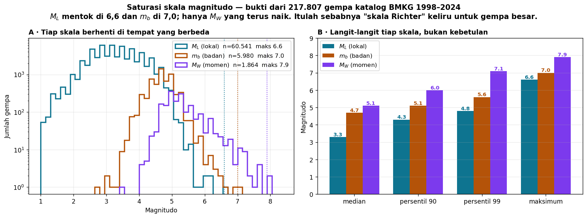
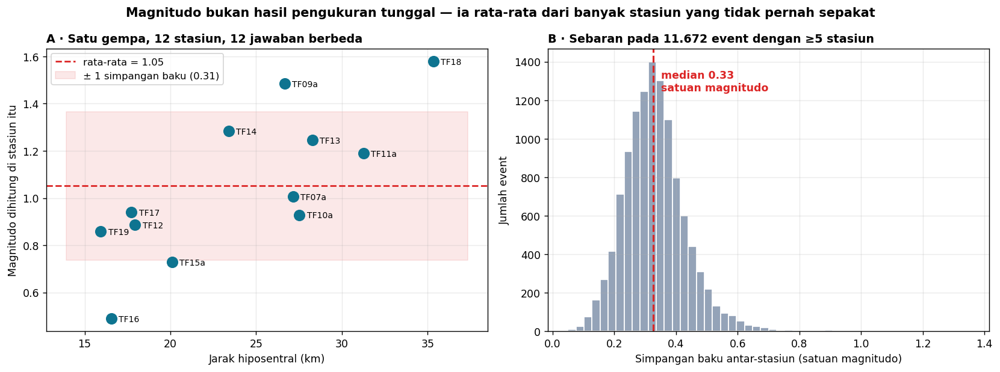
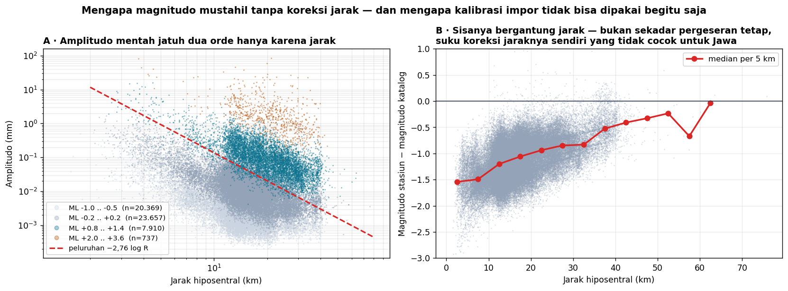
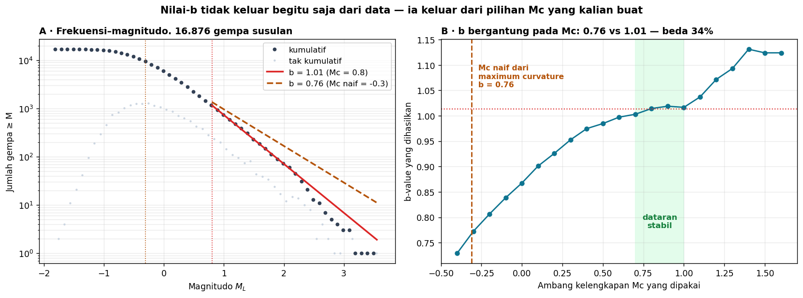

# Minggu 13 — Magnitudo, Momen, Energi, dan Intensitas

**Seismologi `PAGF262413`** · Senin 07:15–08:55, Ruang Kelas 209
Pokok Bahasan 6 · **CPMK4** · Bloom **C3–C4**
Menopang **Praktikum Acara 4**

> **Sasaran pertemuan.** Di akhir 100 menit mahasiswa dapat (a) menjelaskan mengapa magnitudo adalah rata-rata dan bukan pengukuran tunggal, (b) menghitung magnitudo lokal dari amplitudo dan jarak serta menjelaskan mengapa kalibrasinya harus regional, (c) menjelaskan momen seismik dan mengapa $M_W$ tidak jenuh, (d) menghitung nisbah energi antar-magnitudo, dan (e) membedakan **magnitudo** dari **intensitas** serta memakai perbedaan itu untuk menjelaskan kasus Yogyakarta 2006.

Seluruh data pertemuan ini berasal dari **gempa susulan Yogyakarta 2006** (16.876 event, 97.691 pembacaan amplitudo) dan **katalog BMKG 1998–2024** (217.807 gempa).

---

## 0 · Pembuka: "skala Richter" itu keliru, dan ini buktinya · 10 menit

Tanyakan lebih dulu: *"Kalau ada gempa besar, angka yang disebut di berita itu skala apa?"* Hampir pasti ada yang menjawab "skala Richter".

Lalu tunjukkan gambar ini — 217.807 gempa dari katalog BMKG, dikelompokkan menurut jenis magnitudo yang benar-benar dipakai:

| Skala | Median | Persentil 99 | **Maksimum** |
|:--|--:|--:|--:|
| $M_L$ lokal | 3,3 | 4,8 | **6,6** |
| $m_b$ badan | 4,7 | 5,6 | **7,0** |
| $M_W$ momen | 5,1 | 7,1 | **7,9** |

$M_L$ **tidak pernah** melampaui 6,6 dalam 27 tahun data. Bukan karena Indonesia tak punya gempa lebih besar — Aceh 2004 adalah M9,1 — melainkan karena **skalanya sendiri berhenti bisa membedakan** di atas titik itu.

> **Pesan pembuka:** angka magnitudo tidak berarti apa-apa tanpa menyebut skalanya. Dan "skala Richter" — yaitu $M_L$ — justru skala yang paling cepat menyerah untuk gempa yang paling penting.

### Satu kejujuran tentang gambar itu

Langit-langit yang terlihat **bukan bukti murni saturasi**. BMKG memilih skala menurut ukuran dan prosedur: gempa kecil tidak pernah dihitung $M_W$-nya, gempa raksasa selalu dihitung. Jadi sebagian pola itu adalah **efek pemilihan**, bukan fisika.

Yang membuatnya tetap meyakinkan: langit-langit yang teramati **cocok dengan titik saturasi yang diramalkan teori** ($M_L$ sekitar 6,5, $m_b$ sekitar 6,5–7). Pembuktian bersih memerlukan gempa yang sama diukur dengan ketiga skala — dan katalog ini hanya menyimpan satu jenis per event. Sampaikan keterbatasan ini ke kelas; membedakan bukti kuat dari bukti yang cocok adalah bagian dari pelajarannya.

---

## 1 · Magnitudo bukan hasil pengukuran tunggal · 15 menit

Satu gempa. Dua belas stasiun. **Dua belas jawaban yang berbeda.**

Panel A: satu gempa susulan diukur di 12 stasiun memberi magnitudo dari 0,49 sampai 1,58 — rentang lebih dari satu satuan penuh. Simpangan bakunya 0,31.

Panel B: pola itu bukan kebetulan. Pada 11.672 event dengan minimal lima stasiun, simpangan baku antar-stasiun bermedian **0,33 satuan magnitudo**.

Penyebabnya nyata semua: pola radiasi sumber yang tidak sama ke segala arah, kondisi tanah setempat di tiap stasiun, lintasan gelombang yang berbeda, dan galat pengukuran amplitudo.

> **Konsekuensi yang harus dipahami:** ketika BMKG mengumumkan "M5,2", angka itu adalah rata-rata dengan ketidakpastian sekitar ±0,3 — bukan hasil satu pembacaan. Perdebatan antar-lembaga tentang selisih 0,2 satuan magnitudo hampir selalu perdebatan di dalam derau.

---

## 2 · Dari amplitudo ke magnitudo · 20 menit

Gagasan Richter (1935) sederhana: ukur amplitudo maksimum, lalu koreksi pengaruh jarak.

$$M_L = \log_{10} A + f(R)$$

Panel A menunjukkan mengapa suku $f(R)$ mutlak diperlukan: pada 97.691 pembacaan nyata, amplitudo jatuh **dua orde besaran** hanya karena jarak. Tanpa koreksi, gempa yang sama akan terbaca sangat berbeda di stasiun dekat dan jauh.

### Mengapa kalibrasi impor tidak bisa dipakai begitu saja

Panel B adalah pelajaran yang tidak ada di buku teks. Saya terapkan rumus kalibrasi California yang lazim dikutip:

$$M_L = \log_{10} A + 2{,}76 \log_{10} R - 2{,}48$$

Hasilnya meleset **−1,12 satuan magnitudo** terhadap katalog. Dan yang lebih penting: sisanya **tidak tetap** — ia bergerak dari −1,5 pada jarak dekat menjadi hampir nol pada 60 km.

Artinya bukan sekadar konstantanya yang salah, melainkan **suku peluruhan jaraknya sendiri**. Kerak di bawah Jawa Tengah meredam gelombang secara berbeda dari California.

> **Kesimpulan praktis:** setiap wilayah harus mengkalibrasi $f(R)$-nya sendiri. Menyalin rumus dari buku teks Amerika menghasilkan magnitudo yang salah lebih dari satu satuan — dan bergantung jarak, sehingga tidak bisa diperbaiki dengan sekadar menambahkan konstanta.

---

## 3 · Momen seismik: ukuran yang tidak menyerah · 20 menit

Semua skala berbasis amplitudo pada akhirnya jenuh, karena amplitudo pada satu perioda tertentu berhenti tumbuh ketika sumbernya menjadi jauh lebih besar daripada panjang gelombang yang diukur.

**Momen seismik** menghindari jebakan itu dengan tidak mengukur getaran sama sekali, melainkan mengukur **seberapa banyak batuan yang bergeser**:

$$M_0 = \mu \, \bar{D} \, A$$

dengan $\mu$ modulus geser, $\bar D$ pergeseran rata-rata, dan $A$ luas bidang sesar. Satuannya N·m — satuan kerja, bukan satuan amplitudo.

Karena tidak ada suku yang bisa jenuh, $M_0$ tumbuh terus. Magnitudo momen dibuat agar angkanya bersambung dengan skala lama:

$$M_W = \frac{2}{3}\left( \log_{10} M_0 - 9{,}1 \right)$$

### Spektrum sumber dan frekuensi sudut

Spektrum perpindahan dari sumber gempa berbentuk datar pada frekuensi rendah lalu meluruh setelah **frekuensi sudut** $f_c$:

- **Tinggi bagian datar** sebanding dengan $M_0$ — inilah yang tidak pernah jenuh
- **$f_c$** berbanding terbalik dengan ukuran sumber; gempa besar berfrekuensi sudut rendah

Sekarang saturasi jadi jelas: $M_L$ diukur sekitar 1–10 Hz. Untuk gempa M8, $f_c$ sudah jauh di bawah pita itu, sehingga **menambah ukuran gempa tidak lagi menambah amplitudo pada pita yang diukur.** Skalanya buta terhadap pertumbuhan lebih lanjut.

Ini menyambung langsung dengan Minggu 11: mahasiswa sudah melihat sendiri bahwa gempa mikro Yogyakarta berenergi di 15–45 Hz, sementara gempa besar berenergi jauh lebih rendah.

---

## 4 · Energi, dan mengapa gempa kecil tidak menolong · 15 menit

Energi seismik teradiasi berhubungan dengan magnitudo:

$$\log_{10} E \approx 1{,}5\,M + 4{,}8$$

Setiap satu satuan magnitudo berarti energi **31,6 kali** lipat:

| Selisih magnitudo | Nisbah energi |
|:--|--:|
| 1 | 32 × |
| 2 | 1.000 × |
| 3 | 31.623 × |
| 4 | 1.000.000 × |

**Aceh 2004 (M9,1) melepaskan sekitar 16.000 kali energi Yogyakarta 2006 (M6,3).**

*Bahan diskusi:* sering terdengar pendapat bahwa banyak gempa kecil "melepaskan tegangan" sehingga mencegah gempa besar. Uji dengan angka: untuk menyamai satu M7, diperlukan **1.000.000 gempa M3**. Kalau terjadi seribu gempa M3 per tahun, perlu **seribu tahun**. Gagasan itu tidak bertahan menghadapi aritmetika.

### Stress drop

Selisih tegangan geser sebelum dan sesudah gempa, $\Delta\sigma$, mengendalikan seberapa keras guncangan pada magnitudo tertentu. Nilainya khas 1–10 MPa dan **hampir tidak bergantung ukuran gempa** — inilah dasar *penskalaan diri-serupa* (*self-similar scaling*): gempa besar dan kecil pada dasarnya proses yang sama pada skala berbeda.

---

## 5 · Intensitas: yang dirasakan, bukan yang dilepaskan · 20 menit

Di sinilah kita akhirnya menjawab pertanyaan yang digantung sejak Minggu 1.

| | Magnitudo | Intensitas |
|:--|:--|:--|
| Mengukur | Energi yang dilepas **di sumber** | Guncangan yang dirasakan **di suatu tempat** |
| Nilainya | **Satu** per gempa | **Berbeda-beda** di tiap lokasi |
| Diperoleh dari | Instrumen | Pengamatan kerusakan, kuesioner, percepatan tanah |
| Skala | $M_L$, $m_b$, $M_S$, $M_W$ | MMI (I–XII), MMI-BMKG |

Intensitas di suatu titik bergantung pada magnitudo, **jarak**, **kedalaman**, **kondisi tanah setempat**, dan **mutu bangunan**.

### Kembali ke Yogyakarta 2006

Di Minggu 1 kita bertanya: mengapa gempa M6,3 menewaskan lebih dari 5.700 orang, sementara Aceh M9,1 melepaskan 16.000 kali lebih banyak energi?

Sekarang jawabannya dapat disusun:

| Faktor | Yogyakarta 2006 |
|:--|:--|
| **Kedalaman** | ± 10 km — sangat dangkal, energinya tidak sempat menyebar |
| **Jarak** | Sesar tepat di bawah kawasan padat Bantul |
| **Kondisi tanah** | Endapan aluvial Bantul memperkuat guncangan |
| **Bangunan** | Rumah bata tanpa tulangan, sangat rentan |
| **Waktu** | 05:54 pagi, sebagian besar orang masih di dalam rumah |

**Magnitudo hanyalah satu dari lima faktor itu** — dan satu-satunya yang tidak dapat diubah manusia. Empat sisanya bisa.

> Ini titik afektif pertemuan ini (**A4**): magnitudo adalah berita, tetapi intensitas adalah yang membunuh. Dan intensitas dapat dikurangi.

Sisanya — risiko sebagai bahaya × kerentanan × keterpaparan — kita selesaikan di Minggu 15.

---

## Tugas Minggu 13

### T13.1 — Prediksi terkunci (sebelum menyentuh komputer)

1. Dua stasiun mengukur gempa yang sama pada jarak 10 km dan 40 km. Amplitudo di stasiun jauh lebih kecil berapa kali? Beri **selang**.
2. Berapa gempa M4 diperlukan untuk menyamai energi satu M6?
3. Kalau kalian memakai rumus $M_L$ California di Jawa, hasilnya terlalu besar atau terlalu kecil?
4. Nilai-b khas kerak adalah sekitar berapa?

### T13.2 — Notebook praktik

Kerjakan [`Minggu13_Praktik.ipynb`](Minggu13_Praktik.ipynb). Data di [`data/`](data/): amplitudo enam gempa di 9–12 stasiun, plus katalog 16.876 nilai $M_L$ untuk latihan nilai-b.

### T13.3 — Nilai-b, dan jebakannya

Hubungan Gutenberg–Richter menyatakan $\log_{10} N = a - bM$. Nilai-b khas kerak adalah sekitar 1,0.

Tetapi perhatikan panel B baik-baik. Nilai-b **bergantung sepenuhnya pada ambang kelengkapan $M_c$ yang kalian pilih**:

| Pilihan $M_c$ | b yang dihasilkan |
|:--|--:|
| $M_c = -0{,}3$ dari *maximum curvature* (naif) | **0,76** |
| $M_c = 0{,}8$ dari dataran stabil | **1,01** |

Selisihnya **34%**. Angka 0,76 keliru karena di bawah $M_c$ sejati katalognya tidak lengkap — gempa terkecil banyak yang tidak terdeteksi, sehingga kemiringannya tampak lebih landai daripada yang sebenarnya.

**Tugas:** ulangi analisis ini pada katalog yang disediakan. Laporkan $M_c$ dan b kalian, **beserta alasan memilih $M_c$ itu**. Jawaban tanpa alasan bernilai nol — karena persis di situlah letak pemahamannya.

> Inilah contoh sempurna perbedaan antara menjalankan kode dan memahaminya. Rutin nilai-b mana pun akan mengembalikan sebuah angka. Hanya orang yang paham yang tahu bahwa angka itu bisa salah 34%.

### T13.4 — Bacaan

| Sumber | Bagian |
|:--|:--|
| Stein & Wysession | 4.6.1 *Magnitudes and moment* (h. 263), 4.6.2 *Source spectra and scaling laws* (h. 266), 4.6.3 *Stress drop and earthquake energy* (h. 269) |
| Shearer | 9.5 *Stress Drop*, 9.6 *Radiated Seismic Energy*, 9.7 *Earthquake Magnitude*, 9.7.3 *The Intensity Scale* |

---

## Catatan waktu

| Bagian | Menit | Kumulatif |
|:--|:--:|:--:|
| 0 · Pembuka: "skala Richter" itu keliru | 10 | 10 |
| 1 · Magnitudo bukan pengukuran tunggal | 15 | 25 |
| 2 · Dari amplitudo ke magnitudo | 20 | 45 |
| 3 · Momen seismik dan $M_W$ | 20 | 65 |
| 4 · Energi dan *stress drop* | 15 | 80 |
| 5 · Intensitas dan kasus Yogyakarta | 20 | 100 |

---

## Catatan untuk pengajar

**Diskusi "skala Richter" yang diminta RPS** paling baik ditaruh di §0 sebagai pembuka, bukan di akhir. Ia menciptakan ketidaknyamanan yang produktif: hampir semua mahasiswa datang dengan keyakinan yang keliru, dan membongkarnya di menit pertama membuat sisa pertemuan terasa perlu.

**Jangan lewatkan catatan kejujuran di §0.** Gambar saturasi itu memuat efek pemilihan, dan mengatakannya justru memperkuat wibawa Anda — sekaligus melatih mahasiswa membedakan bukti kuat dari bukti yang sekadar cocok.

**Minggu depan:** mekanisme sumber gempa. Momen seismik yang diperkenalkan hari ini akan kembali sebagai **tensor** momen — dan di situlah arah sesar terbaca.

Seismologi PAGF262413 · Program Studi Sarjana Geofisika FMIPA UGM · Kurikulum 2026
