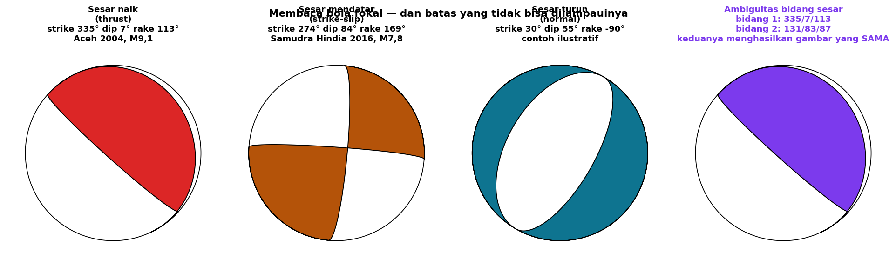
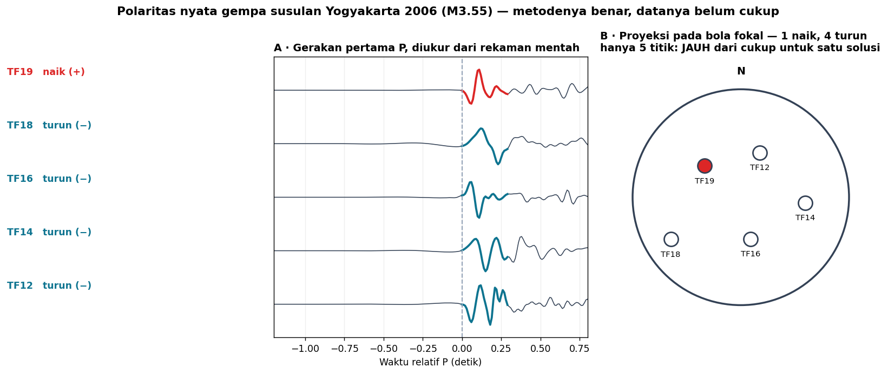
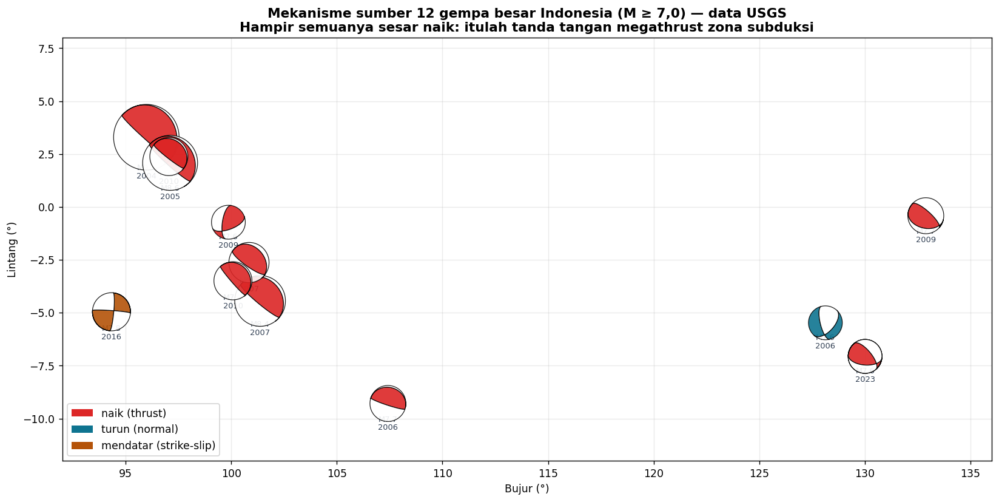

# Minggu 14 — Mekanisme Sumber: Bidang Sesar, *First Motion*, dan *Beach Ball*

**Seismologi `PAGF262413`** · Senin 07:15–08:55, Ruang Kelas 209
Pokok Bahasan 7 · **CPMK4** · Bloom **C4**
Menopang **Praktikum Acara 5**

> **Sasaran pertemuan.** Di akhir 100 menit mahasiswa dapat (a) menyebutkan geometri sesar dengan *strike*, *dip*, dan *rake*, (b) menjelaskan pola radiasi P dan mengapa ia terbagi empat kuadran, (c) membaca *beach ball* dan menentukan tipe sesarnya, (d) menjelaskan **ambiguitas bidang sesar** dan mengapa seismologi sendiri tidak dapat memecahkannya, dan (e) menafsirkan tensor momen serta komponen non-*double-couple*.

---

## 0 · Pembuka: satu gambar, dua jawaban · 10 menit

Tunjukkan panel keempat. Itu bola fokal gempa **Aceh–Andaman 2004, M9,1** — gempa terbesar dalam sejarah modern Indonesia.

Dari gambar itu, USGS melaporkan **dua** bidang yang sama-sama mungkin:

| | *Strike* | *Dip* | *Rake* |
|:--|--:|--:|--:|
| Bidang 1 | 335° | 7° | 113° |
| Bidang 2 | 131° | 83° | 87° |

Bidang pertama hampir mendatar, yang kedua hampir tegak. **Keduanya menghasilkan gambar yang sama persis** dan cocok sempurna dengan seluruh data seismik.

*Tanyakan:* mana yang benar, dan bagaimana kita bisa tahu?

Jawabannya — dan ini mengejutkan mahasiswa — **seismologi sendiri tidak bisa menjawabnya.** Yang memutuskan adalah pengetahuan lain: sebaran gempa susulan, geologi permukaan, geodesi, konteks tektonik. Untuk Aceh, kita tahu bidang yang benar adalah yang hampir mendatar karena itulah geometri megathrust zona subduksi.

> Ini pelajaran ketiga tentang batas metode, setelah kedalaman (Minggu 12) dan saturasi (Minggu 13). Pola yang berulang: **data seismik menentukan banyak hal, tetapi tidak segalanya, dan mengetahui batasnya adalah bagian dari keahlian.**

---

## 1 · Geometri sesar: tiga sudut · 15 menit

Setiap bidang sesar dan arah geraknya dinyatakan dengan tiga angka.

| Sudut | Rentang | Artinya |
|:--|:--|:--|
| ***Strike*** | 0°–360° | Arah garis perpotongan bidang sesar dengan bidang datar, diukur dari utara |
| ***Dip*** | 0°–90° | Kemiringan bidang sesar dari bidang datar |
| ***Rake*** | −180°–180° | Arah gerak blok atas **di dalam** bidang sesar |

**Rake menentukan tipe sesar**, dan hanya itu:

| *Rake* | Tipe | Rezim tektonik |
|:--|:--|:--|
| ≈ +90° | **Naik** (*thrust*/*reverse*) | Kompresi — zona subduksi, sabuk lipatan |
| ≈ −90° | **Turun** (*normal*) | Tarikan — punggungan tengah samudra, cekungan |
| ≈ 0° atau ±180° | **Mendatar** (*strike-slip*) | Geser — sesar transform |

Perhatikan Aceh 2004: *rake* 113° — sesar naik, dengan sedikit komponen mendatar. Dan *dip* hanya 7°, hampir mendatar. Itulah bentuk khas bidang megathrust.

---

## 2 · Mengapa polanya terbagi empat · 20 menit

Gempa bukan ledakan. Ledakan mendorong ke segala arah sama besar, sehingga gerakan pertama akan **naik di mana-mana**. Yang teramati sama sekali berbeda.

Sumber gempa adalah **kopel ganda** (*double couple*): dua blok saling menggeser. Akibatnya, gelombang P berangkat dengan **tanda yang berselang-seling di empat kuadran**:

- Kuadran **kompresi** — tanah pertama kali bergerak **menjauhi** sumber → gerakan pertama **naik** (+)
- Kuadran **dilatasi** — tanah pertama kali bergerak **mendekati** sumber → gerakan pertama **turun** (−)

Batas antar-kuadran adalah dua bidang tegak lurus: **bidang sesar** dan **bidang bantu** (*auxiliary plane*). Di situlah sumber ambiguitas tadi — pola radiasinya simetris terhadap keduanya, sehingga gelombang P tidak dapat membedakan mana yang benar-benar bergerak.

### Bola fokal

Bayangkan bola kecil mengelilingi hiposenter. Tiap sinar seismik menuju stasiun menembus bola itu di satu titik. Tandai titik tersebut menurut polaritas yang terekam, lalu proyeksikan belahan bawah bola ke bidang datar.

Hasilnya **beach ball**: daerah gelap = kuadran kompresi, terang = dilatasi.

---

## 3 · Mengukur polaritas sendiri · 20 menit

Panel A menunjukkan gerakan pertama P pada lima stasiun, diukur langsung dari rekaman mentah gempa susulan Yogyakarta 2006. Empat stasiun turun, satu naik.

Ini pekerjaan yang benar-benar dilakukan seismolog, dan mahasiswa dapat melakukannya persis seperti ini: tapis, cari onset, baca tanda setengah gelombang pertama.

### Dan di sinilah batasnya

Panel B memproyeksikan kelima polaritas itu ke bola fokal. **Lima titik.** Untuk menentukan dua bidang nodal secara stabil, dibutuhkan minimal delapan sampai sepuluh polaritas yang **tersebar merata** pada bola.

Dengan lima titik yang mengumpul di satu sisi, ada tak terhingga banyak solusi yang cocok. Metodenya benar; datanya belum cukup.

> Bandingkan dengan Minggu 12: di sana geometri jaringan yang buruk membuat elips galat memanjang. Di sini geometri yang buruk membuat mekanisme sumbernya sama sekali tak tertentukan. **Pelajaran yang sama, wajah yang berbeda: apa yang dapat kalian ketahui dibatasi oleh di mana alat kalian berada.**

*Aktivitas (10 menit):* bagikan lembar stereonet. Minta mahasiswa memplot kelima polaritas ini dan mencoba menggambar dua bidang nodal yang memisahkan tanda. Mereka akan menemukan sendiri bahwa banyak sekali pilihan yang sama-sama cocok.

---

## 4 · Membaca mekanisme gempa Indonesia · 20 menit

Dua belas gempa M ≥ 7,0 di Indonesia dengan mekanisme dari USGS:

| Tipe | Jumlah | Di mana |
|:--|--:|:--|
| Naik (*thrust*) | **10** | Sepanjang palung Sumatra–Jawa dan busur Banda |
| Mendatar (*strike-slip*) | 1 | Samudra Hindia 2016, M7,8 |
| Turun (*normal*) | 1 | Ambon 2006, kedalaman **397 km** |

Deretan bola fokal merah yang sejajar palung itu bukan kebetulan — itulah **tanda tangan megathrust**. Lempeng Indo-Australia menunjam ke bawah Sunda, dan bidang kontaknya menghasilkan sesar naik berkemiringan landai.

Perhatikan dua pengecualiannya, keduanya bermakna:

- **2016 M7,8 di Samudra Hindia**, *strike-slip* dengan *dip* 84°. Ini bukan megathrust melainkan deformasi **di dalam lempeng samudra** sebelum menunjam.
- **2006 M7,6 dekat Ambon pada 397 km**, sesar turun. Pada kedalaman itu tidak ada gesekan biasa; gempa terjadi di dalam slab yang menghunjam, akibat tarikan gravitasi slab itu sendiri.

> Beach ball bukan hiasan peta. Ia **peta gaya**: dari bentuknya, arah tegasan utama daerah itu terbaca langsung.

---

## 5 · Dari kopel ganda ke tensor momen · 15 menit

Bola fokal *first motion* hanya memakai tanda gerakan pertama — membuang informasi amplitudo dan bentuk gelombang. **Tensor momen** memakai seluruhnya.

$$\mathbf{M} = \begin{pmatrix} M_{rr} & M_{rt} & M_{rp} \\ M_{rt} & M_{tt} & M_{tp} \\ M_{rp} & M_{tp} & M_{pp} \end{pmatrix}$$

Enam bilangan bebas yang menyatakan sistem gaya ekuivalen di sumber. Berkas [`data/W14_mekanisme_indonesia.csv`](data/) memuat keenamnya untuk kedua belas gempa tadi.

Tensor dapat diuraikan menjadi tiga bagian:

| Komponen | Artinya | Muncul pada |
|:--|:--|:--|
| **Kopel ganda** | Pensesaran murni | Hampir semua gempa tektonik |
| **Isotropik** | Perubahan volume | Ledakan, uji nuklir, sebagian gempa vulkanik |
| **CLVD** | Bukan keduanya | Gempa vulkanik, pensesaran rumit, runtuhan kaldera |

Komponen isotropik itulah dasar **pemantauan uji coba nuklir** yang kita sebut di Minggu 1: ledakan menghasilkan komponen isotropik besar, gempa tektonik hampir nol. Perbedaan itu dapat diuji secara kuantitatif — dan menjadi tulang punggung verifikasi CTBT.

---

## Tugas Minggu 14

### T14.1 — Prediksi terkunci

1. Gempa terjadi tepat di bawah stasiun. Gerakan pertama P naik atau turun? Bisakah dipastikan?
2. Berapa polaritas minimal untuk menentukan mekanisme yang stabil? Beri **selang**.
3. Kalau seluruh stasiun berada pada satu kuadran, apa yang terjadi pada solusinya?
4. Ledakan nuklir: berapa kuadran yang akan kalian lihat pada bola fokalnya?

### T14.2 — Notebook praktik

Kerjakan [`Minggu14_Praktik.ipynb`](Minggu14_Praktik.ipynb). Kalian akan mengukur polaritas dari rekaman nyata, memplotnya pada bola fokal, lalu membaca mekanisme dua belas gempa besar Indonesia dari tensor momennya.

### T14.3 — Bacaan

| Sumber | Bagian |
|:--|:--|
| Stein & Wysession | 4.2.1 *Fault geometry* (h. 217), 4.2.2 *First motions* (h. 219), 4.2.3 *Body wave radiation patterns* (h. 220), 4.2.4 *Stereographic fault plane representation* (h. 222), 4.4 *Moment tensors* (h. 239) |
| Shearer | 9.1 *Green's Functions and the Moment Tensor*, 9.2 *Earthquake Faults*, 9.3 *Radiation Patterns and Beach Balls* |

Katalog daring: [Global CMT](https://www.globalcmt.org/CMTsearch.html) dan [IRIS SPUD MT](https://ds.iris.edu/spud/momenttensor).

---

## Catatan waktu

| Bagian | Menit | Kumulatif |
|:--|:--:|:--:|
| 0 · Pembuka: satu gambar, dua jawaban | 10 | 10 |
| 1 · Geometri sesar | 15 | 25 |
| 2 · Pola radiasi dan bola fokal | 20 | 45 |
| 3 · Mengukur polaritas sendiri | 20 | 65 |
| 4 · Mekanisme gempa Indonesia | 20 | 85 |
| 5 · Tensor momen | 15 | 100 |

---

## Catatan untuk pengajar

**Keterbatasan data lokal disampaikan terbuka.** Arsip Yogyakarta 2006 tidak menyimpan polaritas, dan hanya lima stasiunnya punya rekaman kontinu mentah. Polaritas pada materi ini saya ukur ulang dari gelombang, dan lima titik memang tidak cukup untuk satu solusi. Jangan sembunyikan itu — jadikan bahan ajar, persis seperti elips galat di Minggu 12.

**Mekanisme dua belas gempa besar berasal dari USGS**, sudah diunduh ke `data/` agar dapat dipakai tanpa jaringan.

**Minggu depan:** tensor momen, statistika gempa, monitoring dan mitigasi — penutup semester, dan tempat presentasi studi kasus dilaksanakan.

Seismologi PAGF262413 · Program Studi Sarjana Geofisika FMIPA UGM · Kurikulum 2026
