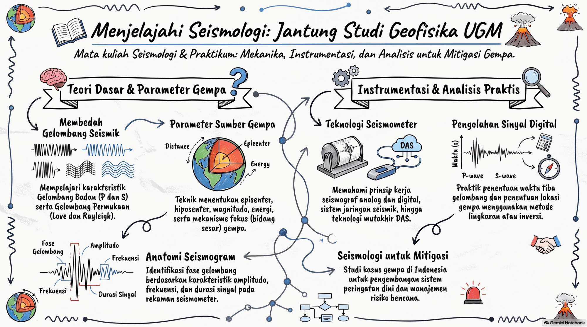
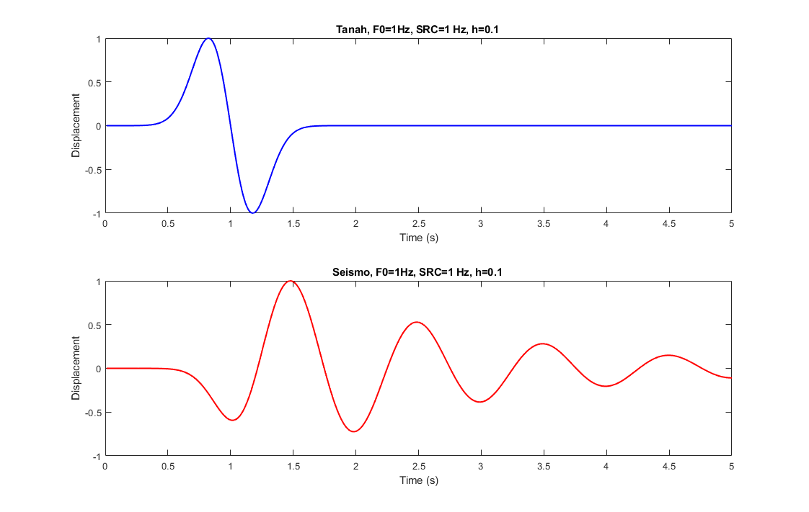

# Seismologi — PAGF262413

**Program Studi Sarjana Geofisika, Departemen Fisika, FMIPA UGM**
Mata kuliah wajib Semester IV, Kurikulum 2026 · 2 SKS

| | |
|:--|:--|
| **Kode** | `PAGF262413` (teori) · `PAGF262412` (praktikum) |
| **Bobot** | 2 SKS teori + 1 SKS praktikum |
| **Semester** | IV — wajib |
| **Rumpun** | Ilmu Geofisika |
| **Kuliah** | Senin, 07:15 – 08:55 · Ruang Kelas 209 |
| **Praktikum** | Kamis, 10:15 – 11:55 · Daring |
| **Prasyarat** | Gelombang (`PADF262208`) dan Mekanika Medium Kontinu (`PAGF262307`) |

> Dalam Kurikulum 2026 Seismologi diajarkan dalam **dua bentuk kegiatan yang saling terintegrasi**: kuliah teori dan praktikum. Praktikum wajib diambil bersamaan (*co-requisite*) atau setelah menempuh kuliah teori.

## Kompetensi

Tujuan utama studi ini adalah memperkenalkan kepada mahasiswa hal yang mendasar tentang seismologi dan gempa bumi — terminologi, dasar teoretis maupun praktis yang mutlak diperlukan bila ingin bekerja dalam bidang kegempaan. Setelah mengikuti kuliah ini mahasiswa diharapkan dapat menjelaskan dengan baik dan benar tentang kejadian gempa, ukuran gempa, intensitas gempa, menentukan lokasi gempa, mekanisme sumber gempa, dan tindakan untuk mengurangi risiko bila terjadi gempa.

Kurikulum 2026 memetakan capaian ini ke **4 Pilar CPL**: Sikap (CPL1), Penguasaan Pengetahuan (CPL2), Keterampilan Umum (CPL3), serta Keterampilan Khusus dan Manajerial (CPL4).

| Pilar CPL | Teori (PAGF262413) | Praktikum (PAGF262412) |
|:--|:--:|:--:|
| CPL1 — Sikap | Sedang | **Kuat** |
| CPL2 — Penguasaan Pengetahuan | **Kuat** | Sedang |
| CPL3 — Keterampilan Umum | Sedang | **Kuat** |
| CPL4.1 — Keterampilan Khusus | Lemah | Sedang |

📄 **Dokumen pendukung**

- [`RPS_Seismologi_2026.md`](RPS_Seismologi_2026.md) — Rencana Pembelajaran Semester: rincian 14 minggu materi + UTS/UAS, penugasan bacaan per subbab Shearer dan Stein & Wysession, kisi-kisi ujian, dan sistem penilaian.
- [`Kurikulum_2026.md`](Kurikulum_2026.md) — bedah lengkap CPL, Taksonomi Bloom, dan posisi mata kuliah dalam Pohon Ilmu Geofisika.
- [`Asesmen_Era_AI_Seismologi.md`](Asesmen_Era_AI_Seismologi.md) — aturan asesmen di kelas berbantuan AI: bobot 25/75, milestone kuantitatif, dan ambang pemicu viva. **Wajib dibaca mahasiswa di pertemuan pertama.**

## Pengampu

- **Dr.rer.nat. Wiwit Suryanto, S.Si., M.Si.** — [@maswiet](https://github.com/maswiet)
- Dr.rer.nat. Ade Anggraini, M.T.

## Silabus

1. **Pendahuluan** — ruang lingkup, sejarah perkembangan seismologi dan elastisitas, serta peran seismologi dalam kebencanaan dan pembangunan berkelanjutan.
2. **Gelombang Seismik** — teori gelombang badan (P dan S), gelombang permukaan (Love dan Rayleigh), kecepatan gelombang, sifat medium, Hukum Snell, *head wave*, dan jalur sinar seismik.
3. **Perambatan Gelombang & Kejadian Gempa** — analisis gempa lokal, regional, dan teleseismik; pengaruh struktur bumi terhadap sinyal seismik; gelombang mantel, kanal, dan mikroseismik.
4. **Instrumentasi Seismologi** — prinsip kerja seismometer dan seismograf (analog & digital), respons instrumen, kalibrasi, jaringan seismik, dan DAS (*Distributed Acoustic Sensing*).
5. **Seismogram dan Anatominya** — analisis komponen seismogram (Z, N, E), identifikasi fase gelombang (P, S, permukaan), serta karakteristik amplitudo, frekuensi, dan durasi sinyal.
6. **Parameter Sumber Gempa** — penentuan lokasi episenter dan hiposenter, magnitudo, energi, serta intensitas gempa bumi beserta dampaknya.
7. **Mekanisme Sumber Gempa** — konsep gaya dan bidang sesar, tipe-tipe mekanisme sumber gempa, dan interpretasinya secara konseptual.
8. **Seismologi dan Mitigasi Bencana** — statistika gempa bumi, hubungan seismologi dengan risiko gempa, peran sistem monitoring dan peringatan dini, serta studi kasus gempa bumi di Indonesia.

## Pendekatan komputasi

Pendidikan Geofisika di era Industri 4.0 tidak lepas dari aplikasi, sehingga dalam kuliah Seismologi ini pendekatan komputasi juga dilakukan — terutama pada materi tentang perangkat yang biasa dipakai dalam pekerjaan seismologi. Hal ini didukung oleh semakin mudahnya akses terhadap bahasa pemrograman modern, dinamis, dan fleksibel seperti [Python](http://python.org) atau MATLAB, lengkap dengan fasilitas [Jupyter notebook](http://jupyter.org/). Harapannya, hal ini memberi motivasi tambahan bagi mahasiswa Geofisika untuk menyenangi komputasi. Karena kalau aku senang, maka aku bisa!

## Jadwal pertemuan

Struktur 14 minggu materi + 2 minggu ujian, mengikuti [`RPS_Seismologi_2026.md`](RPS_Seismologi_2026.md) — di sana ada rincian bacaan per subbab Shearer dan Stein & Wysession, aktivitas, dan kisi-kisi ujian tiap minggu.

| Mg | Tema | PB | CPMK | Materi |
|:--:|:--|:--:|:--:|:--|
| 1 | Ruang lingkup, sejarah, dan peran seismologi | 1 | 5 | **[Materi Minggu 1](Minggu01_Pendahuluan_Seismologi.md)** · [Bahan Kuliah](https://nbviewer.jupyter.org/github/maswiet/Kuliah_Seismologi/blob/master/Sejarah_Wawasan_Seismologi.ipynb)  |
| 2 | Tegangan, regangan, dan elastisitas | 1–2 | 1 | [Segera](#) |
| 3 | Persamaan gelombang seismik; gelombang P dan S | 2 | 1 | [Bahan Kuliah](https://nbviewer.jupyter.org/github/maswiet/Kuliah_Seismologi/blob/master/Gel_Seism.ipynb) (bag. gelombang badan)  |
| 4 | Hukum Snell, jalur sinar, dan *head wave* | 2 | 2 | [Segera](#) |
| 5 | Koefisien refleksi–transmisi; gelombang permukaan dan dispersi | 2 | 1 | [Bahan Kuliah](https://nbviewer.jupyter.org/github/maswiet/Kuliah_Seismologi/blob/master/Gel_Seism.ipynb) (bag. gelombang permukaan)  |
| 6 | Struktur dalam bumi dan fase seismik global | 3 | 2 | [Bahan Kuliah](https://nbviewer.jupyter.org/github/maswiet/Kuliah_Seismologi/blob/master/Struktur.ipynb)  |
| 7 | Gempa lokal, regional, teleseismik; atenuasi dan mikroseismik | 3 | 2 | [Bahan Kuliah](https://nbviewer.jupyter.org/github/maswiet/Kuliah_Seismologi/blob/master/SumberGempa.ipynb) (bag. distribusi & tektonik)  |
| **8** | **Ujian Tengah Semester** | 1–3 | 1, 2, 5 | — |
| 9 | Seismometer sebagai osilator harmonik teredam | 4 | 3 | [Bahan Kuliah](https://nbviewer.jupyter.org/github/maswiet/Kuliah_Seismologi/blob/master/Prinsip_Seismometer.ipynb)  |
| 10 | Jaringan seismik, perekaman digital, dan DAS | 4 | 3 | [Segera](#) |
| 11 | Anatomi seismogram dan pemrosesan sinyal digital | 5 | 4 | **[Materi Minggu 11](Minggu11_Anatomi_Seismogram.md)** · [Notebook praktik](Minggu11_Praktik.ipynb) |
| 12 | Penentuan episenter dan hiposenter | 6 | 4 | **[Materi Minggu 12](Minggu12_Lokasi_Gempa.md)** · [Notebook praktik](Minggu12_Praktik.ipynb) |
| 13 | Magnitudo, momen, energi, dan intensitas | 6 | 4 | [Segera](#) |
| 14 | Mekanisme sumber: bidang sesar, *first motion*, *beach ball* | 7 | 4 | [Segera](#) |
| 15 | Tensor momen, statistika gempa, monitoring dan mitigasi | 7–8 | 4, 5 | [Segera](#) |
| **16** | **Ujian Akhir Semester** | 4–8 | 3, 4, 5 | — |

**PB** = pokok bahasan silabus (1 Pendahuluan · 2 Gelombang Seismik · 3 Perambatan & Kejadian Gempa · 4 Instrumentasi · 5 Seismogram dan Anatominya · 6 Parameter Sumber · 7 Mekanisme Sumber · 8 Mitigasi Bencana). **CPMK** = capaian pembelajaran mata kuliah, lihat [RPS §2](RPS_Seismologi_2026.md).

[Segera](#) = bahan belum disiapkan — tautan sementara, akan diganti notebook begitu materinya siap.

## Praktikum Seismologi (PAGF262412)

Praktikum memindahkan beban pembelajaran dari pemahaman konseptual (kognitif) ke keterampilan operasional (psikomotorik) dan kerja sama tim.

| No | Acara Praktikum |
|:--:|:--|
| 1 | Dasar seismogram dan pemrosesan sinyal digital pada data seismologi |
| 2 | Identifikasi fase gelombang dan penentuan waktu tiba (*travel time*) |
| 3 | Penentuan lokasi episenter dan hiposenter — Metode Lingkaran dan Inversi |
| 4 | Analisis magnitudo dan energi gempa bumi |
| 5 | Penentuan mekanisme fokus (*focal mechanism*) |

## Buku acuan

**Teori**

1. Shearer, P. M. (2019). *Introduction to Seismology* (3rd ed.). Cambridge University Press.
2. Havskov, J., & Alguacil, G. (2016). *Instrumentation in Earthquake Seismology*. Springer.
3. Kulhánek, O. (1990). *Anatomy of Seismograms*. Elsevier.

**Praktikum**

4. Bormann, P. (Ed.). (2012). *New Manual of Seismological Observatory Practice (NMSOP-2)*. GFZ.
5. Suryanto, W. (2026). *Modul Praktikum Seismologi*. Program Studi Geofisika FMIPA UGM.

**Pendukung**

6. Båth, M. (1979). *Introduction to Seismology*. Birkhäuser Verlag.
7. Waluyo (1998). *Materi Kuliah Seismologi*. Program Studi Geofisika, FMIPA UGM.

## Perangkat lunak

- [ObsPy](https://github.com/obspy/obspy/wiki) — *A Python Framework for Seismology*

---

Program Studi Sarjana Geofisika FMIPA UGM · Kurikulum 2026
[![twitter][1.1]][1] [![facebook][2.1]][2] [![github][6.1]][6]

[1.1]: http://i.imgur.com/tXSoThF.png (twitter)
[2.1]: http://i.imgur.com/P3YfQoD.png (facebook)
[6.1]: http://i.imgur.com/0o48UoR.png (github)

[1]: http://www.twitter.com/maswiet
[2]: http://www.facebook.com/mas.wiet.52
[6]: http://www.github.com/maswiet
